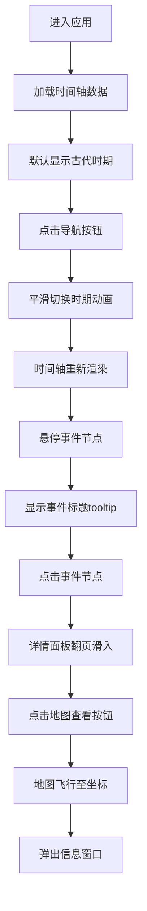

## 1. 产品概述
在线交互式时间轴与历史事件数据可视化展示应用，让用户沉浸式浏览世界历史。
- 主要目的：通过可视化方式让用户直观了解不同历史时期的重大事件及其时空关系
- 解决的问题：传统历史学习缺乏时空关联性和交互体验
- 目标用户：历史爱好者、学生、教育工作者
- 产品价值：将枯燥的历史数据转化为生动的可视化体验，提升学习兴趣和记忆效果

## 2. 核心功能

### 2.1 用户角色
| 角色 | 注册方式 | 核心权限 |
|------|----------|----------|
| 普通用户 | 无需注册 | 浏览时间轴、查看事件详情、地图交互 |

### 2.2 功能模块
1. **导航栏模块**：4个历史时期切换按钮，带动画效果
2. **时间轴模块**：D3.js绘制的水平SVG时间轴，支持缩放、交互
3. **事件详情面板**：右侧滑入面板，展示事件完整信息
4. **地图模块**：Leaflet地图组件，展示事件地理位置

### 2.3 页面详情
| 页面名称 | 模块名称 | 功能描述 |
|----------|----------|----------|
| 主页面 | 导航栏 | 4个历史时期按钮，点击切换时间轴，平滑动画500ms |
| 主页面 | 时间轴画布 | 水平SVG时间轴，显示年份刻度和事件节点，支持悬停和点击 |
| 主页面 | 事件详情面板 | 右侧滑入，展示标题、描述、图片和地图跳转按钮 |
| 主页面 | 地图组件 | 底部/左侧地图，显示事件位置标记，支持飞行动画 |

## 3. 核心流程
用户进入应用 → 默认显示古代时期时间轴 → 点击顶部导航切换时期（平滑滑动动画）→ 鼠标悬停事件节点显示tooltip → 点击节点弹出详情面板 → 点击"在地图上查看"按钮 → 地图飞行至对应位置并弹出信息窗

## 4. 用户界面设计

### 4.1 设计风格
- **整体风格**：深色主题、沉浸式历史沉浸感、磨砂玻璃质感
- **主色调**：背景色#1a1a2e（深靛蓝紫），文字#e0e0e0（冷白色）
- **时期色系**：
  - 古代：赭石色 #8B4513
  - 中世纪：深红色 #8B0000
  - 近代：靛蓝色 #4B0082
  - 现代：翠绿色 #2E8B57
- **按钮样式**：圆角8px，带下划线高亮，背景色渐变，悬停有过渡动画
- **字体**：标题使用Playfair Display，正文使用Inter，字号层级清晰
- **布局风格**：非对称布局，时间轴居中，地图与时间轴响应式排列
- **图标风格**：使用Lucide图标库，线性风格，与整体简洁感一致

### 4.2 页面设计概述
| 页面名称 | 模块名称 | UI元素 |
|----------|----------|----------|
| 主页面 | 导航栏 | 4个时期按钮，渐变色背景，下划线高亮，平滑过渡300ms |
| 主页面 | 时间轴区域 | SVG画布，半透明暗灰色背景，渐变阴影分隔，刻度文字清晰 |
| 主页面 | 事件节点 | 彩色圆点6px，悬停放大到10px，tooltip跟随 |
| 主页面 | 事件面板 | 300px宽，磨砂玻璃背景（backdrop-filter: blur(10px)），翻页滑入动画，圆角8px |
| 主页面 | 地图组件 | 圆角12px边框，标记弹跳出现动画300ms，Popup信息窗 |

### 4.3 响应式
- **大屏（≥768px）**：时间轴与地图并排布局，事件面板右侧固定300px宽
- **小屏（<768px）**：时间轴与地图上下堆叠，事件面板变为底部全宽滑动抽屉
- **触摸优化**：节点点击区域扩大到20px，按钮最小高度44px，支持触摸滑动切换时期

### 4.4 动效设计
- **时间轴切换**：水平滑动500ms，ease-in-out缓动函数
- **节点悬停**：放大动画300ms，阴影渐显
- **面板滑入**：翻页动画，从右侧滑入，透明度渐变
- **地图标记**：弹跳式出现300ms，逐个延迟出现
- **地图飞行**：flyTo动画，平滑缩放移动
- **图片悬停**：缩放1.05倍，阴影加深
