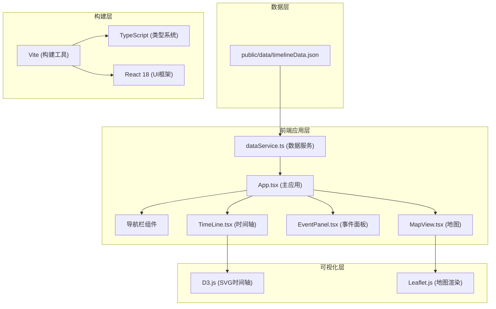
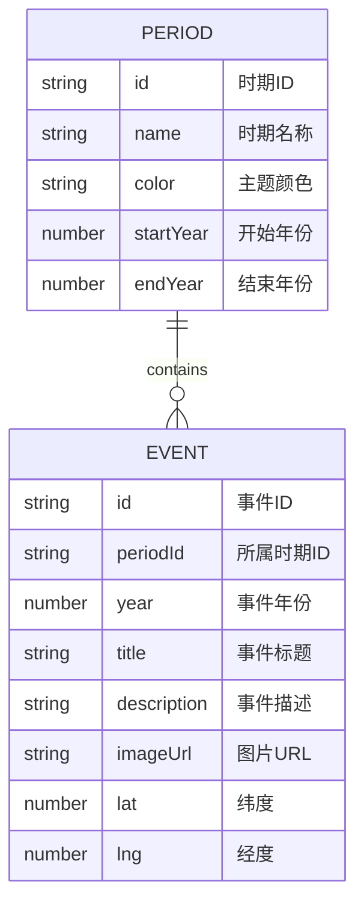

## 1. 架构设计



## 2. 技术描述

- **前端框架**：React 18 + TypeScript 5
- **构建工具**：Vite 5（端口3000，开发服务器）
- **可视化库**：D3.js 7（时间轴绘制）、Leaflet 1.9（地图组件）
- **HTTP客户端**：Axios 1.6（数据请求）
- **样式方案**：原生CSS + CSS变量（不使用Tailwind，按需自定义样式）
- **状态管理**：React useState/useEffect（轻量级，无需额外状态管理库）
- **初始化方式**：Vite react-ts模板

## 3. 路由定义

| 路由 | 用途 |
|------|------|
| / | 主应用页面，包含时间轴、地图、事件面板 |

## 4. 数据模型

### 4.1 数据模型定义



### 4.2 TypeScript 类型定义

```typescript
interface Period {
  id: string;
  name: string;
  color: string;
  startYear: number;
  endYear: number;
}

interface Event {
  id: string;
  periodId: string;
  year: number;
  title: string;
  description: string;
  imageUrl: string;
  lat: number;
  lng: number;
}

interface TimelineData {
  periods: Period[];
  events: Event[];
}
```

### 4.3 JSON 数据结构

```json
{
  "periods": [
    {
      "id": "ancient",
      "name": "古代",
      "color": "#8B4513",
      "startYear": -3000,
      "endYear": 500
    }
  ],
  "events": [
    {
      "id": "event-001",
      "periodId": "ancient",
      "year": -3000,
      "title": "古埃及文明兴起",
      "description": "尼罗河流域出现早期文明...",
      "imageUrl": "https://...",
      "lat": 30.0444,
      "lng": 31.2357
    }
  ]
}
```

## 5. 文件结构

```
e:\solo\SoloAutoDemo\tasks\auto100\
├── package.json
├── vite.config.js
├── tsconfig.json
├── index.html
├── public/
│   └── data/
│       └── timelineData.json
└── src/
    ├── App.tsx
    ├── TimeLine.tsx
    ├── EventPanel.tsx
    ├── MapView.tsx
    └── dataService.ts
```

## 6. 关键技术实现点

### 6.1 时间轴组件 (TimeLine.tsx)
- 使用D3.js创建SVG水平时间轴
- 比例尺：scaleLinear映射年份到x坐标
- 刻度生成：每50年主刻度，每10年次刻度
- 事件节点：circle元素，绑定mouseover/mouseout/click事件
- 切换动画：D3 transition，duration 500ms，ease-in-out

### 6.2 地图组件 (MapView.tsx)
- Leaflet地图初始化，默认中心点(0,0)，缩放级别2
- 标记聚类：超过50个标记时使用Leaflet.markercluster
- 飞行动画：map.flyTo()方法，duration 1000ms
- 标记动画：CSS keyframes实现弹跳效果

### 6.3 性能优化
- 图片懒加载：IntersectionObserver API
- 时间轴虚拟化：仅渲染可见区域节点
- requestAnimationFrame确保动画60fps
- 数据缓存：内存缓存已加载的JSON数据

### 6.4 响应式布局
- CSS Grid + Flexbox实现自适应布局
- @media (max-width: 768px) 断点切换布局
- ResizeObserver监听容器尺寸变化重绘时间轴
