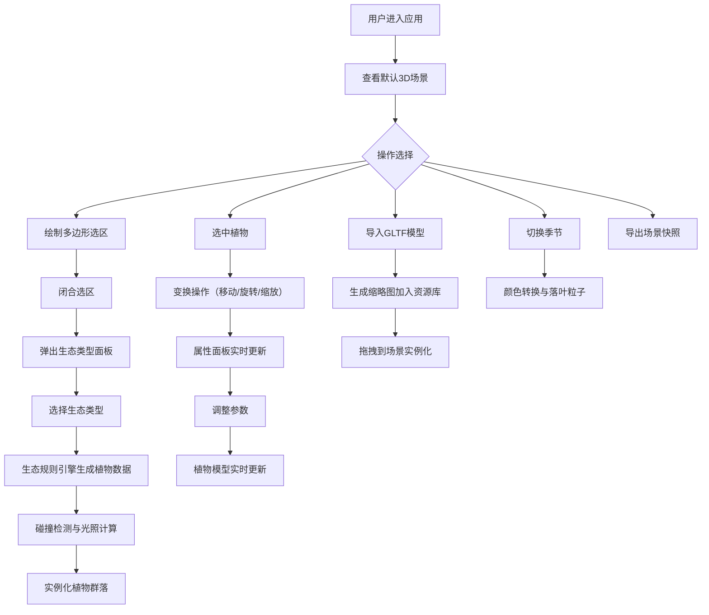

## 1. 产品概述
3D植物生态分布图编辑器，解决游戏场景设计师和景观规划师在构建虚拟自然环境时手动放置植物效率低下且缺乏生态合理性的问题。通过生态规则引擎自动生成符合自然规律的植物群落，支持精细化编辑和自定义模型导入。

## 2. 核心功能

### 2.1 用户角色
| 角色 | 注册方式 | 核心权限 |
|------|---------|---------|
| 场景设计师 | 无需注册 | 完整的3D场景编辑、生态生成、植物编辑、模型导入导出 |
| 景观规划师 | 无需注册 | 生态系统配置、批量植物管理、场景快照导出 |

### 2.2 功能模块
1. **3D场景编辑区**：地形渲染、多边形选区绘制、植物放置与编辑
2. **生态系统生成器**：5种预设生态类型、植物分布规则、光照遮挡计算
3. **植物管理器**：实例化管理、碰撞检测、属性批量更新、自定义模型缓存
4. **资源库面板**：内置植物资源、自定义GLTF/GLB模型导入、搜索筛选
5. **属性编辑面板**：单/多植物属性调整、实时预览更新
6. **季节系统**：四季切换、落叶粒子效果、颜色自动转换

### 2.3 页面详情
| 页面名称 | 模块名称 | 功能描述 |
|---------|---------|---------|
| 主编辑页面 | 顶部工具栏 | 文件操作（导入模型、导出PNG）、编辑操作（撤销/重做）、视图控制（重置视角、正交/透视切换）、帮助 |
| 主编辑页面 | 左侧资源库面板 | 可折叠（280px）、可拖拽分隔条、植物分类筛选、搜索、缩略图预览、拖拽实例化 |
| 主编辑页面 | 中央3D场景区 | 地形渲染、十字准星、多边形选区绘制、植物渲染、变换操作 gizmo |
| 主编辑页面 | 右侧属性面板 | 滑入动画（300ms ease-out）、品种/高度/冠幅/颜色/健康度参数编辑、分隔线分组 |
| 主编辑页面 | 底部状态栏 | 3D坐标显示、植物总数、选中数量 |
| 主编辑页面 | 生态选择面板 | 5种生态类型选择（热带雨林、温带森林、高山草甸、沼泽湿地、沙漠绿洲） |

## 3. 核心流程

## 4. 用户界面设计

### 4.1 设计风格
- **暗色主题**：背景深灰#1e1e1e，控件浅灰#2d2d2d，强调色青蓝#00b4d8
- **滑块轨道**：#3a3a3a，滑块圆点#00b4d8
- **分隔线**：1px深色
- **字体**：现代无衬线字体，标题14px粗体，正文12px常规
- **动效**：面板滑入300ms ease-out，悬停状态过渡150ms
- **空间层次**：面板阴影营造层次感，半透明选区线条

### 4.2 页面设计概述
| 页面名称 | 模块名称 | UI元素 |
|---------|---------|--------|
| 主编辑页面 | 顶部工具栏 | 固定高度48px、菜单项间距24px、下拉菜单半透明背景、悬停高亮 |
| 主编辑页面 | 左侧资源库 | 可折叠面板、拖拽分隔条（5px宽，悬停显示#00b4d8）、搜索框圆角4px、网格布局缩略图（每行2个） |
| 主编辑页面 | 3D场景区 | 全屏显示、半透明十字准星跟随鼠标、选区线条动画、碰撞预览（绿色/红色半透明轮廓） |
| 主编辑页面 | 右侧属性面板 | 固定宽度300px、滑入动画、参数分组间距16px、滑块+数值框组合、实时预览 |
| 主编辑页面 | 底部状态栏 | 固定高度24px、左对齐坐标、右对齐统计信息、字体11px |
| 主编辑页面 | 生态选择面板 | 模态居中、卡片式布局、悬停放大效果、选中边框高亮 |

### 4.3 响应式设计
- **桌面端（≥1024px）**：三栏布局完整显示
- **平板/移动端（<1024px）**：左右面板折叠为边缘悬浮图标按钮，点击弹出抽屉式面板，遮罩层半透明黑色（rgba(0,0,0,0.7)）
- **触摸优化**：增大点击区域至48x48px，支持双指缩放旋转

### 4.4 3D场景设计
- **地形**： procedurally generated 高度图地形，带基础纹理和高度着色
- **光照**：环境光+方向光模拟太阳光，开启阴影映射
- **相机**：PerspectiveCamera，初始位置(30, 30, 30)，看向原点
- **后期处理**：轻微抗锯齿、色调映射
- **粒子系统**：落叶粒子使用BufferGeometry，每棵树独立发射器
- **性能预算**：200棵植物稳定45FPS，Draw Call < 200，三角形 < 500k

## 5. 技术约束
- Three.js r152+，TypeScript 严格模式
- 200棵植物 ≥45FPS
- 模型导入响应 ≤200ms
- GLTF/GLB格式支持
- 最多存储20个自定义模型
