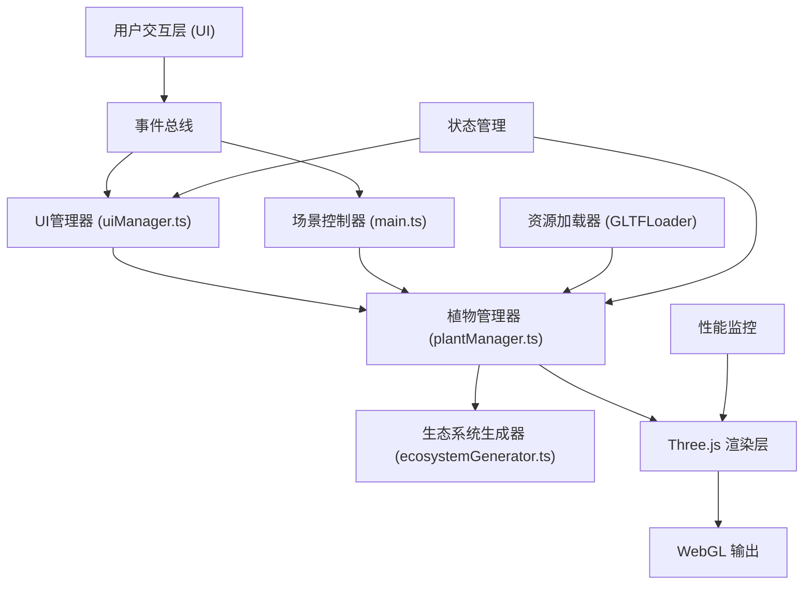

## 1. 架构设计



## 2. 技术描述
- **前端框架**：TypeScript + Vite + Three.js (r152+)
- **UI框架**：原生HTMLElement + CSS2DRenderer（3D场景内UI）
- **状态管理**：基于EventEmitter的轻量事件系统
- **辅助调试**：lil-gui
- **动画库**：@tweenjs/tween.js
- **构建工具**：Vite 5.x
- **包管理器**：npm

## 3. 核心模块设计

### 3.1 目录结构
```
src/
├── main.ts                 # 应用入口
├── ecosystemGenerator.ts   # 生态规则引擎
├── plantManager.ts         # 植物管理器
├── uiManager.ts            # UI管理器
├── types/
│   └── index.ts            # 类型定义
├── utils/
│   ├── math.ts             # 数学工具
│   └── collision.ts        # 碰撞检测
└── shaders/
    └── foliageMaterial.ts  # 植物材质shader
```

### 3.2 类型定义

```typescript
// 生态类型
type EcosystemType = 'rainforest' | 'temperate' | 'alpine' | 'wetland' | 'desert';

// 植物类型
type PlantType = 'tree' | 'shrub' | 'grass' | 'vine' | 'aquatic' | 'palm';

// 季节类型
type Season = 'spring' | 'summer' | 'autumn' | 'winter';

// 植物实例数据
interface PlantInstance {
  id: string;
  type: PlantType;
  species: string;
  position: THREE.Vector3;
  rotation: THREE.Euler;
  scale: THREE.Vector3;
  height: number;
  crownDiameter: number;
  health: number;
  colorShift: number;
  shadeTolerance: number;
  mesh?: THREE.Group;
}

// 生态规则
interface EcosystemRule {
  type: EcosystemType;
  name: string;
  plants: {
    type: PlantType;
    density: number;  // 每100平方米数量
    minSpacing: number;
    heightRange: [number, number];
    crownRange: [number, number];
    shadeTolerance: number;
    colorPalette: string[];
  }[];
  groundMaterial: THREE.Material;
}

// 选择区域
interface SelectionArea {
  vertices: THREE.Vector3[];
  bounds: THREE.Box2;
}
```

## 4. 核心算法

### 4.1 植物分布算法（泊松盘采样）
```typescript
function generatePoissonSampling(
  area: SelectionArea,
  minDistance: number,
  maxAttempts: number
): THREE.Vector3[];
```
- 确保植物间距 ≥ 0.5米
- 在多边形选区内均匀分布
- 时间复杂度 O(n log n)，使用空间网格优化

### 4.2 光照遮挡计算
```typescript
function calculateLightOcclusion(
  position: THREE.Vector3,
  height: number,
  allPlants: PlantInstance[]
): number; // 返回 0-1，0表示完全遮蔽
```
- 基于邻近树木高度和距离计算遮蔽程度
- 低于0.3光照只生成耐阴植物（shadeTolerance > 0.7）

### 4.3 多边形点包含测试
```typescript
function pointInPolygon(
  point: THREE.Vector2,
  polygon: THREE.Vector2[]
): boolean;
```
- 射线法判断点是否在多边形内
- 支持凹多边形

### 4.4 碰撞检测
```typescript
function checkCollision(
  plant: PlantInstance,
  allPlants: PlantInstance[],
  minSpacing: number
): boolean;
```
- 圆柱体碰撞近似
- 高度轴可忽略

## 5. 性能优化策略

1. **实例化渲染 (InstancedMesh)**：同种植物使用InstancedMesh批量渲染
2. **视锥体剔除**：Three.js内置，配合LOD（层次细节）
3. **空间分区**：四叉树管理场景对象，加速碰撞检测
4. **纹理图集**：植物纹理打包为Texture Atlas，减少Draw Call
5. **粒子池**：落叶粒子使用对象池复用
6. **WebWorker**：植物分布计算在Worker线程执行
7. **帧时间预算**：每帧逻辑处理 < 8ms（60FPS目标）
8. **内存管理**：模型缓存LRU策略，超过20个自动清理最早导入的

## 6. 事件系统

```typescript
enum AppEvent {
  SELECTION_DRAW_START = 'selection:draw:start',
  SELECTION_DRAW_END = 'selection:draw:end',
  ECOSYSTEM_SELECTED = 'ecosystem:selected',
  PLANT_SELECTED = 'plant:selected',
  PLANT_TRANSFORM = 'plant:transform',
  PROPERTY_CHANGED = 'property:changed',
  SEASON_CHANGED = 'season:changed',
  MODEL_IMPORTED = 'model:imported',
  UNDO = 'action:undo',
  REDO = 'action:redo',
}
```

## 7. 构建配置

- **开发服务器**：端口3000，开启热更新
- **别名配置**：@ → src目录
- **目标浏览器**：ES2020，原生支持WebGL2
- **生产构建**：开启treeshaking，代码分割，source map
- **资源处理**：GLB文件使用asset/resource加载
