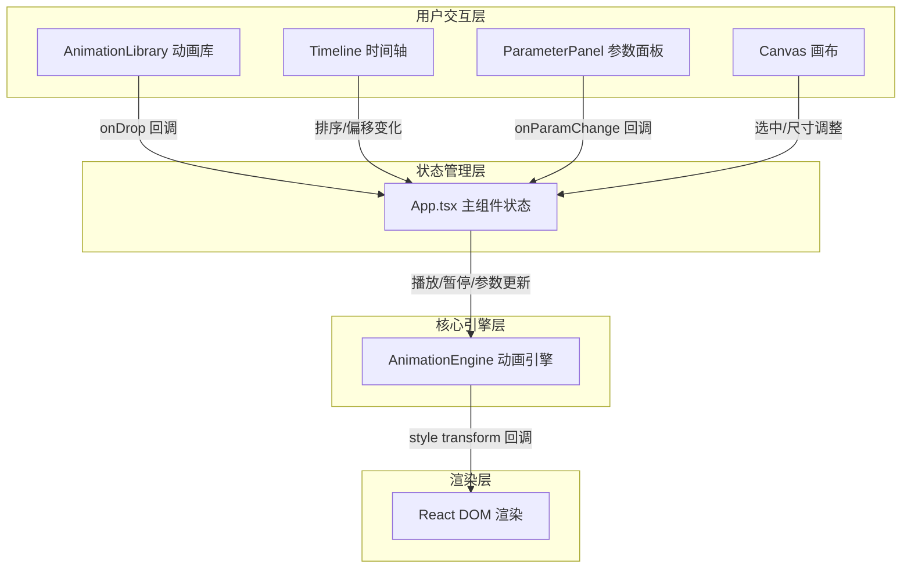

## 1. 架构设计



## 2. 技术描述

- **前端框架**：React@18 + TypeScript@5
- **构建工具**：Vite@5（HMR热更新，端口3000）
- **动画引擎**：基于 requestAnimationFrame + CSS Transform 自行实现状态机，不依赖外部动画库
- **状态管理**：React Hooks（useState、useRef、useEffect、useCallback）
- **样式方案**：CSS-in-JS 行内样式 + CSS 自定义属性（CSS Variables）

## 3. 文件组织

```
项目根目录
├── package.json          # 项目依赖和脚本
├── vite.config.js        # Vite 构建配置
├── tsconfig.json         # TypeScript 配置（严格模式，target ES2020）
├── index.html            # 入口HTML
└── src/
    ├── main.tsx          # React入口
    ├── AnimationEngine.ts # 动画引擎核心
    ├── App.tsx           # 主组件（状态管理、布局）
    ├── AnimationLibrary.tsx # 左侧动画库面板
    ├── Timeline.tsx      # 时间轴组件
    └── ParameterPanel.tsx # 右侧参数面板
```

## 4. 核心数据模型

### 4.1 动画预设类型
```typescript
type AnimationType = 'fadeIn' | 'fadeOut' | 'rotate' | 'bounce' | 'scale' | 'pathMove';
type AnimationCategory = 'entrance' | 'exit' | 'emphasis';

interface AnimationPreset {
  type: AnimationType;
  name: string;
  category: AnimationCategory;
  icon: string;
  defaultParams: AnimationParams;
}
```

### 4.2 动画实例
```typescript
interface AnimationParams {
  duration: number;      // 持续时长(ms)
  delay: number;         // 延迟(ms)
  easing: string;        // 缓动函数
  iterations: number;    // 循环次数，Infinity为无限
  direction: 'normal' | 'reverse' | 'alternate' | 'alternate-reverse';
}

interface AnimationInstance {
  id: string;
  type: AnimationType;
  params: AnimationParams;
  offset: number;        // 时间轴偏移(ms)，用于调整触发顺序
  color: string;         // 时间轴色条颜色
}
```

### 4.3 应用状态
```typescript
interface AppState {
  animations: AnimationInstance[];  // 最多5个
  selectedAnimationId: string | null;
  targetElementSize: { width: number; height: number };
  isPlaying: boolean;
  isPaused: boolean;
}
```

## 5. 动画引擎架构

### 5.1 AnimationEngine 类
```typescript
class AnimationEngine {
  // requestAnimationFrame ID
  private rafId: number | null;
  // 当前播放时间戳
  private startTime: number;
  // 暂停时累积时间
  private pausedTime: number;
  // 动画列表
  private animations: AnimationInstance[];
  // 每帧更新回调
  private onFrame: (transforms: Record<string, string>) => void;

  // 核心方法
  play(animations: AnimationInstance[]): void;
  pause(): void;
  resume(): void;
  stop(): void;
  seek(time: number): void;
  
  // 内部方法
  private loop(timestamp: number): void;
  private computeTransform(animation: AnimationInstance, progress: number): Partial<TransformState>;
  private applyEasing(t: number, easing: string): number;
}
```

### 5.2 变换状态
```typescript
interface TransformState {
  opacity: number;
  translateX: number;
  translateY: number;
  scaleX: number;
  scaleY: number;
  rotate: number;
}
```

### 5.3 缓动函数实现
- linear
- easeInQuad / easeOutQuad / easeInOutQuad
- easeInCubic / easeOutCubic / easeInOutCubic
- easeInBounce / easeOutBounce
- easeInBack / easeOutBack
```

## 6. 关键实现要点

1. **动画引擎**：基于 requestAnimationFrame 实现时间驱动循环，通过 progress(0-1) 计算各动画当前变换值，合并后更新DOM style
2. **拖拽实现**：使用原生 HTML5 Drag & Drop API（动画库→画布），时间轴色条使用鼠标事件（mousedown/mousemove/mouseup）
3. **面板拖拽**：使用鼠标事件监听，动态更新 flex-basis 或 width 样式
4. **响应式**：使用 window.matchMedia 监听窗口宽度变化，切换面板显示模式
5. **性能优化**：动画参数更新使用 useRef 存储避免不必要的重渲染，style 更新直接操作 DOM 跳过 React 调和
