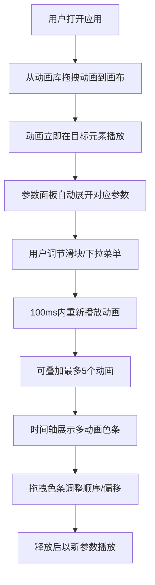

## 1. 产品概述

动画序列编辑器是一款面向前端开发者的可视化交互动画设计工具，帮助用户快速为网页元素生成并预览动态交互动画序列，解决前端开发者在设计微交互时缺乏直观、可调节的动画参数调节工具，需要反复修改CSS代码才能预览效果的问题。

- **目标用户**：前端开发者、UI设计师、动效设计师
- **核心价值**：通过可视化拖拽和实时参数调节，极大提升交互动画设计效率

## 2. 核心功能

### 2.1 功能模块
1. **动画库面板**：预设动画列表展示、拖拽添加
2. **中央画布**：目标元素展示、动画实时预览、选中状态指示
3. **参数面板**：动画参数调节（持续时长、延迟、缓动函数、循环次数、方向）
4. **时间轴**：多动画序列管理、排序、时间偏移调整、并行播放指示

### 2.2 页面详情
| 页面名称 | 模块名称 | 功能描述 |
|-----------|-------------|---------------------|
| 主页面 | 动画库面板 | 左侧展示预设动画（淡入、旋转、弹跳、缩放、路径移动），分类标签（入场/退场/强调），拖拽到画布添加动画 |
| 主页面 | 中央画布 | 展示带阴影的圆角矩形卡片，尺寸可调，实时预览动画效果，选中时流动虚线描边 |
| 主页面 | 参数面板 | 根据选中动画显示对应参数滑块和下拉菜单，实时响应参数变化 |
| 主页面 | 时间轴 | 显示多动画色条，支持拖拽排序和偏移调整，重叠区域渐变色混合 |

## 3. 核心流程

用户从左侧动画库拖拽动画类型到中央画布的目标元素上 → 动画立即播放 → 右侧参数面板自动展开可调参数 → 用户调节滑块实时更新动画 → 可叠加最多5个动画 → 在时间轴上拖拽色条调整触发顺序和起始偏移 → 预览完整动画序列。

## 4. 用户界面设计

### 4.1 设计风格
- **主色调**：品牌色 #6c63ff，高亮色 #7c73ff
- **背景色**：主背景 #1e1e2e，面板背景 #2a2a3e，画布网格线 #2e2e3e，交叉点 #38384e
- **文字颜色**：#ffffff，次要文字 #a0a0b0
- **整体风格**：深色科技感主题，精致细节，流畅过渡动画
- **字体**：使用现代无衬线字体，突出数据可读性

### 4.2 页面设计概述
| 页面名称 | 模块名称 | UI元素 |
|-----------|-------------|-------------|
| 主页面 | 动画库面板 | 悬停背景色过渡（0.2s），动画项带图标和类别标签 |
| 主页面 | 中央画布 | 网格背景，目标元素阴影圆角矩形，选中时流动虚线描边动画（#6c63ff，1s/周） |
| 主页面 | 参数面板 | 自定义滑块（深灰轨道 #3a3a4e，品牌色按钮 #6c63ff，填充渐变，标签淡入动画） |
| 主页面 | 时间轴 | HSL色相环取色（相邻动画色差>120度），色条宽度与时长正比，重叠区域渐变色混合 |
| 主页面 | 面板分隔 | 支持拖拽调整宽度，拖拽时边框高亮 #7c73ff |

### 4.3 响应式设计
- 桌面端优先，最小支持1280px宽度
- 小于1280px时，左右面板自动折叠为图标按钮式侧边栏，点击展开浮动面板

### 4.4 性能要求
- 动画参数调节后，预览动画在100ms内重新开始播放
- 连续快速调节参数时维持60FPS
- 时间轴拖拽时画布动画暂停，松开后50ms内恢复播放
