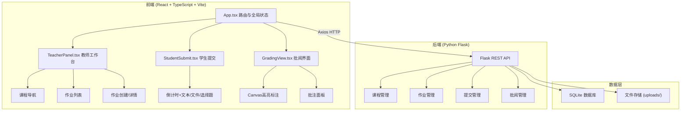
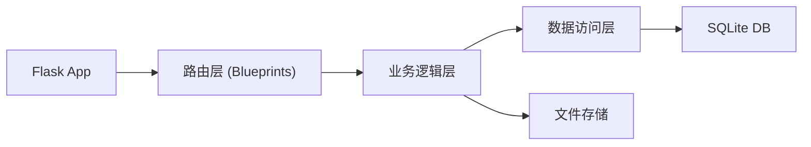
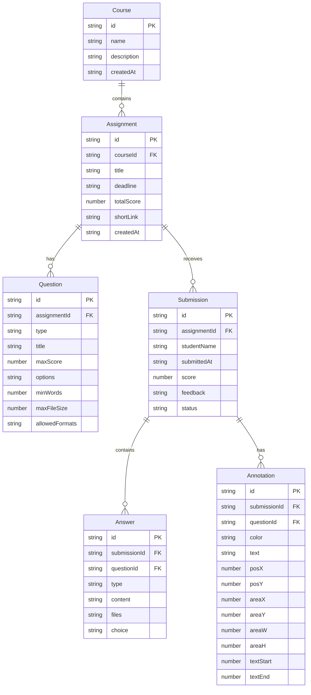

## 1. 架构设计



## 2. 技术说明
- 前端：React@18 + TypeScript + Vite + Tailwind CSS + Zustand
- 初始化工具：vite-init (react-ts 模板)
- 后端：Python Flask (REST API，端口5000)
- 数据库：SQLite（轻量级，无需额外安装）
- 图表：Recharts（雷达图）
- 二维码：qrcode.react
- 拖拽：react-beautiful-dnd
- HTTP 客户端：Axios

## 3. 路由定义
| 路由 | 用途 |
|------|------|
| / | 首页/登录选择 |
| /teacher | 教师工作台（三栏布局） |
| /teacher/grading/:submissionId | 批阅界面 |
| /submit/:assignmentId | 学生提交页 |
| /feedback/:submissionId | 学生反馈详情页 |

## 4. API 定义

### 4.1 认证
| 方法 | 路径 | 描述 | 请求体 | 响应 |
|------|------|------|--------|------|
| POST | /api/auth/login | 教师登录 | {username, password} | {token, user} |

### 4.2 课程管理
| 方法 | 路径 | 描述 | 请求体 | 响应 |
|------|------|------|--------|------|
| GET | /api/courses | 获取课程列表 | - | [{id, name, description}] |
| POST | /api/courses | 创建课程 | {name, description} | {id, name, description} |

### 4.3 作业管理
| 方法 | 路径 | 描述 | 请求体 | 响应 |
|------|------|------|--------|------|
| GET | /api/courses/:courseId/assignments | 获取作业列表 | - | [{id, title, deadline, totalScore, questions}] |
| POST | /api/courses/:courseId/assignments | 创建作业 | {title, deadline, totalScore, questions[]} | {id, title, shortLink, qrCode} |
| GET | /api/assignments/:id | 获取作业详情 | - | {id, title, deadline, questions, shortLink} |

### 4.4 提交管理
| 方法 | 路径 | 描述 | 请求体 | 响应 |
|------|------|------|--------|------|
| POST | /api/assignments/:id/submit | 学生提交作业 | FormData: {studentName, answers[]} | {id, status} |
| GET | /api/assignments/:id/submissions | 获取提交列表 | - | [{id, studentName, submittedAt, files}] |

### 4.5 批阅管理
| 方法 | 路径 | 描述 | 请求体 | 响应 |
|------|------|------|--------|------|
| GET | /api/submissions/:id | 获取提交详情 | - | {id, answers, annotations, score, feedback} |
| POST | /api/submissions/:id/grade | 批阅提交 | {score, feedback, annotations[]} | {status} |
| PUT | /api/submissions/:id/annotations | 更新批注 | {annotations[]} | {status} |

### 4.6 TypeScript 类型定义

```typescript
interface Course {
  id: string;
  name: string;
  description: string;
}

interface Question {
  id: string;
  type: 'text' | 'file' | 'choice';
  title: string;
  required?: boolean;
  minWords?: number;
  maxFileSize?: number;
  allowedFormats?: string[];
  options?: string[];
  maxScore: number;
}

interface Assignment {
  id: string;
  courseId: string;
  title: string;
  deadline: string;
  totalScore: number;
  questions: Question[];
  shortLink: string;
  createdAt: string;
}

interface Submission {
  id: string;
  assignmentId: string;
  studentName: string;
  submittedAt: string;
  answers: Answer[];
  score?: number;
  feedback?: string;
  annotations?: Annotation[];
  status: 'submitted' | 'graded';
}

interface Answer {
  questionId: string;
  type: 'text' | 'file' | 'choice';
  content?: string;
  files?: FileInfo[];
  choice?: string;
}

interface FileInfo {
  name: string;
  size: number;
  format: string;
  url: string;
  thumbnailUrl?: string;
}

interface Annotation {
  id: string;
  questionId: string;
  color: 'red' | 'yellow' | 'green';
  text: string;
  position: { x: number; y: number };
  area?: { x: number; y: number; width: number; height: number };
  textRange?: { start: number; end: number };
}
```

## 5. 服务器架构图



## 6. 数据模型

### 6.1 数据模型定义



### 6.2 数据定义语言

```sql
CREATE TABLE course (
    id TEXT PRIMARY KEY,
    name TEXT NOT NULL,
    description TEXT DEFAULT '',
    createdAt TEXT NOT NULL
);

CREATE TABLE assignment (
    id TEXT PRIMARY KEY,
    courseId TEXT NOT NULL REFERENCES course(id),
    title TEXT NOT NULL,
    deadline TEXT NOT NULL,
    totalScore REAL NOT NULL,
    shortLink TEXT UNIQUE NOT NULL,
    createdAt TEXT NOT NULL
);

CREATE TABLE question (
    id TEXT PRIMARY KEY,
    assignmentId TEXT NOT NULL REFERENCES assignment(id),
    type TEXT NOT NULL CHECK(type IN ('text', 'file', 'choice')),
    title TEXT NOT NULL,
    maxScore REAL NOT NULL DEFAULT 0,
    options TEXT DEFAULT '[]',
    minWords INTEGER DEFAULT 0,
    maxFileSize INTEGER DEFAULT 10485760,
    allowedFormats TEXT DEFAULT '[]'
);

CREATE TABLE submission (
    id TEXT PRIMARY KEY,
    assignmentId TEXT NOT NULL REFERENCES assignment(id),
    studentName TEXT NOT NULL,
    submittedAt TEXT NOT NULL,
    score REAL DEFAULT NULL,
    feedback TEXT DEFAULT '',
    status TEXT NOT NULL DEFAULT 'submitted' CHECK(status IN ('submitted', 'graded'))
);

CREATE TABLE answer (
    id TEXT PRIMARY KEY,
    submissionId TEXT NOT NULL REFERENCES submission(id),
    questionId TEXT NOT NULL REFERENCES question(id),
    type TEXT NOT NULL,
    content TEXT DEFAULT '',
    files TEXT DEFAULT '[]',
    choice TEXT DEFAULT ''
);

CREATE TABLE annotation (
    id TEXT PRIMARY KEY,
    submissionId TEXT NOT NULL REFERENCES submission(id),
    questionId TEXT NOT NULL REFERENCES question(id),
    color TEXT NOT NULL CHECK(color IN ('red', 'yellow', 'green')),
    text TEXT NOT NULL DEFAULT '',
    posX REAL DEFAULT 0,
    posY REAL DEFAULT 0,
    areaX REAL DEFAULT 0,
    areaY REAL DEFAULT 0,
    areaW REAL DEFAULT 0,
    areaH REAL DEFAULT 0,
    textStart INTEGER DEFAULT -1,
    textEnd INTEGER DEFAULT -1
);

CREATE INDEX idx_assignment_course ON assignment(courseId);
CREATE INDEX idx_question_assignment ON question(assignmentId);
CREATE INDEX idx_submission_assignment ON submission(assignmentId);
CREATE INDEX idx_answer_submission ON answer(submissionId);
CREATE INDEX idx_annotation_submission ON annotation(submissionId);
```
