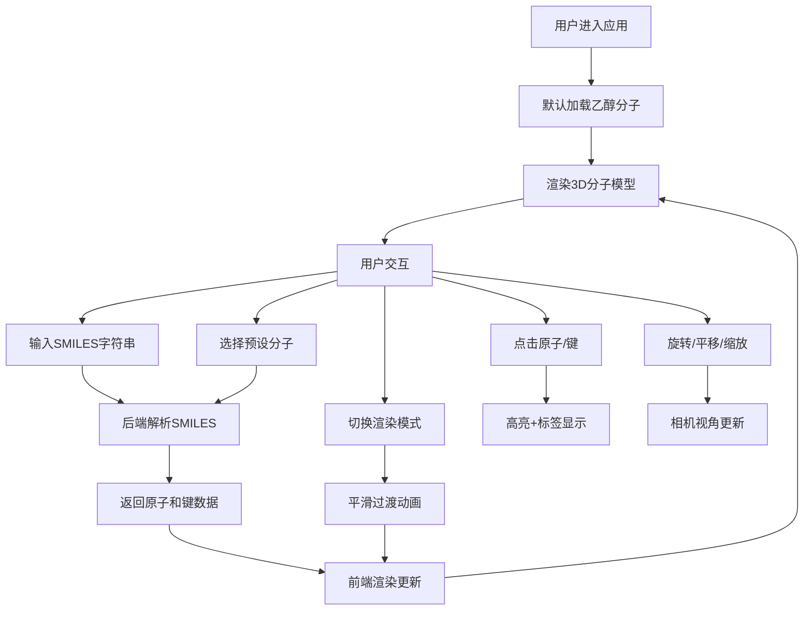

## 1. 产品概述

本产品是一个交互式三维分子结构建模与可视化应用，旨在为化学研究人员、学生和教育工作者提供直观的分子结构展示工具。用户可以通过SMILES字符串加载分子或选择预设示例，以多种渲染模式查看和交互分子结构。

- 核心价值：将抽象的化学分子结构转化为直观的3D可视化模型，支持交互式探索
- 目标用户：化学教育工作者、学生、科研人员、分子建模爱好者
- 解决的问题：传统分子模型难以直观展示三维空间结构，本应用提供沉浸式的3D交互体验

## 2. 核心功能

### 2.1 用户角色
| 角色 | 注册方式 | 核心权限 |
|------|----------|----------|
| 普通用户 | 无需注册 | 浏览分子、切换渲染模式、调整颜色主题、查看分子信息 |

### 2.2 功能模块
1. **主视图区**：3D分子渲染场景，支持旋转、平移、缩放交互
2. **左侧信息面板**：显示分子基本信息（分子式、分子量、原子数、键数）
3. **右侧控制面板**：SMILES输入、预设分子选择、渲染模式切换、颜色主题切换
4. **交互系统**：原子/键点击高亮、悬停发光效果、光照控制
5. **后端API**：分子解析服务、预设分子数据管理

### 2.3 页面详情
| 页面名称 | 模块名称 | 功能描述 |
|----------|----------|----------|
| 主页面 | 3D场景渲染 | Three.js渲染分子模型，支持三种渲染模式切换，平滑过渡动画 |
| 主页面 | 鼠标交互 | 左键旋转、右键平移、滚轮缩放、点击选择元素、悬停发光 |
| 主页面 | 左侧信息面板 | 实时显示当前分子的化学属性数据，毛玻璃效果 |
| 主页面 | 右侧控制面板 | SMILES输入框、预设分子下拉菜单、渲染模式按钮组、颜色主题切换器 |
| 主页面 | 底部进度条 | 显示分子模型加载进度，加载时动画显示 |
| 主页面 | 光照系统 | 环境光+可拖动平行光源（小黄点表示） |

## 3. 核心流程

用户进入应用后，默认加载预设的乙醇分子。用户可以通过以下方式与应用交互：
1. 输入SMILES字符串 → 点击加载 → 后端解析 → 返回原子/键数据 → 前端渲染3D模型
2. 选择预设分子 → 触发加载流程 → 渲染对应分子
3. 点击渲染模式按钮 → 触发0.3秒平滑过渡动画 → 切换到对应渲染模式
4. 点击原子/键 → 高亮元素 → 弹出标签显示详细信息
5. 拖动平行光源（小黄点）→ 实时调整光照方向 → 观察分子光影变化

## 4. 用户界面设计

### 4.1 设计风格
- **设计主题**：深色科技风格，适合科学可视化场景
- **主背景色**：#1a1a2e（深空蓝紫色调）
- **面板风格**：半透明毛玻璃效果，backdrop-filter: blur(10px)，rgba(255,255,255,0.08)背景
- **主色调**：#4fc3f7（青蓝色，用于交互元素、高亮发光）
- **辅助色**：CPK标准配色（碳#909090、氧#ff0d0d、氮#3050f8、氢#ffffff、硫#ffff30等）
- **按钮风格**：圆角8px，悬停时轻微上浮+阴影增强，选中时青蓝色边框
- **字体**：主字体使用 'Segoe UI'、'Microsoft YaHei' 等现代无衬线字体，数字使用等宽字体
- **布局风格**：三栏式布局（左面板+中央3D区+右面板），响应式适配

### 4.2 页面设计概述
| 页面名称 | 模块名称 | UI元素 |
|----------|----------|--------|
| 主页面 | 3D场景区域 | 全屏渲染区域，分子居中，背景渐变深色，可拖动光源小黄点 |
| 主页面 | 左侧信息面板 | 宽度280px，毛玻璃效果，包含分子式卡片、分子量、原子计数、键计数，数据使用等宽字体 |
| 主页面 | 右侧控制面板 | 宽度300px，毛玻璃效果，包含SMILES输入框、加载按钮、预设分子下拉菜单、渲染模式切换按钮组（球棍/空间填充/线框）、颜色主题切换器 |
| 主页面 | 底部进度条 | 高度4px，青蓝色渐变，加载时从左到右动画 |
| 主页面 | 弹出标签 | 点击原子/键时显示，包含元素图标、属性数据，跟随鼠标位置 |

### 4.3 响应式设计
- **桌面端（≥768px）**：三栏式布局，左右面板固定宽度，中央区域自适应
- **移动端（<768px）**：左右面板折叠为底部标签栏，可点击展开/收起，3D区域占满屏幕
- **触摸优化**：支持双指缩放、单指旋转等触摸手势

### 4.4 3D场景设计
- **环境光**：淡蓝色环境光（#87ceeb，强度0.4），提供整体基础照明
- **平行光源**：白色平行光（强度1.0），位置可通过拖动小黄点调整，产生明显阴影
- **相机设置**：PerspectiveCamera，视场角60度，初始距离分子中心5单位
- **交互方式**：OrbitControls实现旋转、平移、缩放，阻尼效果提升手感
- **原子样式**：球棍模型原子半径0.3，空间填充模型原子半径0.6，线框模式使用线条
- **键样式**：半透明浅灰色圆柱体（半径0.08，透明度0.7），线框模式使用线段
- **高亮效果**：选中元素外发光（青蓝色#4fc3f7，半径0.1单位）
- **悬停效果**：光标变为pointer，元素轻微发光
- **过渡动画**：渲染模式切换时使用TWEEN.js实现0.3秒平滑插值动画
