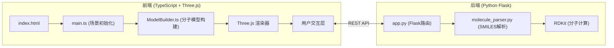
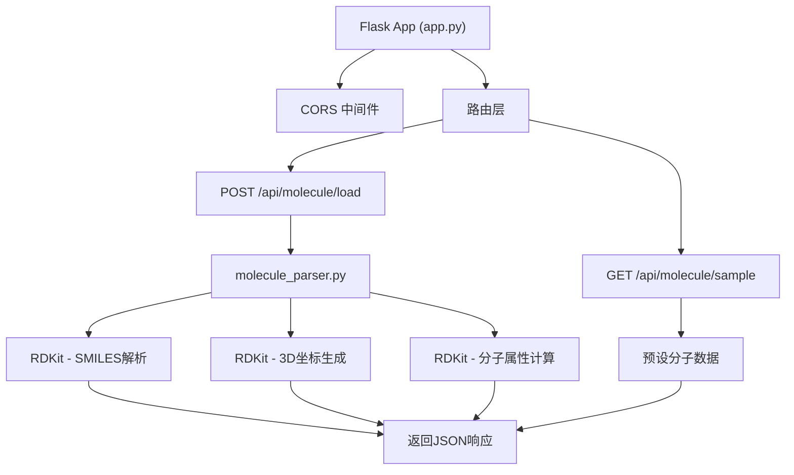

## 1. 架构设计

本应用采用前后端分离架构，前端负责3D渲染与用户交互，后端负责分子数据解析与存储。



## 2. 技术描述

- **前端**：TypeScript + Three.js + Vite
  - three: 3D渲染引擎
  - @types/three: Three.js类型定义
  - typescript: 类型安全
  - vite: 构建工具与开发服务器
  - python-shell: 可选，用于直接调用Python脚本
- **初始化工具**：Vite
- **后端**：Python Flask + RDKit
  - Flask: Web框架
  - RDKit: 化学信息学工具包，用于SMILES解析和3D坐标生成
  - flask-cors: 跨域支持
- **数据库**：无需数据库，预设分子数据硬编码在后端，用户数据保存在内存中

## 3. 目录结构

```
auto113/
├── package.json
├── vite.config.js
├── tsconfig.json
├── index.html
├── src/
│   ├── main.ts
│   └── ModelBuilder.ts
└── backend/
    ├── app.py
    ├── molecule_parser.py
    └── requirements.txt
```

## 4. API 定义

### 4.1 TypeScript 类型定义

```typescript
interface Atom {
  id: number;
  element: string;
  x: number;
  y: number;
  z: number;
}

interface Bond {
  id: number;
  atom1: number;
  atom2: number;
  type: 'single' | 'double' | 'triple' | 'aromatic';
  length: number;
}

interface MoleculeData {
  name: string;
  formula: string;
  molecularWeight: number;
  atoms: Atom[];
  bonds: Bond[];
}

interface PresetMolecule {
  id: string;
  name: string;
  smiles: string;
}

type RenderMode = 'ball-stick' | 'space-filling' | 'wireframe';
type ColorTheme = 'cpk' | 'neon' | 'grayscale';
```

### 4.2 REST API 接口

#### GET /api/molecule/sample
返回预设分子列表

**响应**：
```json
{
  "molecules": [
    {"id": "ethanol", "name": "乙醇", "smiles": "CCO"},
    {"id": "benzene", "name": "苯环", "smiles": "c1ccccc1"},
    {"id": "caffeine", "name": "咖啡因", "smiles": "CN1C=NC2=C1C(=O)N(C(=O)N2C)C"},
    {"id": "glucose", "name": "葡萄糖", "smiles": "C(C1C(C(C(C(O1)O)O)O)O)O"},
    {"id": "peptide", "name": "短肽", "smiles": "NCC(=O)NCC(=O)O"}
  ]
}
```

#### POST /api/molecule/load
解析SMILES字符串并返回分子数据

**请求**：
```json
{"smiles": "CCO"}
```

**响应**：
```json
{
  "name": "乙醇",
  "formula": "C2H6O",
  "molecularWeight": 46.07,
  "atoms": [
    {"id": 0, "element": "C", "x": 0.0, "y": 0.0, "z": 0.0},
    {"id": 1, "element": "C", "x": 1.5, "y": 0.0, "z": 0.0},
    {"id": 2, "element": "O", "x": 2.5, "y": 1.0, "z": 0.0}
  ],
  "bonds": [
    {"id": 0, "atom1": 0, "atom2": 1, "type": "single", "length": 1.5},
    {"id": 1, "atom1": 1, "atom2": 2, "type": "single", "length": 1.4}
  ]
}
```

## 5. 服务器架构图



## 6. 核心模块说明

### 6.1 ModelBuilder 类

**职责**：根据原子和键数据生成Three.js网格对象，支持多种渲染模式

**核心方法**：
- `constructor(scene: THREE.Scene)` - 构造函数，接收Three.js场景
- `buildMolecule(data: MoleculeData)` - 构建分子模型
- `setRenderMode(mode: RenderMode)` - 切换渲染模式，带平滑动画
- `setColorTheme(theme: ColorTheme)` - 切换颜色主题
- `highlightElement(elementId: number, type: 'atom' | 'bond')` - 高亮选中元素
- `clearHighlight()` - 清除高亮
- `dispose()` - 清理资源

### 6.2 main.ts 主程序

**职责**：初始化Three.js场景，处理用户交互，管理应用状态

**核心功能**：
- 场景、相机、渲染器初始化
- OrbitControls 交互控制
- 光照系统（环境光+平行光）
- 光源拖动控制（Raycaster 实现）
- API 调用与数据加载
- UI 事件绑定
- 渲染循环（requestAnimationFrame）

### 6.3 molecule_parser.py 解析器

**职责**：将SMILES字符串转换为分子三维数据

**核心函数**：
- `parse_smiles(smiles: str) -> dict` - 主解析函数
- `generate_3d_coords(mol) -> list` - 生成3D坐标
- `calculate_bond_lengths(mol, coords) -> list` - 计算键长
- `get_molecule_properties(mol) -> dict` - 获取分子属性

## 7. 性能优化策略

- **对象池化**：原子和键的几何体/材质复用，避免重复创建
- **实例化渲染**：对于相同元素的原子使用 InstancedMesh 减少Draw Call
- **LOD控制**：根据距离自动切换几何体精度
- **帧率监控**：实时监控FPS，低于45fps时自动降低渲染质量
- **资源清理**：切换分子时正确 dispose 旧的几何体和材质，防止内存泄漏
- **异步加载**：分子解析和加载过程异步执行，UI线程不阻塞
