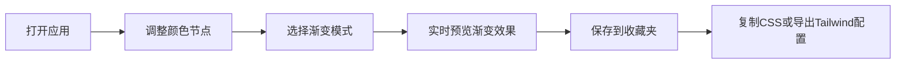

## 1. 产品概述

CSS 渐变色方案生成器，帮助前端开发者快速创建、预览和导出复杂的 CSS 渐变背景。通过可视化拖拽交互替代手动拼写 CSS 代码，解决渐变颜色调试效率低下的问题。

- 核心价值：将渐变设计从"代码试错"变为"所见即所得"，提升前端开发效率
- 目标用户：前端开发者、UI 设计师

## 2. 核心功能

### 2.1 功能模块

1. **色盘编辑区**：支持多颜色节点拖拽、颜色选择、渐变模式切换
2. **代码预览区**：实时高亮显示生成的 CSS 代码，支持复制和导出
3. **收藏夹管理**：本地存储渐变方案，支持快速复用和管理

### 2.2 页面详情

| 页面名称 | 模块名称 | 功能描述 |
|-----------|-------------|---------------------|
| 主页面 | 色盘编辑区 | 拖拽添加 2-8 个颜色节点，支持线性/径向渐变切换，角度和位置调节 |
| 主页面 | 代码预览区 | Prism.js 高亮显示 CSS 代码，一键复制和导出 Tailwind 配置 |
| 主页面 | 收藏夹卡片网格 | 172x120px 卡片展示已保存方案，悬停显示复制/删除按钮 |

## 3. 核心流程

## 4. 用户界面设计

### 4.1 设计风格
- **主色调**：深色背景 #1a1a2e，卡片背景 #16213e，强调色 #e94560
- **按钮风格**：圆角胶囊形，悬停有缩放和阴影效果
- **字体**：现代无衬线字体，代码区使用等宽字体
- **布局**：左侧 60% 宽度色盘区，右侧固定 340px 代码面板
- **动画**：色块拖拽时 scale 1.1 弹性缩放（200ms），通知从底部滑入滑出

### 4.2 页面设计概览

| 页面名称 | 模块名称 | UI 元素 |
|-----------|-------------|-------------|
| 主页面 | 色盘编辑区 | 28px 直径圆形色块（白色边框+阴影），曲线连接线，角度滑块，模式切换按钮 |
| 主页面 | 代码预览区 | Prism.js 代码高亮，复制按钮，导出按钮 |
| 主页面 | 收藏夹 | 卡片网格布局，渐变缩略图，创建时间，悬停操作按钮 |

### 4.3 交互细节
- **颜色节点**：点击弹出 react-colorful 颜色选择器（支持 HEX、HSL）
- **渐变模式**：线性渐变（0-360° 滑块），径向渐变（圆形/椭圆切换，X/Y 位置滑块）
- **复制反馈**：3 秒绿色提示动画（从底部滑入再滑出）
- **性能要求**：拖拽时 30+ FPS，渐变更新响应 < 100ms

### 4.4 响应式
- 桌面端优先设计，色盘区 60% + 代码面板 340px 固定宽度
- 触摸设备优化拖拽交互体验
