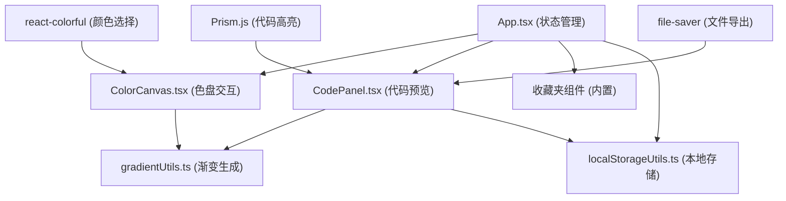

## 1. 架构设计



## 2. 技术描述

- **前端框架**：React 18 + TypeScript 5
- **构建工具**：Vite 5
- **样式方案**：Tailwind CSS 3
- **颜色选择器**：react-colorful
- **代码高亮**：prismjs
- **文件导出**：file-saver
- **状态管理**：React useState/useCallback（轻量级，无需额外状态库）

## 3. 核心文件结构

| 文件路径 | 职责描述 |
|----------|----------|
| `src/App.tsx` | 主应用组件，管理颜色节点、渐变配置、收藏夹状态 |
| `src/components/ColorCanvas.tsx` | 色盘与拖拽交互，渲染颜色节点和曲线连接 |
| `src/components/CodePanel.tsx` | 代码预览面板，Prism.js 高亮，复制/导出功能 |
| `src/utils/gradientUtils.ts` | 渐变配置生成、CSS/Tailwind 字符串构建 |
| `src/utils/localStorageUtils.ts` | 收藏夹本地存储读写 |
| `package.json` | 项目依赖和脚本配置 |
| `vite.config.js` | Vite 构建配置 |
| `tsconfig.json` | TypeScript 严格模式配置 |

## 4. 数据模型

### 4.1 类型定义

```typescript
interface ColorNode {
  id: string;
  color: string;
  position: number; // 0-100 百分比位置
}

interface GradientConfig {
  type: 'linear' | 'radial';
  nodes: ColorNode[];
  angle?: number; // 线性渐变角度 0-360
  radialShape?: 'circle' | 'ellipse';
  radialPosition?: { x: number; y: number }; // 0-100
}

interface SavedGradient {
  id: string;
  name: string;
  config: GradientConfig;
  createdAt: number;
}
```

### 4.2 工具函数定义

**gradientUtils.ts:**
- `generateCSSGradient(config: GradientConfig): string` - 生成 CSS background-image 字符串
- `generateTailwindConfig(config: GradientConfig, name: string): string` - 生成 Tailwind 配置对象
- `validateNodes(nodes: ColorNode[]): boolean` - 验证节点数量 2-8 个

**localStorageUtils.ts:**
- `saveGradient(gradient: SavedGradient): void` - 保存到 localStorage
- `getSavedGradients(): SavedGradient[]` - 读取所有保存的渐变
- `deleteGradient(id: string): void` - 删除指定渐变
- `clearGradients(): void` - 清空收藏夹

## 5. 性能优化策略

1. **requestAnimationFrame**：颜色节点拖拽时使用 rAF 节流，保证 30+ FPS
2. **useMemo/useCallback**：缓存渐变计算结果和事件处理函数
3. **CSS 硬件加速**：使用 transform 和 will-change 优化动画性能
4. **批量更新**：拖拽过程中避免不必要的重渲染
