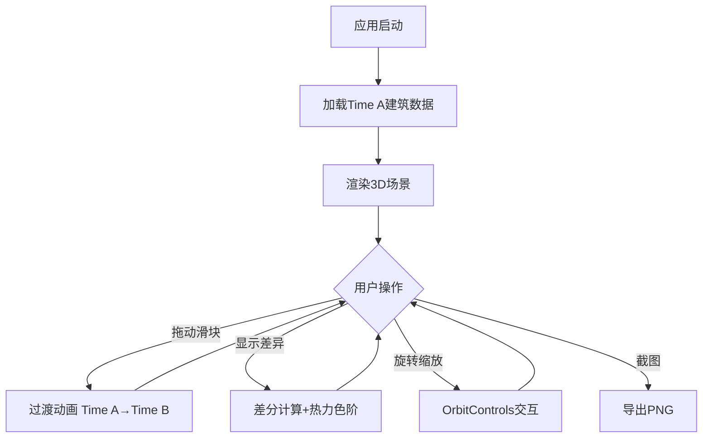

## 1. 产品概述

交互式3D差分对比可视化应用，面向数字孪生和智慧城市工程师，提供直观的3D场景历史变化对比能力。用户通过时间轴滑块动态比较同一三维场景在两个时间点的建筑差异（新增/拆除/高度变化），差异区域以热力色阶高亮，支持旋转缩放和截图导出。

- 核心价值：将传统2D影像叠加分析升级为沉浸式3D差分可视化
- 目标用户：数字孪生工程师、城市规划师、建筑变更审核人员

## 2. 核心功能

### 2.1 功能模块

1. **3D场景渲染页**：地面网格、建筑立方体、光照、相机控制
2. **时间轴对比**：滑块切换Time A/Time B，平滑过渡动画
3. **差分高亮**：热力色阶材质叠加，脉动效果，线框标记
4. **信息面板**：变化统计、建筑变更列表
5. **截图导出**：1920x1080 PNG自动下载

### 2.2 页面详情

| 页面/模块 | 功能 | 描述 |
|-----------|------|------|
| 3D渲染区 | 场景展示 | 20x20地面网格，20-30个随机建筑，OrbitControls交互 |
| 时间轴滑块 | 时间切换 | 底部滑块，Time A↔Time B，1.5s过渡动画 |
| 差分高亮 | 变化可视化 | 红色=新增，蓝→红=高度增加，蓝→橙=高度减少，线框=删除 |
| 信息面板 | 数据统计 | 右侧面板，变化数量统计+建筑变更列表 |
| 截图导出 | 图片保存 | 1920x1080 PNG，文件名diff_日期_时间.png |

## 3. 核心流程

用户打开应用→3D场景加载Time A建筑数据→拖动时间轴滑块至Time B→建筑平滑过渡动画→点击"显示差异"按钮→差分热力色阶高亮→旋转/缩放查看→点击截图导出

## 4. 用户界面设计

### 4.1 设计风格

- 主色调：深色背景 #1a1a2e，UI控件 #16213e，面板 #0f3460
- 按钮：圆角8px，渐变蓝紫色(#0f3460→#533483)，悬停亮度+20%上浮2px
- 时间轴：深蓝渐变轨道，亮蓝色圆形滑块柄(16px+白色发光外圈)
- 字体：白色文字，14px标记文字
- 图例卡片：圆角矩形，半透明白色背景，可拖动

### 4.2 页面设计

| 区域 | 布局 | 元素 |
|------|------|------|
| 3D渲染区 | 左侧75%宽度 | Three.js canvas，地面网格，建筑，北方箭头，图例卡片 |
| 信息面板 | 右侧25%宽度 | 毛玻璃效果，时间点标签，变化统计，建筑列表 |
| 时间轴 | 底部全宽 | 自定义滑块，Time A/B标记 |
| 操作按钮 | 右上角 | 显示差异、截图、复位视角 |

### 4.3 响应式

- 桌面优先设计
- 窗口宽度<768px时，右侧信息面板折叠为顶部横向可展开横条
- 3D渲染区在移动端占满宽度

### 4.4 3D场景指引

- 环境：深色背景，无HDRI，环境光+方向光
- 光照：AmbientLight(0x404060, 0.6) + DirectionalLight(0xffffff, 0.8)
- 相机：PerspectiveCamera，FOV 50°，初始位置(15, 12, 15)，lookAt(0,0,0)
- 交互：OrbitControls，阻尼0.1，缩放范围2-20
- 动画：建筑升起1s+蓝色粒子，碎裂0.8s+白色粒子，高度伸缩1.2s+颜色闪烁
- 性能：30+FPS，差分计算<5ms
