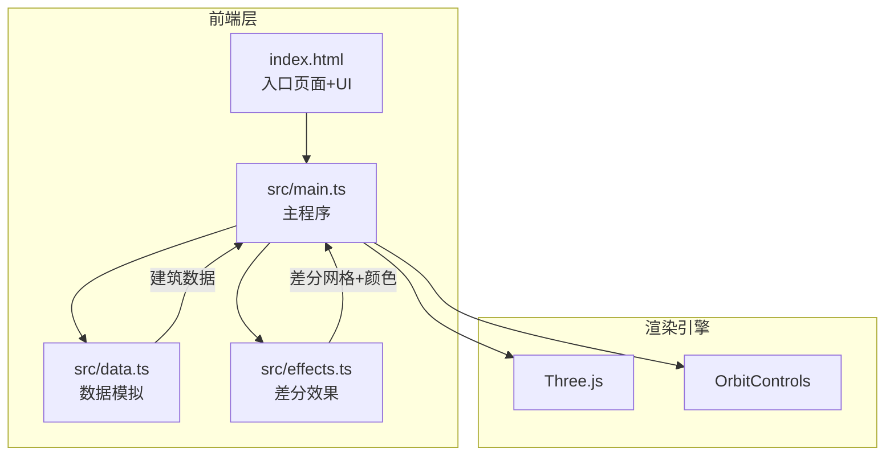

## 1. 架构设计



## 2. 技术说明

- 前端：TypeScript + Three.js + Vite（纯前端，无后端）
- 构建工具：Vite
- 3D引擎：Three.js + OrbitControls
- 语言：TypeScript（严格模式）
- 无需后端和数据库

## 3. 文件结构

```
/
├── package.json          # 依赖：three, typescript, vite, @types/three
├── vite.config.js        # Vite构建配置
├── tsconfig.json         # TypeScript严格模式配置
├── index.html            # 入口页面
└── src/
    ├── main.ts           # 主程序：场景初始化、渲染循环、UI事件
    ├── data.ts           # 数据模拟：两个时间点建筑数据
    └── effects.ts        # 差分效果：差异计算、热力色阶、粒子
```

### 3.1 数据流向

```
data.ts (建筑数据)
    ↓ 导出generateBuildingData()
main.ts (读取数据)
    ↓ 传递两个时间点建筑列表
effects.ts (差异计算)
    ↓ 返回差分网格+颜色映射
main.ts (渲染差分效果)
```

## 4. 数据模型

### 4.1 BuildingData接口

```typescript
interface BuildingData {
  id: string;
  position: { x: number; z: number };
  size: { width: number; depth: number };
  height: number;
  color: string;
  timestamp: string;
  exists: boolean;
}
```

### 4.2 DiffResult接口

```typescript
interface DiffResult {
  added: BuildingData[];
  removed: BuildingData[];
  heightChanged: {
    building: BuildingData;
    oldHeight: number;
    newHeight: number;
    changePercent: number;
  }[];
}
```

## 5. 模块职责

### 5.1 src/data.ts

- `generateBuildingData()`: 生成Time A（20-30个随机建筑）和Time B（基于Time A增删改）
- 建筑参数：宽度0.5-1.2，高度0.5-3，颜色浅灰到深灰渐变
- Time B变化：随机增加/删除5-8个建筑，修改5个建筑高度±0.5

### 5.2 src/effects.ts

- `computeDiff(buildingsA, buildingsB)`: 计算差分结果
- `createDiffMeshes(diffResult)`: 生成差分网格（热力色阶材质）
- `createParticleEffect(type, position)`: 创建粒子效果（升起/碎裂）
- 热力色阶映射：高度增加百分比→深蓝到亮红，高度减少→蓝到橙

### 5.3 src/main.ts

- 初始化Three.js场景、相机、光照、渲染器
- 加载建筑数据并创建3D网格
- 处理时间轴滑块事件，驱动过渡动画
- 管理差分高亮显示/隐藏
- 截图导出功能
- 渲染循环
