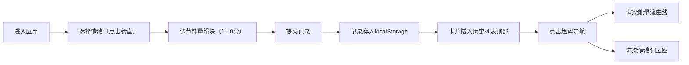

## 1. 产品概述

情绪日记与能量流趋势分析平台，帮助用户通过日常记录追踪情绪状态与能量水平，通过数据可视化发现情绪周期性规律，提升自我觉察能力。

- 核心价值：让用户直观感知自己的情绪与能量变化模式，辅助情绪管理与自我调节
- 目标用户：关注心理健康、希望建立情绪觉察习惯的个人用户

## 2. 核心功能

### 2.1 功能模块

1. **主页（记录视图）**：情绪转盘选择、能量水平滑块、历史记录卡片列表
2. **趋势分析视图**：能量流曲线图、情绪词云图、数据摘要

### 2.2 页面详情

| 页面名称 | 模块名称 | 功能描述 |
|---------|---------|----------|
| 主页 | 导航栏 | 深紫色渐变导航，包含"日记"和"趋势"两个按钮，支持平滑切换 |
| 主页 | 情绪转盘 | 8个扇形区域（快乐/平静/兴奋/感恩/焦虑/悲伤/愤怒/疲倦），渐变颜色，点击选择情绪 |
| 主页 | 能量滑块 | 1-10分能量选择，拖动时显示对应emoji反馈（1分😫→5分😐→10分😄） |
| 主页 | 历史记录列表 | 卡片式展示，背景色匹配情绪，毛玻璃效果，支持悬停删除，最多显示100条 |
| 趋势页 | 能量流曲线 | 最近30天数据，Recharts绘制，数据点用情绪色标记，hover显示tooltip |
| 趋势页 | 摘要文字 | 展示平均能量分、波动情况、主导情绪等统计信息 |
| 趋势页 | 情绪词云 | 近30天情绪频率可视化，词大小代表频率，颜色匹配情绪类型 |

## 3. 核心流程

用户打开应用 → 在主页情绪转盘点击今日情绪 → 拖动能量滑块选择能量水平 → 提交记录 → 记录卡片出现在历史列表顶部 → 点击"趋势"导航查看能量曲线与词云分析 → 发现情绪规律

## 4. 用户界面设计

### 4.1 设计风格

- 主色调：柔和淡紫色（#E8E0F0），营造治愈舒缓氛围
- 导航栏：深紫色渐变（#4A3A5C → #6B5B8A），层次感强
- 卡片风格：圆角12px，轻微阴影，毛玻璃（backdrop-filter）效果
- 情绪配色：
  - 快乐：亮黄色→橙色渐变（#FFD700 → #FF8C00）
  - 平静：薄荷绿→淡青渐变（#98FB98 → #AFEEEE）
  - 兴奋：粉红色→玫红渐变（#FF69B4 → #FF1493）
  - 感恩：暖金色→浅棕渐变（#F4A460 → #DEB887）
  - 焦虑：紫色→浅紫渐变（#9370DB → #DDA0DD）
  - 悲伤：深蓝→浅蓝渐变（#1E3A8A → #87CEEB）
  - 愤怒：红色→橙红渐变（#DC2626 → #F97316）
  - 疲倦：灰蓝→淡灰渐变（#6B7280 → #D1D5DB）
- 动画：页面切换淡入淡出（0.3s），转盘hover缩放，卡片滑入动画
- 字体：使用现代圆润无衬线字体

### 4.2 页面设计概览

| 页面名称 | 模块名称 | UI元素 |
|---------|---------|--------|
| 主页 | 情绪转盘 | 居中圆形，8色渐变扇区，hover时扇形轻微放大、发光 |
| 主页 | 能量滑块 | 自定义轨道和拇指，emoji实时跟随值变化 |
| 主页 | 历史卡片 | 左右布局，左时间右能量分，hover显示删除按钮 |
| 趋势页 | 曲线图 | 平滑曲线，填充渐变，彩色数据点，交互式tooltip |
| 趋势页 | 词云 | 圆形白色半透明背景，浅阴影，响应式字号 |

### 4.3 响应式设计

- 桌面端（≥1024px）：情绪转盘左、历史列表右的双栏布局
- 平板端（768-1023px）：转盘居中，列表下方全宽展示
- 移动端（<768px）：上下单列布局，组件宽度自适应，字体缩小，触控区域优化
