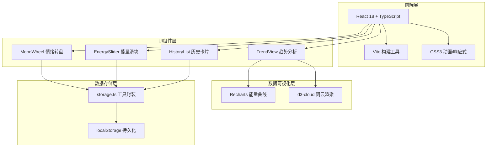

## 1. 架构设计



## 2. 技术描述

- **前端框架**：React 18 + TypeScript（严格模式）
- **构建工具**：Vite 5.x
- **图表库**：Recharts 2.x（能量流曲线图）
- **词云库**：d3-cloud + @types/d3-cloud（情绪词云）
- **HTTP库**：axios（预留API扩展）
- **状态管理**：React useState/useEffect（轻量级，无需额外库）
- **数据持久化**：浏览器 localStorage
- **样式方案**：原生 CSS（内联样式 + style 标签，CSS变量 + CSS动画）
- **后端**：无（纯前端应用）
- **数据库**：localStorage 模拟

## 3. 路由/视图定义

本项目为单页应用（SPA），通过视图切换而非路由：

| 视图名称 | 切换方式 | 展示内容 |
|---------|---------|----------|
| DiaryView（日记） | 导航栏"日记"按钮 | 情绪转盘、能量滑块、历史记录列表 |
| TrendView（趋势） | 导航栏"趋势"按钮 | 能量曲线图、数据摘要、情绪词云 |

## 4. 数据模型

### 4.1 数据结构定义

```typescript
// 情绪类型枚举
type MoodType = 'happy' | 'calm' | 'excited' | 'grateful' | 'anxious' | 'sad' | 'angry' | 'tired';

// 情绪配置项
interface MoodConfig {
  key: MoodType;
  name: string;           // 中文名称
  emoji: string;          // 代表表情
  gradientFrom: string;   // 渐变起始色
  gradientTo: string;     // 渐变结束色
  solidColor: string;     // 卡片主色（用于卡片背景等）
}

// 单条情绪记录
interface MoodRecord {
  id: string;             // UUID
  mood: MoodType;         // 情绪类型
  energy: number;         // 能量分 1-10
  timestamp: number;      // 创建时间戳（ms）
  dateKey: string;        // YYYY-MM-DD 格式日期键，用于趋势查询
}
```

### 4.2 数据存储规范

- **localStorage Key**：`mood-diary-records`
- **存储格式**：JSON 字符串，`MoodRecord[]` 数组
- **最大记录数**：100条（超出后保留最新100条）
- **排序规则**：按 timestamp 降序排列（最新在前）

## 5. 文件结构

```
auto119/
├── package.json              # 项目依赖与脚本
├── index.html                # HTML入口
├── tsconfig.json             # TS配置（严格模式）
├── vite.config.js            # Vite构建配置
└── src/
    ├── main.tsx              # React入口
    ├── App.tsx               # 根组件（视图切换+全局状态）
    ├── types.ts              # 全局类型定义（新增）
    ├── utils/
    │   └── storage.ts        # localStorage读写封装
    └── components/
        ├── MoodWheel.tsx     # 情绪转盘（SVG扇区）
        ├── EnergySlider.tsx  # 能量滑块（自定义range）
        ├── HistoryList.tsx   # 历史卡片列表（新增）
        └── TrendView.tsx     # 趋势视图（Recharts+d3-cloud）
```

## 6. 性能优化策略

1. **虚拟滚动**：历史卡片使用固定高度+可视区域渲染，避免100条全量渲染卡顿
2. **memo优化**：对MoodWheel、TrendView等重组件使用React.memo
3. **CSS硬件加速**：动画使用transform/opacity，避免重排
4. **防抖节流**：滑块拖动事件节流，避免频繁重渲染
5. **requestAnimationFrame**：高频率动画使用rAF确保60fps
6. **CSS过渡**：页面切换使用CSS transition而非JS动画
