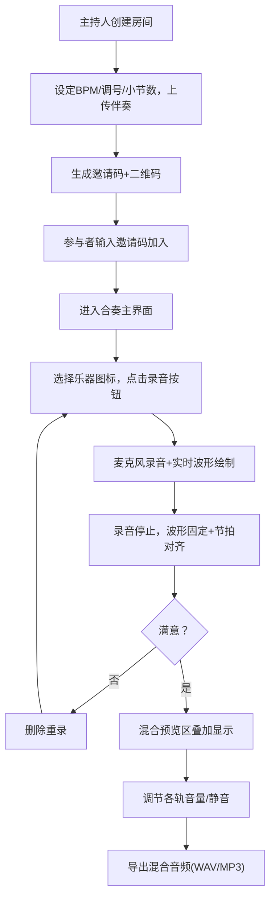

## 1. 产品概述

在线音乐合奏协作平台——多位远程乐手围绕同一首曲目，在浏览器中实时录制和叠加自己的乐器音轨，最终混合生成完整的合奏音频。目标用户为远程协作的乐队、音乐教育课堂及线上即兴合奏爱好者。

## 2. 核心功能

### 2.1 用户角色

| 角色 | 进入方式 | 核心权限 |
|------|----------|----------|
| 主持人 | 创建房间 | 设定BPM/调号/小节数、上传伴奏、移除参与者、锁定房间、设置收听权限、导出混合 |
| 参与者 | 输入邀请码加入 | 录音/回放/删除自己的音轨、调节音量和静音、查看混合预览 |

### 2.2 功能模块

1. **房间创建/加入页**：主持人创建房间设定参数、上传伴奏、生成邀请码和二维码；参与者输入邀请码加入
2. **合奏主界面**：多轨时间线、混合预览区、全局状态栏、页脚信息栏

### 2.3 页面详情

| 页面名称 | 模块名称 | 功能描述 |
|----------|----------|----------|
| 房间创建页 | 房间配置表单 | 填写房间名称、BPM(60-180)、调号、总小节数，上传伴奏MP3(≤5MB)，提交后生成6位邀请码和二维码 |
| 房间加入页 | 邀请码输入 | 输入6位邀请码加入房间，显示房间基本信息确认 |
| 合奏主界面 | 全局状态栏 | 显示BPM(可编辑+微调滑块)、节拍器开关、房间名称、当前小节/总小节数 |
| 合奏主界面 | 多轨时间线 | 纵向排列的多轨波形，每轨含乐手头像/昵称/乐器图标切换/录音按钮/回放按钮/删除按钮，波形实时卷动，播放头线匀速移动 |
| 合奏主界面 | 混合预览区 | 叠加波形显示(白色线条，超0dB红色闪烁)，各轨音量滑块(0-100)和静音开关，导出混合按钮(WAV/MP3，44100Hz 16bit) |
| 合奏主界面 | 主持人控制 | 移除参与者(头像右上角红叉)、锁定房间、设置收听权限 |
| 合奏主界面 | 页脚 | 网络延迟(ping值，颜色指示)、帮助按钮(弹出操作指南) |

## 3. 核心流程

## 4. 用户界面设计

### 4.1 设计风格

- 深色主题：主背景 #121220，卡片背景 #1e1e32，文字 #e0e0f0
- 状态栏：深蓝灰渐变 #2a2a3e→#1a1a2e，高度60px，底部1px亮蓝分隔线
- 播放头线：黄色带发光效果
- 录音状态：绿色脉冲动画边框，波形绿色2px(峰值亮黄)
- 混合预览区：半透明黑背景，白色线条，超0dB红色闪烁
- 按钮悬停：亮度提升20%+缩放过渡(0.2s ease-in-out)
- 点击反馈：缩放至0.95后恢复
- 导出按钮：绿色，悬停亮绿

### 4.2 页面设计概览

| 页面名称 | 模块名称 | UI元素 |
|----------|----------|--------|
| 合奏主界面 | 全局状态栏 | 深蓝灰渐变背景，BPM数字+微调滑块，节拍器图标(脉冲动画)，房间名称(24px白色粗体)，小节计数 |
| 合奏主界面 | 多轨时间线 | 纵向排列轨道，左列：圆形头像(随机颜色+乐器图标标记)+昵称+乐器图标下拉+播放/录音/删除按钮；右列：波形区域+黄色播放头线 |
| 合奏主界面 | 混合预览区 | 半透明黑背景，混合波形(白线/红线)，垂直音量滑块(圆形手柄带阴影)，静音按钮(红色斜线)，绿色导出按钮 |
| 合奏主界面 | 主持人控制 | 头像右上角红色叉号，锁定图标，在线人数+录音时长列表 |
| 合奏主界面 | 页脚 | ping值(绿/黄/红)，问号帮助图标 |

### 4.3 响应式设计

桌面优先设计，最小支持1280px宽度。时间线区域支持垂直滚动以容纳多轨道。

### 4.4 性能要求

- 实时录音和波形绘制延迟 ≤ 50ms
- 音频混合导出时间 ≤ 音频实际时长
- 伴奏MP3限制5MB以内
- 导出采样率44100Hz，位深16bit
