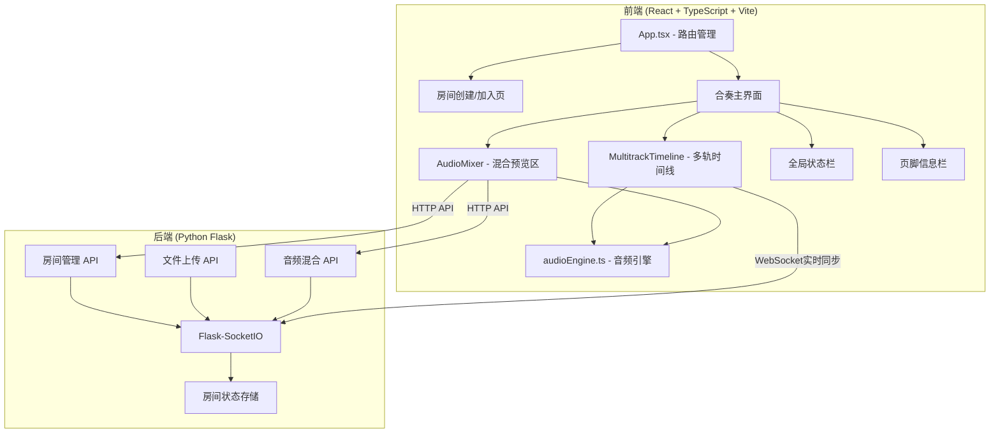
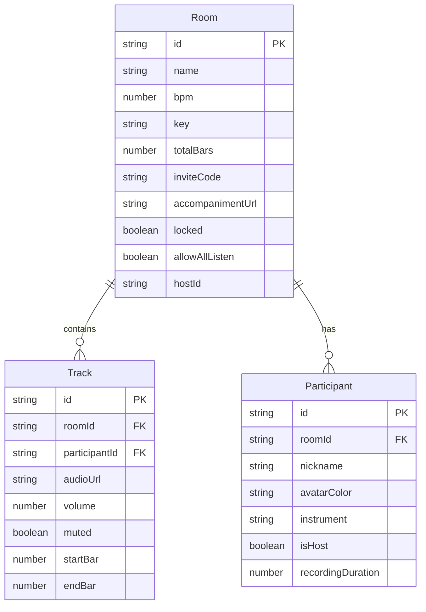

## 1. 架构设计



## 2. 技术说明

- 前端：React@18 + TypeScript + Vite + Tailwind CSS
- 音频处理：Tone.js (实时录音/节拍对齐) + WaveSurfer.js (波形显示)
- 状态管理：Zustand
- 后端：Python Flask + Flask-SocketIO (WebSocket通信)
- 通信：Socket.IO Client (实时状态同步) + Axios (HTTP API调用)
- 构建：Vite，代理后端端口5000

## 3. 路由定义

| 路由 | 用途 |
|------|------|
| / | 首页，房间创建/加入入口 |
| /room/:roomId | 合奏主界面 |

## 4. API 定义

### 4.1 房间管理 API

```typescript
interface CreateRoomRequest {
  name: string;
  bpm: number;
  key: string;
  totalBars: number;
  accompaniment: File;
}

interface CreateRoomResponse {
  roomId: string;
  inviteCode: string;
}

interface JoinRoomRequest {
  inviteCode: string;
}

interface JoinRoomResponse {
  roomId: string;
  name: string;
  bpm: number;
  key: string;
  totalBars: number;
  tracks: Track[];
}
```

### 4.2 WebSocket 事件

```typescript
interface ServerToClientEvents {
  "track:added": (track: Track) => void;
  "track:updated": (track: Track) => void;
  "track:removed": (trackId: string) => void;
  "playhead:position": (position: number) => void;
  "bpm:changed": (bpm: number) => void;
  "participant:removed": (participantId: string) => void;
  "room:locked": () => void;
}

interface ClientToServerEvents {
  "track:record:start": (trackId: string) => void;
  "track:record:stop": (trackId: string, audioData: ArrayBuffer) => void;
  "track:volume": (trackId: string, volume: number) => void;
  "track:mute": (trackId: string, muted: boolean) => void;
  "bpm:change": (bpm: number) => void;
  "participant:remove": (participantId: string) => void;
  "room:lock": () => void;
}
```

### 4.3 音频混合导出 API

```typescript
interface MixExportRequest {
  roomId: string;
  trackIds: string[];
  volumes: Record<string, number>;
  format: "wav" | "mp3";
}

interface MixExportResponse {
  downloadUrl: string;
}
```

## 5. 数据模型



## 6. 文件结构

```
├── package.json
├── index.html
├── tsconfig.json
├── vite.config.js
├── server/
│   ├── app.py              # Flask 主应用
│   ├── routes/
│   │   ├── rooms.py        # 房间管理路由
│   │   └── audio.py        # 音频混合路由
│   └── requirements.txt    # Python 依赖
├── src/
│   ├── main.tsx            # React 入口
│   ├── App.tsx             # 主应用组件+路由
│   ├── store/
│   │   └── useRoomStore.ts # Zustand 状态管理
│   ├── components/
│   │   ├── MultitrackTimeline.tsx  # 多轨时间线
│   │   ├── AudioMixer.tsx          # 混合预览区
│   │   ├── GlobalStatusBar.tsx     # 全局状态栏
│   │   └── Footer.tsx              # 页脚
│   └── utils/
│       └── audioEngine.ts  # 音频引擎
└── uploads/                # 上传文件存储
```
