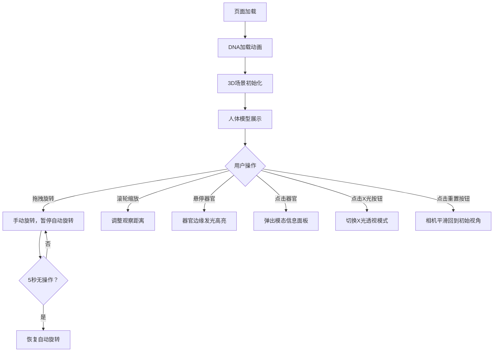

## 1. 产品概述

交互式3D人体解剖探索应用，面向生物医学研究人员和科普教育学习者，通过Three.js构建沉浸式3D场景，让用户从任意角度观察人体主要器官系统的结构与相对位置，支持点击查看器官信息、X光透视模式切换和视角重置等功能，解决传统教学图册缺乏沉浸感与交互性的问题。

## 2. 核心功能

### 2.1 功能模块

1. **3D场景页面**：全屏3D画布，展示人体器官模型，支持拖拽旋转、滚轮缩放、点击交互

### 2.2 页面详情

| 页面名称 | 模块名称 | 功能描述 |
|----------|----------|----------|
| 3D场景页面 | 人体模型展示 | 程序化生成10+器官几何体，不同颜色区分，MeshStandardMaterial接受光照 |
| 3D场景页面 | 交互拾取与信息显示 | 鼠标悬停高亮器官边缘、手势指针；点击弹出模态面板显示器官名称和描述 |
| 3D场景页面 | X光透视模式 | 右上角切换按钮，器官半透明蓝色调，骨骼白色线框显示 |
| 3D场景页面 | 视角重置与自动旋转 | 左下角重置按钮，相机平滑过渡；默认自动旋转，拖拽暂停，5秒后恢复 |
| 3D场景页面 | 加载动画 | DNA双螺旋线框旋转动画 |
| 3D场景页面 | 控制栏 | 底部半透明栏，显示操作提示文字 |

## 3. 核心流程

用户打开页面 → DNA加载动画播放 → 场景加载完成显示人体模型 → 用户可拖拽旋转观察 → 鼠标悬停器官高亮 → 点击器官弹出信息面板 → 可切换X光模式 → 可重置视角



## 4. 用户界面设计

### 4.1 设计风格

- 主色调：深色背景 #1a1a2e，文字 #e0e0e0
- 器官颜色：心脏#E53935，肺#F48FB1，肝脏#B71C1C，胃#FFB74D，大脑#FCE4EC，骨骼#F5F5DC
- 按钮风格：圆形，深灰背景，激活变蓝，hover缩放1.05
- 字体：'Segoe UI', Roboto, sans-serif（无衬线）
- 布局：全屏3D画布，覆盖式UI控件

### 4.2 页面设计概览

| 页面名称 | 模块名称 | UI元素 |
|----------|----------|--------|
| 3D场景页面 | X光切换按钮 | 右上角圆形40px，X光图标，深灰→蓝色切换，hover缩放1.05 |
| 3D场景页面 | 视角重置按钮 | 左下角圆形36px，瞄准器图标，白色背景阴影，hover缩放1.05 |
| 3D场景页面 | 信息面板 | 毛玻璃背景，圆角16px，底部滑入0.3s，器官名称+描述，关闭按钮 |
| 3D场景页面 | 控制栏 | 底部60px高，黑色透明0.7，提示文字，<768px缩为图标 |
| 3D场景页面 | 加载动画 | DNA双螺旋线框旋转，居中显示 |

### 4.3 响应式

- 桌面优先设计，全屏画布100vw×100vh
- 宽度<768px时控制栏文字缩小为图标提示
- 所有UI控件保持可点击和可见

### 4.4 3D场景指引

- 环境：深色背景，无HDRI，使用定向光+环境光
- 灯光：DirectionalLight主光源 + AmbientLight环境补光
- 相机：PerspectiveCamera，FOV 45°，初始正面视角，距离约5
- 交互：OrbitControls拖拽旋转缩放，Raycaster点击拾取
- 动画：自动旋转1°/s，TWEEN缓动视角重置
- 性能：器官顶点总数≤5000，60fps目标

## 5. 数据定义

### 5.1 器官数据结构

```typescript
interface OrganData {
  name: string;        // 中文名称
  description: string; // 50字以内功能描述
  color: string;       // 十六进制颜色
  position: [number, number, number]; // 相对位置
  scale: [number, number, number];    // 缩放
  geometryType: 'sphere' | 'cylinder' | 'custom'; // 几何体类型
}
```
