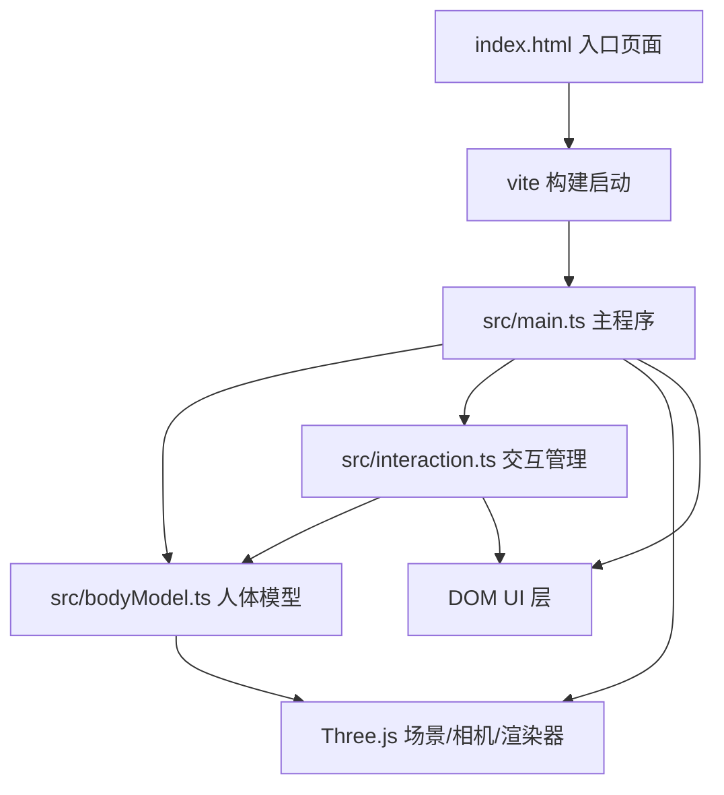

## 1. 架构设计

数据流向：
- `main.ts` 初始化场景、相机、渲染器，实例化 `bodyModel` 和 `interaction`
- `main.ts` 将鼠标事件分发给 `interaction`
- `interaction` 通过 raycaster 拾取器官，调用 `bodyModel` 的方法切换可见性/材质
- `interaction` 触发 DOM 层的模态面板显示
- `bodyModel` 返回 Three.js Group 对象供 `main.ts` 添加到场景

## 2. 技术说明

- 前端：TypeScript + Three.js + Vite（纯前端，无后端）
- 初始化工具：Vite
- 3D库：three + @types/three
- 动画缓动：tween.js（@tweenjs/tween.js）
- 无数据库、无后端服务

## 3. 文件结构与职责

| 文件 | 职责 | 调用关系 |
|------|------|----------|
| package.json | 依赖管理，启动脚本 | - |
| index.html | 入口页面，加载动画，提示文本 | 引用 main.ts |
| vite.config.js | Vite构建配置 | - |
| tsconfig.json | TypeScript严格模式配置 | - |
| src/main.ts | 主程序：初始化场景/相机/渲染器/OrbitControls，加载bodyModel，启动动画循环，分发鼠标事件 | → bodyModel, interaction |
| src/bodyModel.ts | 人体模型类：程序化生成器官几何体，管理可见性和材质透明度切换 | 被 main.ts 实例化 |
| src/interaction.ts | 交互管理类：raycaster拾取，悬停高亮，点击弹出面板，X光模式切换 | 监听main.ts事件，调用bodyModel方法 |

## 4. 关键技术决策

### 4.1 器官几何体方案

使用 SphereGeometry、CylinderGeometry 组合简化表现器官形状，每个器官顶点数控制在200-500，总计≤5000。使用 MeshStandardMaterial 接受光照，通过 bumpScale 参数模拟凹凸感。

### 4.2 交互拾取方案

使用 Three.js Raycaster 进行鼠标拾取，每帧检测悬停，点击时精确拾取。高亮效果通过在选中器官上叠加略大的半透明轮廓网格实现。

### 4.3 X光模式方案

切换时遍历所有器官mesh，修改material的opacity和color偏向蓝色调，骨骼部分切换为线框材质（白色）。使用material.transparent = true 实现半透明。

### 4.4 动画方案

- 自动旋转：在动画循环中对bodyModel Group进行Y轴旋转
- 视角重置：使用 @tweenjs/tween.js 对相机位置进行缓动动画
- 暂停/恢复：记录用户交互时间，5秒无操作恢复自动旋转

### 4.5 UI方案

纯HTML/CSS实现UI层（X光按钮、重置按钮、信息面板、控制栏、加载动画），通过CSS动画实现面板滑入滑出效果，不使用UI框架。
