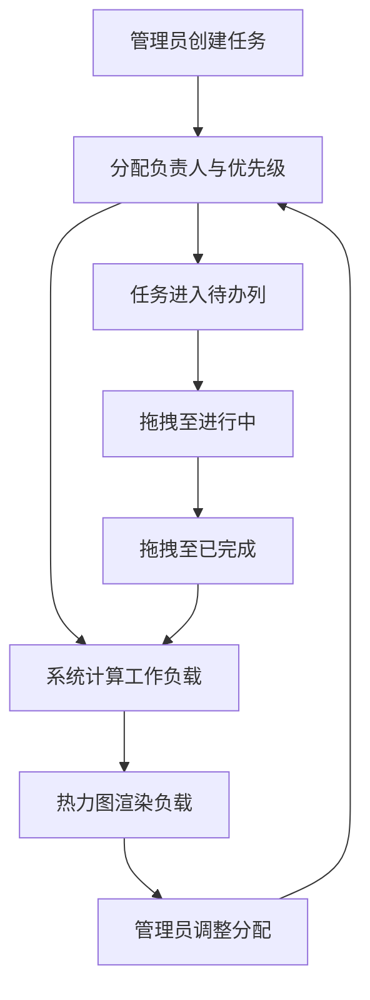

## 1. 产品概述

团队项目进度看板与工作负载热力图分析应用，旨在帮助团队高效管理项目任务、可视化成员工作负载，实现任务全生命周期管理（创建→分配→执行→完成）与负载预警。目标用户为中小型研发团队（5-50人），核心价值在于将任务管理与资源调度融合为统一视图，避免成员过载或闲置。

## 2. 核心功能

### 2.1 用户角色
| 角色 | 注册方式 | 核心权限 |
|------|----------|----------|
| 管理员 | 系统预设 | 创建/编辑/删除任务和成员，查看热力图 |
| 团队成员 | 管理员添加 | 查看看板与热力图，拖拽更新任务状态 |

### 2.2 功能模块
1. **看板视图**：三列拖拽看板（待办/进行中/已完成），任务卡片支持创建、拖拽排序、状态切换
2. **热力图视图**：日历网格热力图，按成员×日期展示工作负载百分比，颜色渐变（绿→黄→橙→红）
3. **成员管理**：管理员添加/编辑/删除成员，设置每日默认可用工时

### 2.3 页面详情
| 页面名称 | 模块名称 | 功能描述 |
|----------|----------|----------|
| 看板视图 | 状态列 | 三列看板，每列显示状态名与任务计数，支持跨列拖拽 |
| 看板视图 | 任务卡片 | 显示标题、负责人头像、优先级徽章、截止日期倒计时 |
| 看板视图 | 添加任务对话框 | 模态弹窗，输入标题/描述/负责人/优先级/截止日期 |
| 热力图视图 | 月份选择器 | 左右箭头切换月份 |
| 热力图视图 | 负载网格 | 成员×日期网格，每个单元格显示负载百分比与渐变色背景 |
| 热力图视图 | 工具提示 | 鼠标悬停显示当日任务列表与预估总工时 |
| 成员管理 | 成员列表 | 表格展示所有成员，支持行内编辑与删除 |
| 成员管理 | 添加成员 | 输入姓名与默认可用工时/天 |

## 3. 核心流程

用户在看板创建任务并分配负责人和工时 → 系统自动计算每位成员每日工作负载 → 热力图实时可视化负载分布 → 管理员根据热力图调整任务分配 → 看板与热力图数据双向同步

## 4. 用户界面设计

### 4.1 设计风格
- 主题色：暗色主题（背景 #1a1d23，卡片 #2a2d35，文字 #e0e0e0）
- 按钮风格：圆角（12px），悬停亮度增加15%，过渡0.2s
- 字体：Inter, sans-serif
- 布局风格：顶部导航标签切换，看板三列并排，热力图网格布局
- 图标风格：Google Material Icons

### 4.2 页面设计概述
| 页面名称 | 模块名称 | UI元素 |
|----------|----------|--------|
| 看板视图 | 状态列 | 圆角12px列容器，背景#252830，顶部状态名+蓝色计数标签 |
| 看板视图 | 任务卡片 | 圆角12px，边框1px #3a3d45，拖拽时0.95倍缩放+阴影 |
| 看板视图 | 添加任务对话框 | 浮动居中模态，半透明遮罩0.3s淡入，表单布局 |
| 热力图视图 | 负载网格 | 单元格圆角6px，网格线，颜色渐变绿→黄→橙→红 |
| 热力图视图 | 月份选择器 | 左右箭头+当前月份文字 |
| 成员管理 | 成员列表 | 表格布局，行内编辑，编辑/删除按钮 |

### 4.3 响应式适配
- 桌面优先设计
- 页面宽度<768px时：看板三列垂直堆叠，热力图改为每日列表视图
- 触控优化：拖拽操作适配触摸设备

### 4.4 3D场景指导
- 不适用
