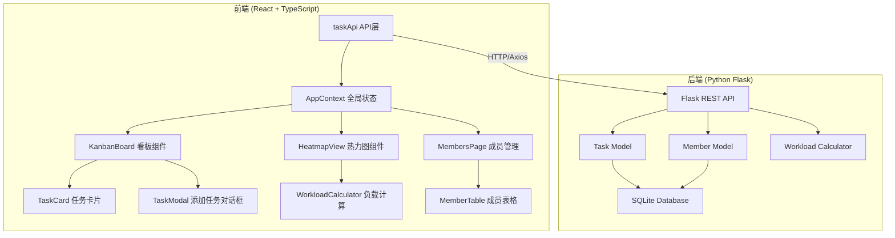
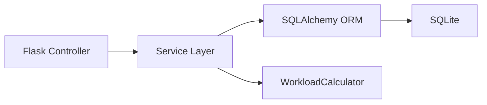
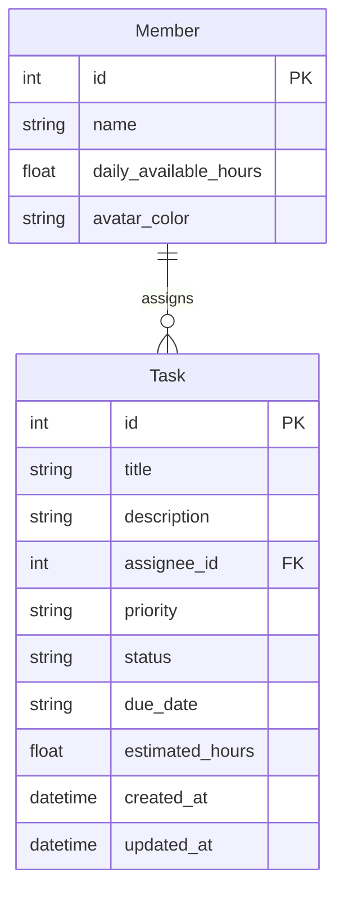

## 1. 架构设计



## 2. 技术说明
- 前端：React@18 + TypeScript + Vite + Tailwind CSS
- 初始化工具：vite-init（react-ts模板）
- 后端：Python Flask + SQLAlchemy + Flask-CORS
- 数据库：SQLite

## 3. 路由定义
| 路由 | 用途 |
|------|------|
| / | 主页面，包含看板/热力图/成员管理三个标签页 |

## 4. API定义

### 4.1 任务相关
| 方法 | 路径 | 请求体 | 响应 |
|------|------|--------|------|
| GET | /api/tasks | - | `Task[]` |
| POST | /api/tasks | `{title, description, assignee_id, priority, due_date, estimated_hours}` | `Task` |
| PUT | /api/tasks/:id | `{status?, title?, description?, assignee_id?, priority?, due_date?, estimated_hours?}` | `Task` |
| DELETE | /api/tasks/:id | - | `{success: bool}` |

### 4.2 成员相关
| 方法 | 路径 | 请求体 | 响应 |
|------|------|--------|------|
| GET | /api/members | - | `Member[]` |
| POST | /api/members | `{name, daily_available_hours}` | `Member` |
| PUT | /api/members/:id | `{name?, daily_available_hours?}` | `Member` |
| DELETE | /api/members/:id | - | `{success: bool}` |

### 4.3 负载相关
| 方法 | 路径 | 请求体 | 响应 |
|------|------|--------|------|
| GET | /api/workload?month=YYYY-MM | - | `{member_id: {date: hours}}` |

### 4.4 TypeScript类型定义
```typescript
interface Task {
  id: number;
  title: string;
  description: string;
  assignee_id: number;
  priority: 'urgent' | 'high' | 'medium' | 'low';
  status: 'todo' | 'in_progress' | 'done';
  due_date: string;
  estimated_hours: number;
  created_at: string;
  updated_at: string;
}

interface Member {
  id: number;
  name: string;
  daily_available_hours: number;
  avatar_color: string;
}

interface WorkloadDay {
  member_id: number;
  date: string;
  total_hours: number;
  load_percentage: number;
  tasks: Task[];
}
```

## 5. 服务器架构图



## 6. 数据模型

### 6.1 数据模型定义



### 6.2 数据定义语言
```sql
CREATE TABLE member (
    id INTEGER PRIMARY KEY AUTOINCREMENT,
    name VARCHAR(100) NOT NULL,
    daily_available_hours FLOAT DEFAULT 8.0,
    avatar_color VARCHAR(7) NOT NULL
);

CREATE TABLE task (
    id INTEGER PRIMARY KEY AUTOINCREMENT,
    title VARCHAR(200) NOT NULL,
    description TEXT DEFAULT '',
    assignee_id INTEGER NOT NULL,
    priority VARCHAR(20) DEFAULT 'medium',
    status VARCHAR(20) DEFAULT 'todo',
    due_date DATE,
    estimated_hours FLOAT DEFAULT 1.0,
    created_at DATETIME DEFAULT CURRENT_TIMESTAMP,
    updated_at DATETIME DEFAULT CURRENT_TIMESTAMP,
    FOREIGN KEY (assignee_id) REFERENCES member(id)
);
```
