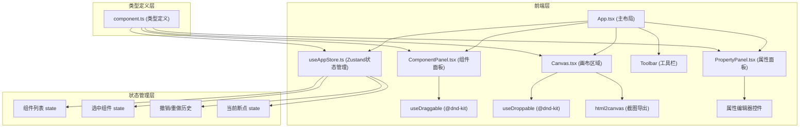

## 1. 架构设计



## 2. 技术描述

### 2.1 技术栈

- **前端框架**：React 18 + TypeScript
- **构建工具**：Vite 5
- **状态管理**：Zustand 4
- **拖拽库**：@dnd-kit/core + @dnd-kit/sortable
- **截图导出**：html2canvas
- **图标库**：lucide-react
- **样式方案**：CSS Modules + CSS Variables

### 2.2 核心依赖

```json
{
  "react": "^18.2.0",
  "react-dom": "^18.2.0",
  "typescript": "^5.3.0",
  "vite": "^5.0.0",
  "zustand": "^4.4.0",
  "@dnd-kit/core": "^6.1.0",
  "@dnd-kit/sortable": "^8.0.0",
  "html2canvas": "^1.4.1",
  "lucide-react": "^0.294.0",
  "@types/react": "^18.2.0",
  "@types/react-dom": "^18.2.0"
}
```

### 2.3 项目结构

```
├── src/
│   ├── components/
│   │   ├── ComponentPanel.tsx    # 左侧组件面板
│   │   ├── Canvas.tsx            # 中间画布区域
│   │   └── PropertyPanel.tsx     # 右侧属性面板
│   ├── store/
│   │   └── useAppStore.ts        # Zustand全局状态管理
│   ├── types/
│   │   └── component.ts          # 类型定义
│   ├── App.tsx                   # 主应用组件
│   └── main.tsx                  # React入口
├── index.html                    # 入口HTML
├── vite.config.js                # Vite配置
├── tsconfig.json                 # TypeScript配置
└── package.json                  # 项目配置
```

## 3. 类型定义

### ComponentData 接口

```typescript
interface ComponentStyle {
  width: number;
  widthUnit: 'px' | '%';
  height: number;
  heightUnit: 'px' | 'auto';
  backgroundColor: string;
  marginTop: number;
  marginRight: number;
  marginBottom: number;
  marginLeft: number;
  paddingTop: number;
  paddingRight: number;
  paddingBottom: number;
  paddingLeft: number;
  borderRadius: number;
  borderColor: string;
  borderWidth: number;
  borderStyle: 'solid' | 'dashed' | 'dotted' | 'none';
  boxShadowX: number;
  boxShadowY: number;
  boxShadowBlur: number;
  boxShadowColor: string;
}

interface ComponentData {
  id: string;
  type: 'navbar' | 'carousel' | 'cardGrid' | 'twoColumn' | 'threeColumn' | 'footer';
  x: number;
  y: number;
  style: ComponentStyle;
}
```

### 断点类型

```typescript
type Breakpoint = 'mobile' | 'tablet' | 'laptop' | 'desktop';

const BREAKPOINT_WIDTHS: Record<Breakpoint, number> = {
  mobile: 375,
  tablet: 768,
  laptop: 1024,
  desktop: 1440,
};
```

## 4. 状态管理设计

### Zustand Store 结构

```typescript
interface AppState {
  // 组件列表
  components: ComponentData[];
  // 当前选中组件ID
  selectedComponentId: string | null;
  // 当前断点
  currentBreakpoint: Breakpoint;
  // 历史记录
  history: ComponentData[][];
  historyIndex: number;
  // 操作方法
  addComponent: (component: ComponentData) => void;
  updateComponent: (id: string, updates: Partial<ComponentData>) => void;
  deleteComponent: (id: string) => void;
  selectComponent: (id: string | null) => void;
  setBreakpoint: (breakpoint: Breakpoint) => void;
  undo: () => void;
  redo: () => void;
  clearCanvas: () => void;
  saveToHistory: () => void;
}
```

### 撤销/重做实现

- 使用数组存储历史状态
- `historyIndex` 指向当前状态
- 每次修改前保存当前状态到历史
- 撤销时 `historyIndex--`
- 重做时 `historyIndex++`
- 最大历史记录数：50

## 5. 核心功能实现

### 5.1 拖拽功能

- 使用 `@dnd-kit/core` 实现拖拽
- `ComponentPanel` 中的组件使用 `useDraggable`
- `Canvas` 使用 `useDroppable` 接收拖拽
- 拖拽时显示半透明位置指示线（蓝色虚线）
- 组件边缘吸附逻辑

### 5.2 属性编辑

- `PropertyPanel` 根据选中组件ID获取组件数据
- 使用受控组件实现双向绑定
- 修改时调用 `updateComponent` 更新状态
- 状态变化触发画布重绘

### 5.3 断点切换

- 顶部4个断点按钮
- 点击时更新 `currentBreakpoint`
- 画布宽度平滑过渡动画（0.4秒）
- 组件根据新宽度自动适配

### 5.4 导出功能

- **导出HTML**：生成包含所有组件样式的独立HTML文件，触发下载
- **导出截图**：使用 `html2canvas` 截取画布区域，生成PNG并下载

## 6. 性能优化

### 6.1 拖拽性能

- 使用 `@dnd-kit` 的硬件加速拖拽
- 避免拖拽过程中频繁重渲染
- 使用 CSS transforms 实现拖拽预览

### 6.2 重绘优化

- 使用 React.memo 优化组件渲染
- Zustand 状态选择器避免不必要重渲染
- 属性修改使用批处理更新

### 6.3 截图优化

- `html2canvas` 配置优化
- 截图前暂停动画
- 控制画布组件数量上限

## 7. 开发脚本

| 命令 | 描述 |
|------|------|
| `npm run dev` | 启动开发服务器（端口3000） |
| `npm run build` | 构建生产版本 |
| `npm run preview` | 预览生产构建 |
