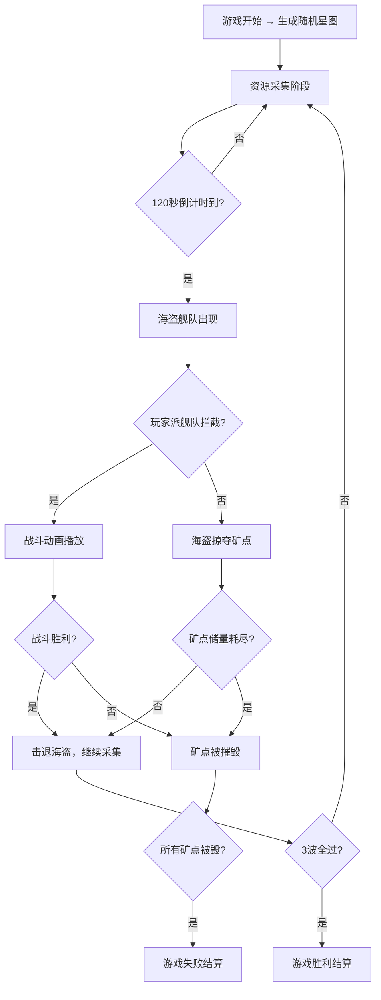

## 1. 产品概述

星际矿工是一款资源采集与舰队指挥策略游戏。玩家在随机生成的星图上派遣采矿舰队采集铁、铜、水晶、稀有矿四类星际资源，并建造防御工事抵御周期性来袭的太空海盗舰队，结合实时战略操作与资源管理，提供紧张刺激的太空战斗体验。

## 2. 核心功能

### 2.1 用户角色
| 角色 | 注册方式 | 核心权限 |
|------|----------|----------|
| 玩家 | 无需注册，直接开始游戏 | 资源采集、舰队指挥、建造防御、战斗指挥 |

### 2.2 功能模块
1. **星图主界面**: 星图Canvas渲染、行星与矿点显示、舰队位置与移动、交互操作（点击/框选）
2. **资源采集系统**: 矿点采矿、资源实时更新、矿点储量管理
3. **舰队指挥系统**: 舰队选择与移动、批量指令、采矿/战斗指令下发
4. **战斗系统**: 海盗来袭机制、自动战斗动画、胜负判定
5. **建造系统**: 防御炮塔建造、舰队升级、资源消耗
6. **游戏结束与结算**: 胜负判定、数据统计、重新开始

### 2.3 页面详情
| 页面名称 | 模块名称 | 功能描述 |
|----------|----------|----------|
| 星图主界面 | 星图Canvas | 渲染行星、矿点、舰队，支持点击矿点采矿、框选舰队、显示战斗动画 |
| 星图主界面 | 资源条 | 左侧竖排显示四种资源数量与增量，数字变化时有缩放动画 |
| 星图主界面 | 舰队面板 | 右侧显示舰队卡片列表，批量指令按钮，任务状态与进度条 |
| 星图主界面 | 顶部状态栏 | 游戏时钟、波次倒计时显示 |
| 星图主界面 | 底部功能栏 | 集合/分散/建造功能按钮 |
| 建造模态框 | 建造界面 | 半透明毛玻璃模态框，炮塔建造与舰队升级选项 |
| 结算页面 | 游戏结果 | 采集总量、存活舰船数、击退海盗次数统计，再来一局按钮 |

## 3. 核心流程

## 4. 界面设计

### 4.1 设计风格
- 主色调：深蓝黑 #1a1a2e，辅助色金色 #ffd700，蓝色 #0f4c81
- 按钮风格：圆角按钮，悬停上浮2px+阴影，点击收缩0.1秒
- 字体：monospace 等宽字体
- 布局：全屏星图背景，左侧8%资源条，右侧20%舰队面板
- 风格关键词：深空科幻、金属质感、全息投影

### 4.2 页面设计概览
| 页面名称 | 模块名称 | UI元素 |
|----------|----------|--------|
| 星图主界面 | 星图Canvas | 深蓝到黑色径向渐变背景，闪烁白点星空，行星用大圆点，矿点20px半透明发光圆点，舰队用小三角图标 |
| 星图主界面 | 资源条 | 左侧8%宽度，竖排图标+数字+增量，数字变化0.3秒缩放动画 |
| 星图主界面 | 舰队面板 | 右侧20%宽度，圆角卡片，毛玻璃背景，左侧船图标+右侧状态文字+渐变进度条 |
| 星图主界面 | 顶部状态栏 | 中央游戏时钟+波次倒计时，半透明深色背景 |
| 星图主界面 | 底部功能栏 | 集合/分散/建造按钮，悬停上浮+阴影，点击收缩 |
| 建造模态框 | 建造界面 | 半透明毛玻璃模态框，炮塔与升级选项卡片 |
| 结算页面 | 游戏结果 | 全屏半透明遮罩，居中统计卡片，再来一局按钮 |

### 4.3 响应式
- 桌面优先设计，1920x1080和1440x900分辨率使用vh/vw等比缩放
- 移动端展示核心资源条，隐藏舰队面板部分内容

### 4.4 动画效果
- 矿点：半透明发光，鼠标悬停弹出信息窗，采矿时周围流动粒子效果
- 海盗出现：红色闪烁0.5秒提示
- 战斗：舰船互射激光弹幕，护盾和血条动画
- 矿点被毁：碎裂动画
- 炮塔：六边形+旋转炮管，开火时炮管发红光
- 框选：蓝色半透明矩形选区
