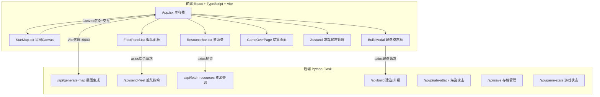
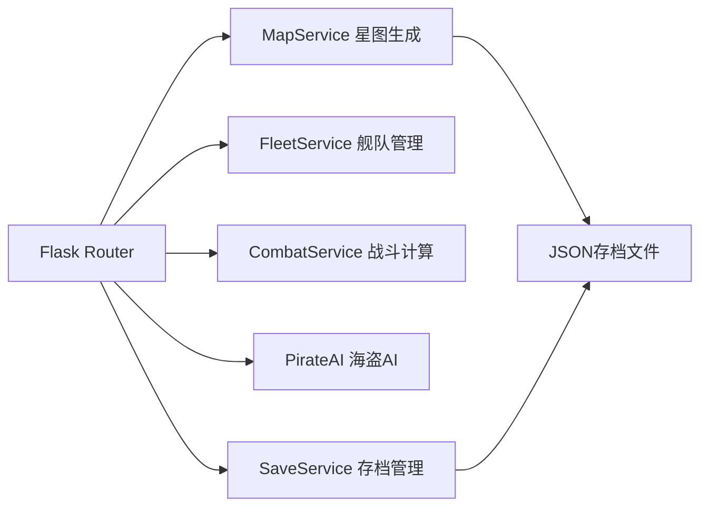
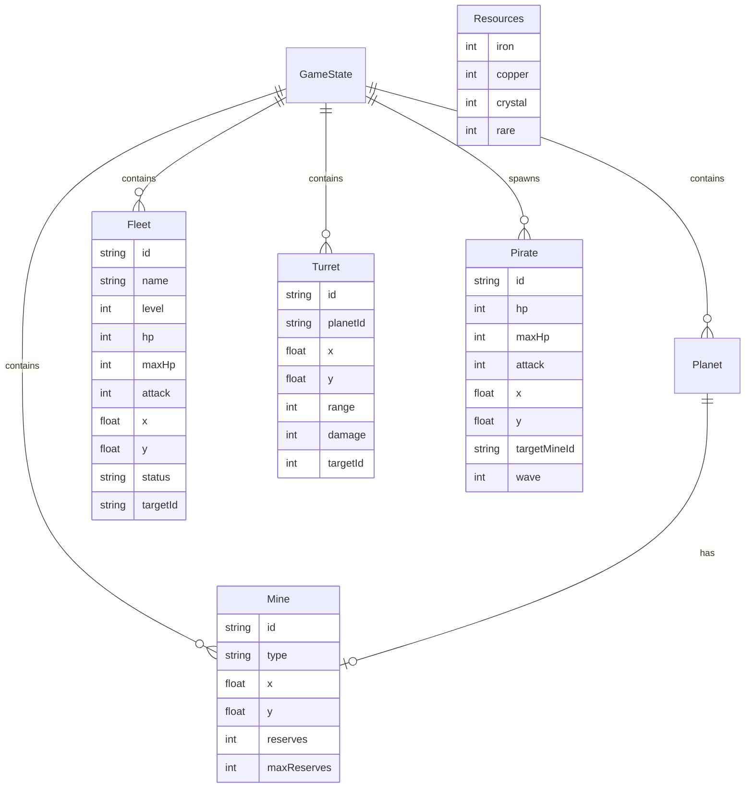

## 1. 架构设计



## 2. 技术说明
- 前端：React 18 + TypeScript + Vite + react-konva（Canvas渲染）+ zustand（状态管理）+ axios（HTTP请求）
- 构建工具：Vite，开发代理后端5000端口
- 后端：Python Flask，提供星图生成、NPC AI、存档管理REST API
- 数据存储：JSON文件存储玩家存档（轻量级方案）
- 初始化工具：Vite init

## 3. 路由定义
| 路由 | 用途 |
|------|------|
| / | 游戏主界面（星图+资源条+舰队面板） |

## 4. API定义

### 4.1 生成星图
- **POST** `/api/generate-map`
- 请求：`{ "seed": number | null }`
- 响应：`{ "planets": Planet[], "mines": Mine[], "width": number, "height": number }`

### 4.2 发送舰队指令
- **POST** `/api/send-fleet`
- 请求：`{ "fleetIds": string[], "action": "mine"|"attack"|"rally"|"scatter", "targetId"?: string }`
- 响应：`{ "success": boolean, "fleets": Fleet[] }`

### 4.3 获取资源
- **GET** `/api/fetch-resources`
- 响应：`{ "iron": number, "copper": number, "crystal": number, "rare": number, "rates": { "iron": number, "copper": number, "crystal": number, "rare": number } }`

### 4.4 建造/升级
- **POST** `/api/build`
- 请求：`{ "type": "turret"|"upgrade", "targetId"?: string }`
- 响应：`{ "success": boolean, "resources": Resources, "turret"?: Turret, "fleet"?: Fleet }`

### 4.5 海盗攻击
- **GET** `/api/pirate-attack`
- 响应：`{ "wave": number, "pirates": Pirate[], "targetMineId": string }`

### 4.6 战斗结果
- **POST** `/api/combat`
- 请求：`{ "fleetIds": string[], "pirateIds": string[] }`
- 响应：`{ "victory": boolean, "fleetLosses": Fleet[], "pirateLosses": Pirate[], "mineDestroyed": boolean }`

### 4.7 游戏状态
- **GET** `/api/game-state`
- 响应：`{ "gameOver": boolean, "victory": boolean, "stats": GameStats }`

### 4.8 存档管理
- **POST** `/api/save`
- 请求：`{ "state": GameState }`
- 响应：`{ "success": boolean }`

### 4.9 重置游戏
- **POST** `/api/reset`
- 响应：`{ "success": boolean, "newMap": MapData }`

## 5. 服务端架构



## 6. 数据模型

### 6.1 数据模型定义



### 6.2 核心类型定义

```typescript
interface Planet {
  id: string;
  x: number;
  y: number;
  radius: number;
  name: string;
  hasMine: boolean;
  hasTurret: boolean;
}

interface Mine {
  id: string;
  planetId: string;
  type: 'iron' | 'copper' | 'crystal' | 'rare';
  x: number;
  y: number;
  reserves: number;
  maxReserves: number;
  destroyed: boolean;
}

interface Fleet {
  id: string;
  name: string;
  level: number;
  hp: number;
  maxHp: number;
  attack: number;
  x: number;
  y: number;
  status: 'idle' | 'moving' | 'mining' | 'fighting';
  targetId: string | null;
  miningRate: { iron: number; copper: number; crystal: number; rare: number };
}

interface Turret {
  id: string;
  planetId: string;
  x: number;
  y: number;
  range: number;
  damage: number;
  angle: number;
}

interface Pirate {
  id: string;
  hp: number;
  maxHp: number;
  attack: number;
  x: number;
  y: number;
  targetMineId: string;
  wave: number;
}

interface Resources {
  iron: number;
  copper: number;
  crystal: number;
  rare: number;
}

interface GameStats {
  totalMined: Resources;
  shipsSurvived: number;
  piratesDefeated: number;
}
```
