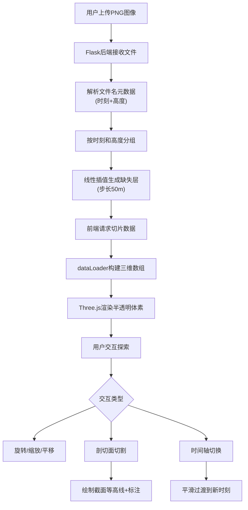

# 气象雷达3D可视化系统 - 产品需求文档

## 1. 产品概述

交互式3D气象雷达数据可视化应用，面向气象学家和灾害预警人员，支持从多张二维雷达反射率图像构建三维云层体数据，以半透明彩色云层形式展示，并提供旋转、缩放、剖切和时间轴动画等交互功能，帮助用户快速判断对流强度和降雨趋势。

- 核心价值：将海量二维雷达回波图快速叠加为三维云层结构，实现直观的立体化气象数据分析
- 目标用户：气象学家、灾害预警分析人员

## 2. 核心功能

### 2.1 功能模块

1. **3D可视化主页面**：Three.js三维场景、体数据渲染、交互控制、时间轴动画、文件上传

### 2.2 页面详情

| 页面名称 | 模块名称 | 功能描述 |
|----------|----------|----------|
| 3D可视化主页面 | 文件上传模块 | 上传多张PNG雷达反射率图像，自动解析文件名元数据（海拔高度、时刻），按时刻和高度分组 |
| 3D可视化主页面 | 三维体数据构建 | 后端线性插值生成50米步长连续体数据；前端半透明彩色体素渲染，反射率映射为蓝→绿→黄→红渐变，透明度随反射率递增 |
| 3D可视化主页面 | 交互式探索 | 鼠标左键旋转、右键平移、滚轮缩放；三轴(X/Y/Z)剖切面切换，可拖动半透明灰色切割面，截面上动态绘制反射率等高线并标注数值 |
| 3D可视化主页面 | 时间轴动画 | 水平时间轴滑块标注所有时刻，拖动时体数据平滑过渡，右侧显示当前时刻，播放按钮自动循环播放（每秒1帧） |

## 3. 核心流程

用户上传雷达图像 → 后端解析文件名元数据并分组 → 后端插值生成连续体数据 → 前端获取切片和元数据 → 构建三维数组 → Three.js渲染半透明体素 → 用户交互探索（旋转/缩放/剖切/时间轴）



## 4. 用户界面设计

### 4.1 设计风格

- **主题**：深色科技风格
- **背景色**：#0a0e1a
- **文字色**：#e0e6f0
- **标题**：半透明发光白色字体（左上角）
- **顶部工具栏**：磨砂玻璃效果（背景rgba(20,30,60,0.6)，背模糊8px）
- **按钮交互**：悬停时scale(1.05) + 发光描边
- **字体**：Rajdhani（显示字体，科技感）+ Source Sans 3（UI字体）
- **布局**：顶部工具栏 + 全屏3D场景 + 底部状态栏

### 4.2 页面设计概览

| 页面名称 | 模块名称 | UI元素 |
|----------|----------|--------|
| 3D可视化主页面 | 左上角标题 | 发光白色字体，Rajdhani Bold，text-shadow发光效果 |
| 3D可视化主页面 | 顶部工具栏 | 磨砂玻璃背景，横向排列：上传按钮、剖切面按钮组(X/Y/Z)、播放控制按钮 |
| 3D可视化主页面 | 3D场景区域 | 全屏Three.js画布，半透明彩色体素云团，地面网格 |
| 3D可视化主页面 | 时间轴滑块 | 渐变轨道，发光圆点滑块，右侧当前时刻文字，播放按钮 |
| 3D可视化主页面 | 底部状态栏 | 半透明背景，展示当前时刻、海拔范围、体数据量 |

### 4.3 响应式适配

- 桌面端（≥768px）：完整工具栏横排展示
- 移动端（<768px）：工具栏折叠为汉堡菜单，剖切面按钮改为图标模式
- 触摸优化：3D场景支持触摸旋转和缩放

### 4.4 3D场景指引

- **环境**：深色空间背景(#0a0e1a)，无HDRI，纯暗色氛围
- **光照**：环境光(0x334466, 0.6) + 方向光(0xffffff, 0.8)营造科技感
- **相机**：透视相机，初始视角45度俯瞰，远裁面5000
- **体素渲染**：半透明彩色方块，反射率→颜色映射(蓝→绿→黄→红)，透明度随反射率递增
- **地面网格**：细线网格(0x1a2a4a, 0.3)，提供空间参考
- **剖切面**：灰色半透明平面(ClippingPlane)，可拖动，截面上绘制等高线
- **交互**：OrbitControls鼠标控制，剖切面拖拽，时间轴滑块
- **性能**：LOD策略，远处体素降低分辨率；帧率≥25FPS

## 5. 文件结构

```
├── package.json              # 前端依赖和脚本
├── vite.config.js            # Vite构建配置，代理后端5000端口
├── tsconfig.json             # TypeScript严格模式，ES2020
├── index.html                # 入口页面
├── src/
│   ├── visualizer/
│   │   └── main.ts           # Three.js场景、渲染、交互
│   ├── utils/
│   │   └── dataLoader.ts     # 数据获取与三维数组构建
│   └── components/
│       └── uiController.ts   # UI元素管理
└── backend/
    ├── app.py                # Flask应用和API路由
    └── slicer.py             # 图像预处理与插值
```

### 数据流向

```
用户操作 → uiController.ts → 调用visualizer/main.ts调整渲染参数
                          → 调用dataLoader.ts请求数据
dataLoader.ts → axios → Flask /api/* → slicer.py图像处理
dataLoader.ts → 三维数组 → visualizer/main.ts渲染
```
