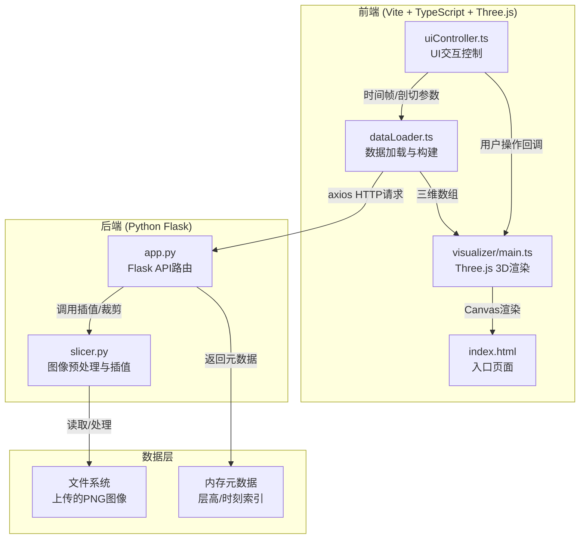

# 气象雷达3D可视化系统 - 技术架构文档

## 1. 架构设计



## 2. 技术说明

- **前端**：TypeScript + Three.js + Vite + axios + dat.gui
- **构建工具**：Vite（开发服务器 + 生产构建）
- **后端**：Python Flask（文件解析、元数据管理、CAPPI切片插值）
- **数据库**：无（文件系统存储 + 内存元数据索引）
- **3D渲染**：Three.js（WebGL2），半透明体素渲染 + ClippingPlane剖切

## 3. API定义

### 3.1 POST /api/upload

上传雷达图像文件

**请求**：`multipart/form-data`，字段 `files`（多文件）

**响应**：
```typescript
interface UploadResponse {
  success: boolean;
  timestamps: string[];       // 解析出的时刻列表，如 ["20250315_1200", "20250315_1210"]
  height_levels: number[];    // 解析出的高度层列表（米），如 [500, 1000, 1500]
  file_count: number;
}
```

### 3.2 GET /api/metadata

获取已上传数据的元数据

**响应**：
```typescript
interface MetadataResponse {
  timestamps: string[];
  height_levels: number[];    // 原始高度层
  interpolated_levels: number[]; // 插值后的完整高度层（50米步长）
  min_height: number;         // 最低高度（米）
  max_height: number;         // 最高高度（米）
}
```

### 3.3 GET /api/slice

获取某时刻某层的切片图片

**请求参数**：
```typescript
interface SliceRequest {
  timestamp: string;    // 时刻，如 "20250315_1200"
  height: number;       // 高度（米）
}
```

**响应**：PNG图片（Content-Type: image/png）

## 4. 前端模块架构

### 4.1 visualizer/main.ts

核心3D渲染模块，职责：
- 初始化Three.js场景（Scene、Camera、Renderer、Lights、Grid）
- 接收dataLoader传入的三维体数据数组
- 创建半透明体素云团（使用InstancedMesh优化性能）
- 实现反射率→颜色/透明度映射（蓝→绿→黄→红）
- 提供剖切面交互接口（addClippingPlane / removeClippingPlane）
- 响应uiController的时间帧切换，更新体素数据

### 4.2 utils/dataLoader.ts

数据加载与构建模块，职责：
- 通过axios调用Flask API（/api/upload, /api/metadata, /api/slice）
- 将PNG图片解码为Canvas像素矩阵
- 按高度堆叠为三维数组（width × height × depth）
- 输出体数据给visualizer/main.ts

### 4.3 components/uiController.ts

UI交互控制模块，职责：
- 管理文件上传按钮（触发上传流程）
- 管理剖切面切换按钮（X/Y/Z三轴）
- 管理时间轴滑块和播放控制
- 响应用户操作，调用visualizer调整渲染参数

## 5. 后端模块架构

### 5.1 app.py

Flask应用主文件，职责：
- 提供/api/upload接口：接收多文件上传，解析文件名元数据
- 提供/api/metadata接口：返回层高和时刻列表
- 提供/api/slice接口：返回指定时刻和高度的切片图片
- 文件名解析规则：`Z_YYYYMMDD_HHMM_HHHH.png` → 时刻=YYYYMMDD_HHMM，高度=HHHH米

### 5.2 slicer.py

图像预处理模块，职责：
- 裁剪RTI标记（去除图像边缘的雷达信息标注区域）
- 归一化反射率值到0-255
- 线性插值生成缺失高度层的中间切片（步长50米，最高10公里）
- 双线性插值保证切片质量

## 6. 关键数据结构

```typescript
interface VolumeData {
  width: number;
  height: number;
  depth: number;
  data: Uint8Array;           // 三维体数据，展平为一维
  colorMap: (value: number) => [number, number, number, number]; // 反射率→RGBA
}

interface TimeFrame {
  timestamp: string;
  volumeData: VolumeData;
}

interface ClippingConfig {
  axis: 'x' | 'y' | 'z';
  position: number;
  enabled: boolean;
}
```

## 7. 性能策略

- **体素渲染**：使用InstancedMesh批量渲染，减少drawcall
- **LOD策略**：远处体素降低分辨率
- **时间帧切换**：预加载相邻帧，0.5秒内完成过渡
- **插值计算**：后端预计算，前端仅加载结果
- **帧率目标**：≥25FPS（体素数量≤50万时）
