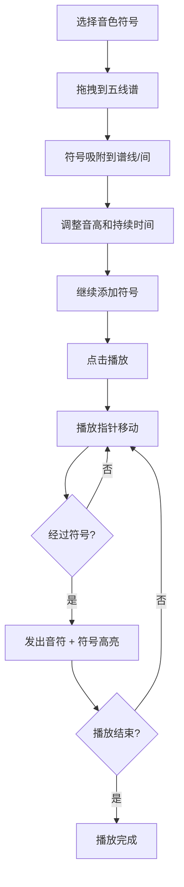

## 1. 产品概述

符号乐谱是一款可视化音乐创作工具，让用户通过拖拽和组合图形符号（圆形、三角形、方块、波浪线）在五线谱上拼出乐谱，点击播放即可自动生成旋律并实时播放。目标用户为音乐爱好者、创意工作者和零基础的音乐探索者。

## 2. 核心功能

### 2.1 用户角色

| 角色 | 使用方式 | 核心权限 |
|------|----------|----------|
| 普通用户 | 直接使用 | 拖拽符号、编辑乐谱、播放音乐 |

### 2.2 功能模块

1. **主界面**：符号面板 + 五线谱画布 + 属性面板，三栏布局

### 2.3 页面详情

| 页面名称 | 模块名称 | 功能描述 |
|----------|----------|----------|
| 主界面 | 符号面板 | 展示4种音色符号（圆形=钢琴、三角=弦乐、方块=吉他、波浪线=电子），每种用不同颜色填充，悬停放大1.15倍并显示名称和说明 |
| 主界面 | 五线谱画布 | 5条金色谱线，深灰渐变背景，0-8小节时间轴，支持拖拽放置符号、吸附到谱线/间、弹性动画、双击调整音高、点击设置持续时间 |
| 主界面 | 播放控制栏 | 绿色圆角播放按钮，金色播放指针匀速移动，0.5x-2x倍速调节 |
| 主界面 | 属性面板 | 选中符号时显示音高、节拍、颜色属性，提供红色删除按钮 |

## 3. 核心流程

用户从左侧符号面板拖拽音色符号到中央五线谱画布 → 符号自动吸附到最近的谱线或间（弹性动画0.2秒）→ 用户可双击符号调整音高（半音步进，显示半透明刻度尺）→ 用户可点击符号右上角小圆点设置持续时间（全音符红色、二分音符蓝色、四分音符绿色、八分音符紫色）→ 排列完成后点击播放按钮 → 金色竖直线从左到右移动 → 经过符号时发出对应音符并高亮闪烁0.2秒

## 4. 用户界面设计

### 4.1 设计风格

- **主色调**：深灰背景（#2C3E50 → #34495E 渐变）+ 金色强调（#D4A848）
- **符号颜色**：钢琴暖橙 #F39C12、弦乐淡紫 #8E44AD、吉他翠绿 #27AE60、电子冰蓝 #3498DB
- **持续时间颜色**：全音符红色、二分音符蓝色、四分音符绿色、八分音符紫色
- **按钮风格**：圆角矩形，播放按钮绿色，删除按钮红色
- **字体**：显示字体用特色几何感字体，UI字体用清晰的无衬线字体
- **布局**：三栏横向布局（符号面板 | 五线谱画布 | 属性面板）
- **动画**：弹性吸附0.2秒、悬停放大1.15倍、播放高亮闪烁0.2秒、播放指针匀速移动

### 4.2 页面设计概览

| 页面名称 | 模块名称 | UI元素 |
|----------|----------|--------|
| 主界面 | 符号面板 | 深色卡片背景，两行符号网格，每个符号带颜色填充和形状，悬停放大+tooltip显示音色说明 |
| 主界面 | 五线谱画布 | 深灰渐变背景，5条金色水平线，横向0-8小节刻度，符号以彩色图形呈现，播放时金色竖线移动 |
| 主界面 | 播放控制栏 | 顶部居中，绿色圆角按钮内含三角播放图标，倍速选择器 |
| 主界面 | 属性面板 | 右侧深色面板，显示音高/节拍/颜色信息，红色删除按钮 |

### 4.3 响应式设计

- 桌面优先设计，三栏布局在宽屏下展示完整
- 中等屏幕下属性面板可折叠
- 触摸设备支持拖拽操作

### 4.4 性能要求

- 播放延迟不超过100ms
- 五线谱滚动和符号拖拽动画保持60FPS
- 使用 requestAnimationFrame 驱动播放指针动画
