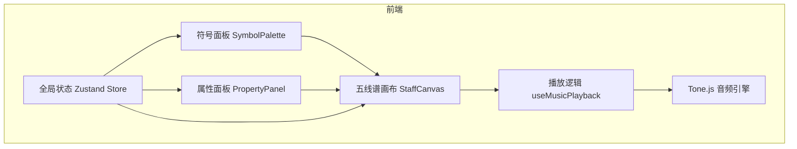

## 1. 架构设计



## 2. 技术说明

- **前端框架**：React 18 + TypeScript + Vite
- **状态管理**：Zustand
- **拖拽库**：@dnd-kit/core + @dnd-kit/sortable
- **音频引擎**：Tone.js
- **样式方案**：CSS Modules + CSS Variables（暗色调主题）
- **无后端**：纯前端应用，所有逻辑在浏览器端运行

## 3. 路由定义

| 路由 | 用途 |
|------|------|
| / | 主界面，包含符号面板、五线谱画布、属性面板 |

## 4. 数据模型

### 4.1 核心类型定义

```typescript
type InstrumentType = 'piano' | 'strings' | 'guitar' | 'synth';

type DurationType = 'whole' | 'half' | 'quarter' | 'eighth';

interface MusicSymbol {
  id: string;
  instrument: InstrumentType;
  beat: number;
  pitch: number;
  duration: DurationType;
  linePosition: number;
}

interface PlaybackState {
  isPlaying: boolean;
  currentBeat: number;
  speed: number;
}
```

### 4.2 音色映射

| 符号形状 | 音色 | Tone.js 合成器 | 颜色 |
|----------|------|----------------|------|
| 圆形 | 钢琴 | Tone.Synth | #F39C12 |
| 三角形 | 弦乐 | Tone.PluckSynth | #8E44AD |
| 方块 | 吉他 | Tone.PolySynth | #27AE60 |
| 波浪线 | 电子 | Tone.MonoSynth | #3498DB |

### 4.3 持续时间映射

| 类型 | 节拍数 | 颜色 |
|------|--------|------|
| whole（全音符） | 4 | 红色 |
| half（二分音符） | 2 | 蓝色 |
| quarter（四分音符） | 1 | 绿色 |
| eighth（八分音符） | 0.5 | 紫色 |

## 5. 文件结构

```
├── package.json
├── index.html
├── tsconfig.json
├── vite.config.js
└── src/
    ├── main.tsx
    ├── App.tsx
    ├── core/
    │   └── types.ts
    ├── store/
    │   └── useScoreStore.ts
    ├── modules/
    │   ├── symbol-panel/
    │   │   └── components/
    │   │       └── SymbolPalette.tsx
    │   ├── staff-editor/
    │   │   ├── components/
    │   │   │   └── StaffCanvas.tsx
    │   │   └── hooks/
    │   │       └── useMusicPlayback.ts
    │   └── property-panel/
    │       └── components/
    │           └── PropertyPanel.tsx
    └── styles/
        └── global.css
```

## 6. 性能策略

- 使用 requestAnimationFrame 驱动播放指针动画，确保60FPS
- Tone.js 合成器预加载，减少首次播放延迟至100ms以内
- 符号拖拽使用 @dnd-kit 的传感器优化，保持60FPS
- 五线谱画布使用 CSS transform 代替 top/left 进行动画
- Zustand 选择性订阅，避免不必要的重渲染
