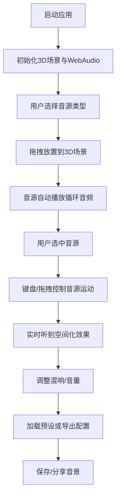

## 1. 产品概述

3D音景混合器是一款面向音乐爱好者和声音设计师的交互式音频可视化工具，解决传统音频编辑软件无法直观感知声音空间感的痛点，让用户通过可视化3D场景直观地预览和混合多层空间音频。

- 核心价值：将抽象的声音空间关系转化为直观的3D视觉表现，让用户"看到"声音的位置与运动
- 目标用户：音乐制作人、声音设计师、游戏音频开发者、沉浸式艺术创作者

## 2. 核心功能

### 2.1 功能模块

1. **3D场景主界面**：虚拟听音点、音源球体、网格地面、动态视觉效果
2. **音源交互系统**：拖拽放置、键盘/鼠标控制运动、轨迹拖尾效果
3. **混合控制面板**：总音量、混响开关、预设音景一键加载
4. **配置导入导出**：录制当前布局、导出JSON、拖入加载回放
5. **俯视小地图**：左下角实时显示所有音源和听音点的俯视位置

### 2.2 页面详情

| 页面名称 | 模块名称 | 功能描述 |
|---------|---------|---------|
| 主界面 | 3D场景渲染 | 深灰蓝渐变背景、半透明网格地面、听音点半透明人形、6种带方向箭头的发光球体音源 |
| 主界面 | 音源交互 | 点击选中、拖拽放置、键盘WASD/方向键+QE控制三维运动、轨迹线拖尾效果 |
| 主界面 | 视觉反馈 | 球体流光脉冲（与节拍同步）、选中旋转光环、悬停放大显示信息、听音点光晕 |
| 控制面板 | 音量与混响 | 全局总音量滑块（0-100%）、环境混响开关按钮 |
| 控制面板 | 预设系统 | 3个预设音景（清晨森林、雨夜城市、电子舞池）一键加载 |
| 控制面板 | 配置管理 | 录制导出JSON、拖入JSON文件加载回放 |
| 主界面 | 小地图 | 左下角微型俯视图，实时显示音源和听音点位置 |

## 3. 核心流程

用户操作流程：
1. 启动应用后，3D场景和WebAudio上下文初始化完成
2. 从音源库中选择一种音源类型，拖拽到场景中任意位置
3. 音源自动播放，音量根据距离和方位自动衰减
4. 点击选中音源后，可通过键盘或拖拽控制其三维运动
5. 可开启混响效果使声音更融合，或加载预设音景
6. 满意后可导出JSON配置文件保存或分享

## 4. 用户界面设计

### 4.1 设计风格
- **主色调**：深灰蓝色渐变背景（#1a1a2e → #16213e），营造沉浸式科技感
- **音源配色**：钢琴(暖橙#ff8c42)、贝斯(深紫#7b2cbf)、鼓点(红色#e63946)、鸟鸣(翠绿#2ec4b6)、雨声(淡蓝#4cc9f0)、电子脉冲(霓虹粉#ff006e)
- **交互色彩**：选中光环金色(#ffd700)、听音点光晕淡蓝(#a8dadc)
- **字体**：标题使用Orbitron（科技感），正文使用Rajdhani（现代简洁）
- **视觉风格**：赛博朋克+未来科技感，发光效果、半透明材质、动态脉冲

### 4.2 页面设计概述

| 页面名称 | 模块名称 | UI元素 |
|---------|---------|---------|
| 主界面 | 3D场景 | 深灰蓝渐变背景、半透明发光网格地面、居中听音点带光晕、可拖拽的发光球体音源 |
| 主界面 | 音源球体 | 颜色与音色对应、表面流光纹理、脉冲发光与节拍同步、方向箭头指示朝向 |
| 主界面 | 交互反馈 | 选中时金色旋转光环、悬停放大1.1倍并显示名称/坐标/音量条 |
| 主界面 | 运动轨迹 | 透明渐变拖尾线，长度约2秒，随运动逐渐消散 |
| 主界面 | 小地图 | 左下角150x150px半透明黑框、俯视图显示所有音源位置和听音点 |
| 控制面板 | 右上角面板 | 半透明深色玻璃态背景、总音量滑块、混响开关、预设按钮、导出按钮 |

### 4.3 响应式
- 桌面端优先，支持1080p及以上分辨率
- 3D画布自适应窗口大小，控制面板固定在右上角
- 小地图固定在左下角，不随窗口缩放改变大小
- 拖拽操作支持鼠标，键盘操作支持标准键盘布局

### 4.4 3D场景指导
- **环境**：深灰蓝渐变雾效，增强空间纵深感
- **光照**：环境光+半球光提供基础照明，每个音源自带点光源实现发光效果
- **相机**：透视相机，初始位置(0, 8, 15)，看向原点，支持轨道控制器缩放旋转
- **合成**：音源球体使用MeshStandardMaterial配合emissive实现自发光，选中光环使用LineSegments实现旋转效果
- **动画**：每帧更新音源脉冲发光强度（与音频节拍同步约120BPM）、拖尾线顶点更新、光环旋转
- **性能优化**：限制音源数量≤8个，使用BufferGeometry，材质复用，动画循环中避免垃圾回收

## 5. 音频设计
- **空间化**：使用WebAudio API的PannerNode实现HRTF空间化
- **距离衰减**：线性衰减模型，最大距离20单位
- **混响效果**：使用ConvolverNode实现卷积混响，提供IR脉冲响应
- **音频源**：6种预设循环音频片段，每段2-4秒，无缝循环
- **性能**：使用AudioBufferSourceNode，所有音源共享一个AudioContext
