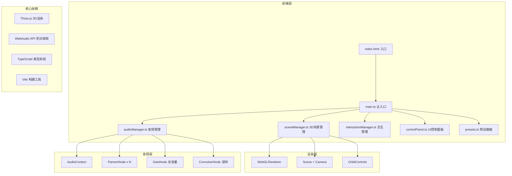

## 1. 架构设计



## 2. 技术描述

- **前端框架**：原生 TypeScript + Three.js（无React/Vue，最大化3D性能）
- **构建工具**：Vite 5.x，启用TypeScript严格模式
- **3D引擎**：Three.js 0.160.x，使用WebGLRenderer
- **音频引擎**：WebAudio API（浏览器原生），PannerNode实现HRTF空间化
- **音频生成**：使用OscillatorNode和BufferSourceNode生成合成音频，无需外部音频文件
- **类型系统**：TypeScript 5.x，strict模式，完整类型定义

## 3. 目录结构

```
src/
├── main.ts              # 应用入口，协调各模块启动
├── presets.ts           # 预设音景配置数据
├── types.ts             # 全局类型定义
├── sceneManager.ts      # 3D场景管理：物体创建、动画循环
├── audioManager.ts      # WebAudio管理：空间化、混响、音量
├── interactionManager.ts # 交互管理：拾取、拖拽、键盘控制
└── controlPanel.ts      # UI控制面板：DOM元素构建与事件
```

## 4. 核心类型定义

```typescript
// 音源类型枚举
type SoundSourceType = 'piano' | 'bass' | 'drums' | 'birds' | 'rain' | 'synth';

// 音源配置接口
interface SoundSourceConfig {
  type: SoundSourceType;
  position: { x: number; y: number; z: number };
  volume: number;
  loop: boolean;
}

// 音源实例接口
interface SoundSource {
  id: string;
  type: SoundSourceType;
  mesh: THREE.Group;
  position: THREE.Vector3;
  audioSource: AudioBufferSourceNode | OscillatorNode;
  panner: PannerNode;
  gainNode: GainNode;
  trail: THREE.Line;
  trailPositions: THREE.Vector3[];
  isSelected: boolean;
  isPlaying: boolean;
}

// 音景配置接口（用于导入导出）
interface SoundscapeConfig {
  version: string;
  timestamp: number;
  masterVolume: number;
  reverbEnabled: boolean;
  sources: SoundSourceConfig[];
}

// 预设音景接口
interface PresetSoundscape {
  id: string;
  name: string;
  description: string;
  config: SoundscapeConfig;
}
```

## 5. 模块职责划分

### 5.1 main.ts
- 初始化 THREE.Scene, PerspectiveCamera, WebGLRenderer
- 初始化 AudioContext（用户交互后激活）
- 创建 sceneManager, audioManager, interactionManager, controlPanel 实例
- 启动动画循环（requestAnimationFrame）
- 处理窗口 resize 事件

### 5.2 sceneManager.ts
- 创建网格地面（半透明发光网格）
- 创建听音点（半透明人形图标 + 光晕）
- 创建音源球体（每种类型对应颜色、发光材质、方向箭头）
- 管理所有3D物体的位置更新
- 动画循环：脉冲发光、轨迹更新、光环旋转
- 创建和更新小地图

### 5.3 audioManager.ts
- 创建和管理 AudioContext
- 为每个音源创建 PannerNode 和 GainNode
- 生成合成音频（使用振荡器和噪声生成器模拟6种音色）
- 创建混响 ConvolverNode（程序化生成IR）
- 实时更新音源位置到 PannerNode
- 控制总音量和混响开关

### 5.4 interactionManager.ts
- 使用 THREE.Raycaster 实现鼠标拾取
- 处理音源拖拽放置（从音源库拖到3D场景）
- 处理选中音源的键盘控制（WASD/方向键+QE）
- 处理鼠标悬停反馈（放大、显示信息）
- 处理拖尾轨迹记录

### 5.5 controlPanel.ts
- 构建右上角控制面板DOM
- 总音量滑块事件绑定
- 混响开关按钮事件绑定
- 预设音景加载按钮
- 导出JSON按钮和拖入加载功能
- 音源库面板（6种音源可拖拽）

### 5.6 presets.ts
- 定义6种音源的元数据（颜色、名称、音频参数）
- 定义3个预设音景配置：
  - 清晨森林：鸟鸣、雨声、钢琴
  - 雨夜城市：雨声、贝斯、鼓点
  - 电子舞池：电子脉冲、鼓点、贝斯

## 6. 性能优化策略

1. **渲染优化**
   - 所有音源球体共享 BufferGeometry
   - 材质实例复用，仅修改 emissive 颜色
   - 限制最大音源数量为 8
   - 拖尾线使用 BufferGeometry 顶点更新而非重建

2. **内存管理**
   - 音源删除时正确 dispose 几何体和材质
   - 音频节点断开连接并停止
   - 动画循环中避免创建新对象

3. **动画优化**
   - 使用 clock.getDelta() 计算帧率无关的运动
   - 脉冲发光使用预计算的正弦值
   - 小地图每2帧更新一次而非每帧

## 7. 音频合成方案

由于不需要外部音频文件，使用 WebAudio API 程序化生成6种音色：

- **钢琴**：多个正弦振荡器叠加，模拟钢琴泛音列，ADSR包络
- **贝斯**：锯齿波振荡器，低通滤波器，慢速LFO调制
- **鼓点**：白噪声 + 快速衰减包络，低通滤波处理
- **鸟鸣**：高频正弦波，频率快速调制（滑音效果）
- **雨声**：粉红噪声，带通滤波，缓慢振幅调制
- **电子脉冲**：方波振荡器，高通滤波，快速ADSR包络

## 8. 构建与部署

- **开发命令**：`npm run dev` → 启动 Vite 开发服务器（端口5173）
- **构建命令**：`npm run build` → 输出到 dist 目录
- **依赖安装**：`npm install`
- 无需后端服务，纯前端应用
