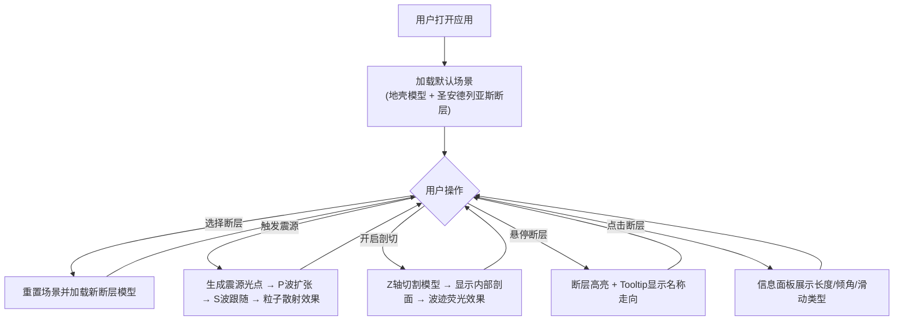

## 1. 产品概述

交互式3D地震波传播模拟应用，用于地震数据研究和防灾科普，帮助研究人员和公众直观理解地震波在地壳中的传播过程以及不同地质断层对波的影响。

- 核心用途：地震波传播可视化、地质断层科普教学、防灾研究辅助工具
- 目标用户：地震研究人员、地质专业学生、防灾科普工作者、对地震科学感兴趣的公众
- 市场价值：填补地震波3D交互式模拟工具的空白，提升地震科学的可视化教学效果

## 2. 核心功能

### 2.1 用户角色
| 角色 | 注册方式 | 核心权限 |
|------|----------|----------|
| 普通用户 | 无需注册，直接使用 | 浏览所有功能、切换断层模型、触发震源、调整视图参数 |

### 2.2 功能模块
1. **主场景模块**：3D地壳模型渲染、相机控制、场景灯光、辅助网格
2. **断层模型模块**：三种预设断层（圣安德列亚斯、逆冲、走滑）加载、地质纹理、高亮显示
3. **地震波模拟模块**：P波/S波传播动画、波阵面球壳渲染、折射反射物理效果、粒子散射
4. **交互控制模块**：断层选择、震源触发、介质透明度调节、剖切模式开关
5. **信息展示模块**：悬停tooltip、断层详情面板、波场分布可视化

### 2.3 页面详情
| 页面名称 | 模块名称 | 功能描述 |
|---------|----------|----------|
| 主场景页面 | 3D渲染模块 | 全屏3D场景展示，支持拖拽旋转、滚轮缩放、右键平移 |
| 主场景页面 | 控制面板模块 | 左上角折叠式控制面板，包含断层选择下拉框、触发震源按钮、介质透明度滑块、剖切模式开关 |
| 主场景页面 | 信息面板模块 | 右上角信息展示区，显示选中断层的详细数据（长度、倾角、滑动类型） |
| 主场景页面 | 剖切视图模块 | Z轴剖切显示内部剖面，波传播轨迹荧光效果 |

## 3. 核心流程

用户打开应用 → 默认加载地壳模型和圣安德列亚斯断层 → 用户可选择其他断层模型 → 点击震源触发按钮 → 观察P波和S波传播动画 → 可开启剖切模式查看内部 → 悬停/点击断层查看详细信息 → 可调节透明度等参数

## 4. 用户界面设计

### 4.1 设计风格
- 主色调：深空蓝黑渐变背景（#0a0a1a到#1a1a3a），蓝色辅助线（#4466aa）
- 波阵面色：P波蓝紫色渐变、S波橙红色渐变
- 断层高亮：红色发光线条
- 按钮风格：圆形红色震源按钮，带脉冲扩散动效
- 字体：浅灰色科技感字体，界面文字清晰可读
- 布局风格：全屏沉浸式3D场景，左上角悬浮控制面板，右上角悬浮信息面板
- 特殊效果：半透明毛玻璃背景（backdrop-filter: blur(4px)）、断层发光边缘、波阵面半透明渐变

### 4.2 页面设计概述
| 页面名称 | 模块名称 | UI元素 |
|---------|----------|--------|
| 主场景页面 | 3D场景 | 深空蓝黑渐变背景、半透明蓝色网格地面、红绿蓝三轴辅助线、半透明地壳层模型、红色发光断层线 |
| 主场景页面 | 控制面板 | 深灰半透明背景（rgba(30,30,40,0.85)）、毛玻璃效果、折叠式布局、下拉选择框、圆形红色按钮、颜色滑块 |
| 主场景页面 | 信息面板 | 右上角悬浮卡片、浅灰文字、断层参数列表 |
| 主场景页面 | Tooltip | 跟随鼠标、浅灰背景、断层名称和走向角 |

### 4.3 响应式
- 桌面优先设计，支持1920x1080和1366x768分辨率
- 窗口大小变化时自动调整相机视野和渲染尺寸
- 全屏渲染，无滚动条
- 控制面板和信息面板固定定位，不随窗口缩放而错位

### 4.4 3D场景指导
- 环境：深空蓝黑渐变背景，营造深邃地下空间感
- 光照：半球光模拟环境光 + 方向光模拟主光源，带适当阴影
- 相机：PerspectiveCamera，初始位置(0, 5, 15)，看向原点
- 交互：OrbitControls轨道控制，支持旋转、缩放、平移，限制合理视角范围
- 动画：波阵面平滑扩张动画、震源脉冲动画、粒子飞散动画、剖切切换过渡动画
- 后期处理：轻微泛光效果增强发光感，色彩校正提升视觉质量
- 性能：波前数量>5时降低粒子分辨率，确保60fps流畅运行

## 5. 技术约束
- 震源触发后波传播动画保持60fps
- 剖切模式下帧率不低于30fps
- 波前数量超过5个时粒子数从1000降至500
- 使用Three.js进行3D渲染，TypeScript保证类型安全
