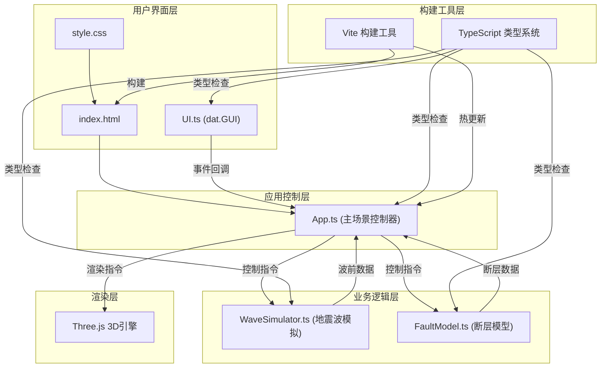

## 1. 架构设计



## 2. 技术描述

- 前端框架：原生TypeScript + Three.js（无React/Vue，按用户需求采用面向对象架构）
- 构建工具：Vite 5.x
- 类型系统：TypeScript 5.x，严格模式，ES2020模块目标
- 3D引擎：Three.js 0.160.x
- 类型定义：@types/three
- UI组件：dat.GUI 0.7.x
- 开发服务器：Vite Dev Server

## 3. 文件结构

```
project-root/
├── package.json              # 项目依赖和脚本
├── vite.config.js            # Vite构建配置
├── tsconfig.json             # TypeScript配置
├── index.html                # 入口HTML文件
└── src/
    ├── main.ts               # 应用入口
    ├── App.ts                # 主场景类
    ├── WaveSimulator.ts      # 地震波模拟类
    ├── FaultModel.ts         # 断层模型类
    ├── UI.ts                 # 用户界面类
    └── style.css             # 全局样式
```

## 4. 核心类定义

### 4.1 App 类
```typescript
class App {
    constructor(container: HTMLElement)
    init(): void
    update(deltaTime: number): void
    render(): void
    resize(): void
    loadFaultModel(type: FaultType): void
    triggerEarthquake(): void
    setCuttingMode(enabled: boolean): void
    setMediumOpacity(opacity: number): void
    onFaultClick(faultInfo: FaultInfo): void
    onFaultHover(faultInfo: FaultInfo | null): void
    dispose(): void
}
```

### 4.2 WaveSimulator 类
```typescript
interface WaveFront {
    id: number
    type: 'P' | 'S'
    center: THREE.Vector3
    radius: number
    maxRadius: number
    speed: number
    opacity: number
    color: THREE.Color
    medium: MediumType
}

interface Particle {
    position: THREE.Vector3
    velocity: THREE.Vector3
    life: number
    maxLife: number
    color: THREE.Color
}

type MediumType = 'sediment' | 'granite' | 'water'

class WaveSimulator {
    constructor(scene: THREE.Scene)
    triggerSource(position: THREE.Vector3): void
    update(deltaTime: number): WaveFront[]
    checkMediumAtPosition(pos: THREE.Vector3): MediumType
    handleBoundaryReflection(wave: WaveFront, normal: THREE.Vector3): void
    handleRefraction(wave: WaveFront, fromMedium: MediumType, toMedium: MediumType): void
    spawnScatterParticles(position: THREE.Vector3, direction: THREE.Vector3, count: number): void
    clearWaves(): void
    getWaveFronts(): WaveFront[]
    getParticles(): Particle[]
}
```

### 4.3 FaultModel 类
```typescript
interface FaultSegment {
    id: string
    name: string
    vertices: number[]
    indices: number[]
    strikeAngle: number
    dipAngle: number
    length: number
    slipType: 'strike-slip' | 'thrust' | 'normal'
    mesh: THREE.Mesh
    line: THREE.Line
}

interface FaultInfo {
    segment: FaultSegment
    name: string
    strikeAngle: number
    dipAngle: number
    length: number
    slipType: string
    hitPoint: THREE.Vector3
}

type FaultType = 'san-andreas' | 'thrust' | 'strike-slip'

class FaultModel {
    constructor(scene: THREE.Scene)
    loadFault(type: FaultType): FaultSegment[]
    raycast(raycaster: THREE.Raycaster): FaultInfo | null
    highlightSegment(segmentId: string | null): void
    getFaultSegments(): FaultSegment[]
    checkWaveIntersection(waveCenter: THREE.Vector3, waveRadius: number): THREE.Vector3[]
    dispose(): void
}
```

### 4.4 UI 类
```typescript
interface UICallbacks {
    onFaultChange: (type: FaultType) => void
    onTrigger: () => void
    onOpacityChange: (opacity: number) => void
    onCuttingModeChange: (enabled: boolean) => void
}

class UI {
    constructor(callbacks: UICallbacks)
    showFaultInfo(info: FaultInfo): void
    hideFaultInfo(): void
    showTooltip(text: string, x: number, y: number): void
    hideTooltip(): void
    updateInfoPanel(data: Record<string, string | number>): void
    dispose(): void
}
```

## 5. 数据流向

1. **用户交互 → UI层 → App层**：用户通过dat.GUI控制面板操作，UI触发回调通知App
2. **App层 → 业务逻辑层**：App调用FaultModel加载断层、调用WaveSimulator触发震源
3. **业务逻辑层 → App层**：WaveSimulator每帧返回波前数据，FaultModel返回碰撞检测结果
4. **App层 → 渲染层**：App将所有数据传递给Three.js进行渲染
5. **App层 → UI层**：App将断层信息传递给UI展示

## 6. 性能优化策略

1. **波前管理**：波前半径达到最大值后自动从场景中移除
2. **粒子降级**：波前数量>5时，粒子数从1000降至500
3. **几何体复用**：波前球壳使用BufferGeometry，避免重复创建
4. **材质复用**：相同类型的波前共享材质实例
5. **视锥剔除**：Three.js内置视锥剔除，不可见物体不渲染
6. **帧率监控**：动态调整粒子数量和渲染质量，维持目标帧率

## 7. 介质参数定义

| 介质类型 | 速度因子 | 颜色 | 说明 |
|---------|----------|------|------|
| 沉积岩 | 0.8（减慢20%） | 浅棕色 #c4a484 | 地壳上层 |
| 花岗岩 | 1.0（基准） | 灰色 #808080 | 地壳下层 |
| 水层 | 1.15（加快15%） | 蓝色 #4488ff | 地表水域 |

## 8. 地震波参数定义

| 波类型 | 初始速度 | 颜色渐变 | 透明度 | 最大半径 |
|--------|----------|----------|--------|----------|
| P波（纵波） | 2km/s | 蓝→紫 (#4444ff → #8844ff) | 随半径降低至0.8 | 30km |
| S波（横波） | 1.2km/s | 橙→红 (#ff8844 → #ff4444) | 固定0.6 | 20km |
