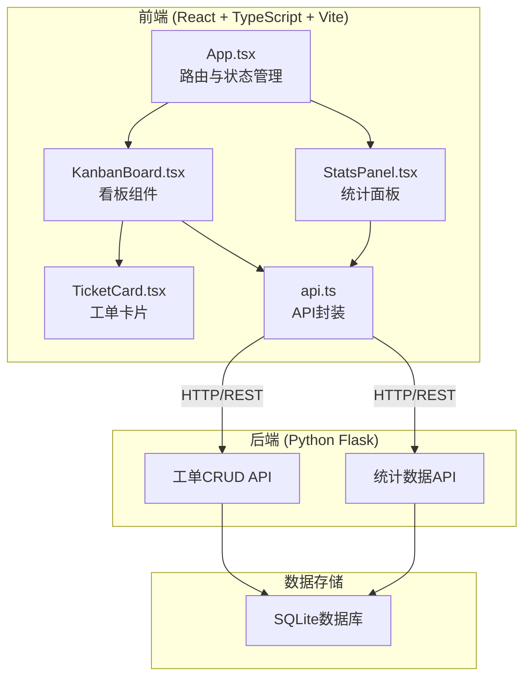
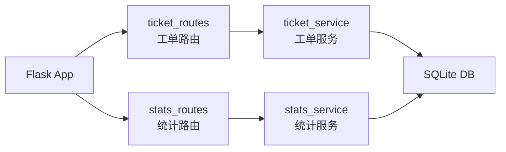
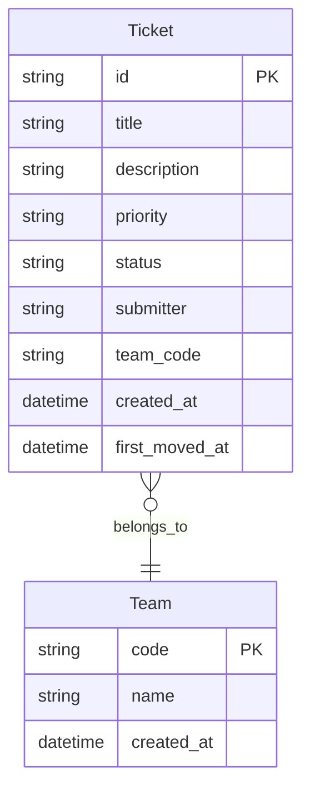

## 1. 架构设计



## 2. 技术说明

- 前端：React@18 + TypeScript + Vite + @dnd-kit/core + @dnd-kit/sortable + recharts + axios
- 后端：Python Flask + SQLite
- 数据库：SQLite（轻量级，无需额外安装）
- 状态管理：React useState/useEffect + zustand
- 初始化工具：vite-init

## 3. 路由定义

| 路由 | 用途 |
|------|------|
| / | 看板主页面（默认视图） |
| /stats | 统计面板页面 |

注：路由通过顶部导航按钮切换看板/统计视图，使用React状态控制而非URL路由。

## 4. API定义

### 4.1 TypeScript类型定义

```typescript
type Priority = 'urgent' | 'high' | 'medium' | 'low'
type TicketStatus = 'pending' | 'in_progress' | 'done'

interface Ticket {
  id: string
  title: string
  description: string
  priority: Priority
  status: TicketStatus
  submitter: string
  team_code: string
  created_at: string
  first_moved_at: string | null
  references: string[]
  referenced_by_count: number
}

interface Stats {
  total: number
  by_priority: Record<Priority, number>
  avg_handling_time_hours: number
  daily_new_tickets: Array<{ date: string; count: number }>
  priority_distribution: Array<{ priority: Priority; count: number }>
  per_capita_handling: Array<{ date: string; avg: number }>
}
```

### 4.2 请求/响应Schema

| 方法 | 路径 | 请求体 | 响应 |
|------|------|--------|------|
| GET | /api/tickets?team_code=XXX | - | Ticket[] |
| POST | /api/tickets | {title, description, priority, submitter, team_code} | Ticket |
| PUT | /api/tickets/:id | {status} | Ticket |
| GET | /api/stats?team_code=XXX | - | Stats |

## 5. 服务端架构图



## 6. 数据模型

### 6.1 数据模型定义



### 6.2 数据定义语言

```sql
CREATE TABLE IF NOT EXISTS team (
    code TEXT PRIMARY KEY,
    name TEXT NOT NULL,
    created_at TEXT DEFAULT (datetime('now'))
);

CREATE TABLE IF NOT EXISTS ticket (
    id TEXT PRIMARY KEY,
    title TEXT NOT NULL,
    description TEXT DEFAULT '',
    priority TEXT NOT NULL CHECK(priority IN ('urgent', 'high', 'medium', 'low')),
    status TEXT NOT NULL DEFAULT 'pending' CHECK(status IN ('pending', 'in_progress', 'done')),
    submitter TEXT NOT NULL,
    team_code TEXT NOT NULL,
    created_at TEXT DEFAULT (datetime('now')),
    first_moved_at TEXT,
    FOREIGN KEY (team_code) REFERENCES team(code)
);

CREATE INDEX IF NOT EXISTS idx_ticket_team ON ticket(team_code);
CREATE INDEX IF NOT EXISTS idx_ticket_status ON ticket(status);
CREATE INDEX IF NOT EXISTS idx_ticket_priority ON ticket(priority);
```
