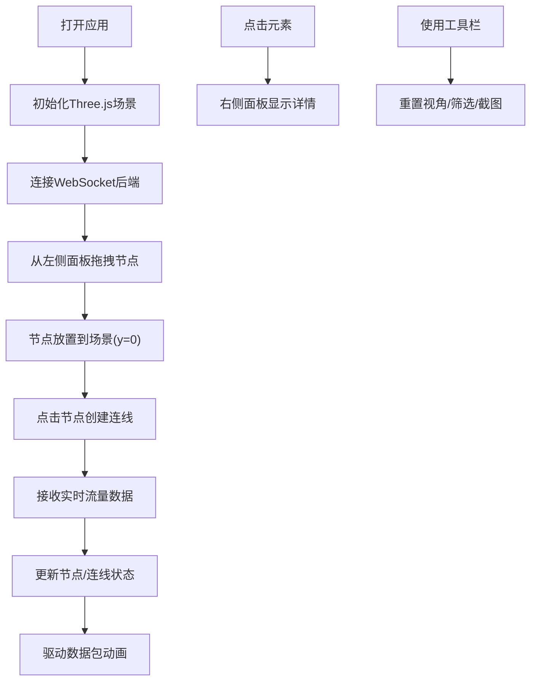

## 1. 产品概述

3D交互式数据流网络拓扑图可视化应用，让用户通过拖拽节点和连线来构建和探索复杂的数据流动网络，并实时显示节点间的流量速率与数据包动画。

- 主要用途：帮助网络工程师、系统架构师可视化和监控数据中心或分布式系统的数据流动态
- 解决的问题：传统2D拓扑图难以直观展示复杂网络结构和实时流量变化
- 目标用户：网络管理员、系统架构师、运维工程师

---

## 2. 核心功能

### 2.1 用户角色
| 角色 | 注册方式 | 核心权限 |
|------|----------|----------|
| 普通用户 | 无需注册 | 构建拓扑、查看实时数据、导出截图 |

### 2.2 功能模块
1. **3D场景主界面**：拓扑图渲染、节点交互、数据包动画
2. **左侧节点面板**：8种预设节点拖拽放置
3. **右侧信息面板**：选中节点/连线的详细数据展示
4. **顶部工具栏**：视角重置、筛选搜索、截图导出
5. **数据模拟后端**：Flask WebSocket实时流量数据推送

### 2.3 页面详情
| 页面名称 | 模块名称 | 功能描述 |
|----------|----------|----------|
| 主页面 | 3D场景渲染 | Three.js渲染网络拓扑，支持旋转/平移/缩放 |
| 主页面 | 节点交互 | 拖拽放置、点击连线、多选高亮 |
| 主页面 | 数据包动画 | 粒子沿连线流动，颜色/密度随流量变化 |
| 主页面 | 节点面板 | 8种节点类型，支持拖拽到场景 |
| 主页面 | 信息面板 | 实时显示选中元素的流量数据 |
| 主页面 | 工具栏 | 视角重置、筛选、截图导出 |

---

## 3. 核心流程

用户从左侧面板拖拽节点到3D场景，节点固定在y=0平面。点击两个节点创建连线，后端通过WebSocket每秒推送流量数据，前端实时更新节点速率和连线流量，并驱动数据包动画。用户可通过轨道控制器自由探索3D场景，点击元素查看详细信息，使用工具栏进行视角重置、筛选和截图。

---

## 4. 用户界面设计

### 4.1 设计风格
- **主色调**：深色太空主题 #0A0A1A
- **节点颜色**：数据库深蓝(#1E3A8A)、API网关紫色(#7C3AED)、负载均衡橙色(#F97316)、缓存青色(#06B6D4)、消息队列红色(#EF4444)、日志服务灰色(#6B7280)、监控绿色(#22C55E)、用户终端粉色(#EC4899)
- **按钮风格**：半透明毛玻璃效果，背景rgba(255,255,255,0.05)，边框rgba(255,255,255,0.1)，圆角8px，悬停背景rgba(255,255,255,0.15)
- **字体**：使用现代无衬线字体，数字使用等宽字体
- **布局**：左侧节点面板（固定宽度200px）、右侧信息面板（固定宽度280px）、顶部工具栏（高度56px）、中央3D场景

### 4.2 页面设计概述
| 页面名称 | 模块名称 | UI元素 |
|----------|----------|--------|
| 主页面 | 3D场景 | 深色背景、星点粒子、节点球体、连线管道、粒子流 |
| 主页面 | 节点面板 | 8个节点卡片，3D球体预览，标签文字，拖拽交互 |
| 主页面 | 信息面板 | 半透明面板，标题区，数据项（带过渡动画），分隔线 |
| 主页面 | 工具栏 | 按钮组、搜索框、半透明毛玻璃背景 |

### 4.3 响应性
- 桌面端优先设计，自适应窗口大小
- 3D场景自动适配窗口尺寸变化
- 面板支持最小化/展开

### 4.4 3D场景指导
- **环境**：深空背景(#0A0A1A)，30个随机闪烁星点粒子
- **光照**：环境光强度0.3 + 两束方向光（左上和右下，强度0.6）
- **材质**：金属质感 roughness 0.3, metalness 0.7
- **相机**：PerspectiveCamera，初始位置(0, 15, 20)，看向原点
- **交互**：OrbitControls，最小距离1，最大距离50
- **动画**：节点呼吸光晕（周期3秒）、粒子正弦波移动、放置弹性缩放、筛选透明度过渡
- **后处理**：节点发光效果、选中高亮边框
