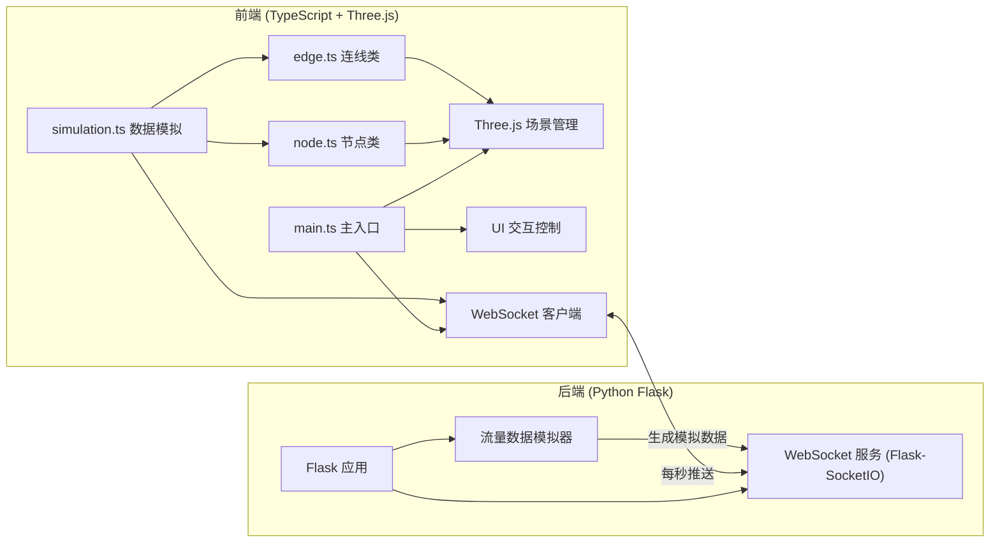

## 1. 架构设计



## 2. 技术描述

- **前端**：TypeScript + Vite + Three.js + socket.io-client + axios
- **初始化工具**：Vite vanilla-ts 模板
- **后端**：Python 3.x + Flask + Flask-SocketIO + eventlet
- **数据传输**：WebSocket 实时推送，每秒一次
- **性能优化**：BufferGeometry、PointsMaterial、帧节流

## 3. 项目结构

```
.
├── package.json
├── tsconfig.json
├── vite.config.js
├── index.html
├── requirements.txt          # Python依赖
├── server.py                 # Flask后端
└── src/
    ├── main.ts               # 主入口
    ├── node.ts               # 节点类
    ├── edge.ts               # 连线类
    ├── simulation.ts         # 数据模拟与WebSocket
    └── types.ts              # 类型定义
```

## 4. 核心数据类型定义

```typescript
// 节点类型
type NodeType = 'database' | 'api-gateway' | 'load-balancer' | 'cache' | 'message-queue' | 'log-service' | 'monitoring' | 'user-terminal';

interface NodeData {
  id: string;
  type: NodeType;
  label: string;
  position: { x: number; y: number; z: number };
  inflowRate: number;   // Mbps
  outflowRate: number;  // Mbps
  connectionCount: number;
}

interface EdgeData {
  id: string;
  sourceId: string;
  targetId: string;
  bandwidth: number;    // Mbps
  trafficPercent: number; // 0-100
  latency: number;      // ms
}

interface SimulationData {
  nodes: NodeData[];
  edges: EdgeData[];
  timestamp: number;
}
```

## 5. API 定义

### WebSocket 事件

| 事件名 | 方向 | 数据格式 | 描述 |
|--------|------|----------|------|
| `connect` | 客户端→服务端 | - | 建立连接 |
| `simulation-data` | 服务端→客户端 | `SimulationData` | 每秒推送实时数据 |
| `add-node` | 客户端→服务端 | `{ type: NodeType, position: Vector3 }` | 通知后端新增节点 |
| `add-edge` | 客户端→服务端 | `{ sourceId: string, targetId: string, bandwidth: number }` | 通知后端新增连线 |

## 6. 性能指标

- **帧率**：≥30 FPS（100节点 + 200连线以内）
- **粒子上限**：2000个
- **数据更新**：每秒1次，前端帧节流处理
- **内存**：BufferGeometry 复用，避免频繁创建销毁

## 7. 关键实现要点

1. **节点类 (Node)**
   - Mesh: SphereGeometry + MeshStandardMaterial
   - 光晕: 外层半透明球体 + 呼吸动画
   - 动态纹理环: CanvasTexture 旋转动画
   - 选中高亮: 白色发光边框 1px

2. **连线类 (Edge)**
   - TubularCurve: CatmullRomCurve3 + TubeGeometry
   - 粒子系统: Points + BufferGeometry
   - 颜色渐变: 青蓝(0%) → 橙红(100%)
   - 粒子密度: 5(0-30%) / 15(30-70%) / 30(70%+)
   - 正弦波移动: 沿路径参数叠加 sin 偏移

3. **Simulation 类**
   - WebSocket 连接管理
   - 数据帧节流（每帧最多处理一次更新）
   - 节点/连线状态更新
   - 粒子密度动态调节

4. **main.ts 主循环**
   - Three.js 场景初始化
   - 轨道控制器配置
   - Raycaster 交互检测
   - 拖拽放置逻辑
   - 节点多选 (Ctrl+点击)
   - UI 事件绑定
   - requestAnimationFrame 渲染循环
