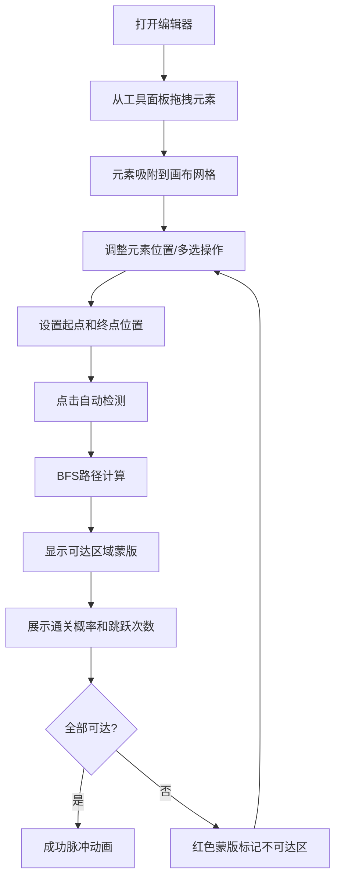

## 1. 产品概述

2D平台关卡编辑器是一款专为游戏关卡设计师打造的可视化布局工具，解决手工放置障碍物和平台时难以快速验证玩家通行性的痛点，帮助设计师快速生成、预览关卡并自动计算可玩性与跳跃路径合理性。

- 核心目标用户：游戏关卡设计师、独立游戏开发者
- 核心价值：提升关卡设计效率，自动检测死胡同和不可达区域，确保关卡可玩性

## 2. 核心功能

### 2.1 用户角色

| 角色 | 注册方式 | 核心权限 |
|------|----------|----------|
| 设计师 | 无需注册，本地应用 | 完整的关卡编辑、路径检测、预览功能 |

### 2.2 功能模块

1. **工具面板**：8种预设关卡元素的拖拽选择
2. **画布编辑区**：元素放置、移动、旋转、删除、多选、缩放平移
3. **属性面板**：关卡尺寸设置、起点终点配置、自动路径检测
4. **路径分析系统**：BFS算法计算可达区域、通关概率、最短跳跃次数

### 2.3 页面详情

| 页面名称 | 模块名称 | 功能描述 |
|---------|----------|----------|
| 主编辑器 | 左侧工具面板 | 8种元素图标展示，悬停放大显示属性，拖拽放置 |
| 主编辑器 | 中央画布区 | 网格背景、元素放置吸附、拖拽预览、右键菜单、框选多选、滚轮缩放、空格平移 |
| 主编辑器 | 右侧属性面板 | 关卡尺寸显示、起点/终点坐标设置、自动检测按钮、结果展示（通关概率、跳跃次数、蒙版提示） |

## 3. 核心流程

设计师从工具面板拖拽元素到画布，元素自动吸附网格。放置完成后设置起点和终点位置，点击"自动检测"按钮，系统使用BFS算法计算可行路径，在画布上以颜色蒙版标识可达/不可达区域，并显示通关概率和最短跳跃次数。设计师可根据反馈调整元素布局，直到获得满意的关卡设计。

## 4. 用户界面设计

### 4.1 设计风格

- 主色调：深色背景 #2C3E50，专业游戏编辑器风格
- 元素颜色：
  - 地面砖块：深灰 #4D4D4D 方块
  - 尖刺：红色 #E74C3C 倒三角
  - 移动平台：浅蓝 #5DADE2 长条
  - 弹簧：亮绿 #27AE60 小方块
  - 传送门：紫色 #8E44AD 圆圈
  - 金币：金色 #F1C40F 五角星
  - 终点旗杆：深红 #900C3F 长条
  - 隐藏砖块：浅灰 #BDC3C7 半透明方块
- 按钮样式：圆角矩形，悬停阴影，点击按压效果
- 字体：现代无衬线字体，清晰的层级对比
- 布局：三栏式布局（左工具面板240px + 中央画布 + 右属性面板280px）
- 交互：所有过渡动画0.15-0.3秒平滑过渡

### 4.2 页面设计概述

| 页面名称 | 模块名称 | UI元素 |
|---------|----------|--------|
| 主编辑器 | 工具面板 | 8个元素卡片（圆角8px），悬停放大1.1倍+阴影+名称提示 |
| 主编辑器 | 画布区 | 淡蓝渐变背景 #E8F8F5，10x10像素深蓝网格线 #2C3E50，十字准星光标，蓝色虚线吸附标记 |
| 主编辑器 | 属性面板 | 圆角卡片，输入框，检测按钮，结果统计展示 |
| 主编辑器 | 交互效果 | 多选框蓝色虚线 #3498DB，选中元素黄色描边 #F1C40F，成功脉冲动画 |

### 4.3 响应性

- 桌面端优先设计，固定三栏布局
- 画布区域自适应剩余空间
- 元素操作支持鼠标精确控制

### 4.4 性能要求

- 关卡元素超过200个时，拖拽帧率不低于45FPS
- 路径检测响应时间小于500ms
- 缩放平移过渡流畅，动画时长0.2秒
