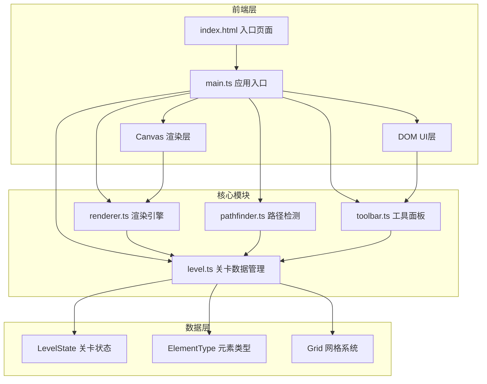

## 1. 架构设计



## 2. 技术描述

- **前端框架**：TypeScript 5.x + Vite 5.x
- **渲染技术**：HTML5 Canvas API（2D上下文）
- **DOM交互**：原生JavaScript事件系统，无额外UI框架
- **初始化工具**：Vite 官方 vanilla-ts 模板
- **构建工具**：Vite
- **开发服务器**：Vite Dev Server

### 技术选型理由
- **TypeScript**：提供强类型保证，适合复杂的编辑器逻辑开发
- **Vite**：极速开发体验，HMR热更新，配置简洁
- **Canvas API**：高性能2D渲染，支持数百元素流畅拖拽
- **原生DOM**：轻量级，无需额外框架开销，更适合Canvas为主的应用

## 3. 项目结构

```
├── package.json          # 项目依赖和脚本
├── tsconfig.json         # TypeScript配置（严格模式）
├── vite.config.js        # Vite构建配置
├── index.html            # 入口页面（全屏黑色背景）
└── src/
    ├── main.ts           # 应用入口：初始化Canvas、事件绑定、主循环
    ├── level.ts          # 关卡数据结构：元素列表、网格、元素类型枚举
    ├── renderer.ts       # 渲染器：绘制网格、元素、蒙版、动画、视口变换
    ├── pathfinder.ts     # 路径检测：BFS算法、可达区域掩码、路径列表
    └── toolbar.ts        # 工具面板：DOM生成、元素交互、拖拽事件监听
```

## 4. 核心数据模型

### 4.1 元素类型枚举

```typescript
enum ElementType {
  GROUND = 'ground',         // 地面砖块
  SPIKE = 'spike',           // 尖刺
  MOVING_PLATFORM = 'moving_platform', // 移动平台
  SPRING = 'spring',         // 弹簧
  PORTAL = 'portal',         // 传送门
  COIN = 'coin',             // 金币
  FLAG = 'flag',             // 终点旗杆
  HIDDEN_BLOCK = 'hidden_block' // 隐藏砖块
}
```

### 4.2 关卡元素接口

```typescript
interface LevelElement {
  id: string;
  type: ElementType;
  x: number;           // 网格坐标X
  y: number;           // 网格坐标Y
  width: number;       // 宽度（网格单位）
  height: number;      // 高度（网格单位）
  rotation: number;    // 旋转角度（0, 90, 180, 270）
  passable: boolean;   // 是否可通行
}
```

### 4.3 关卡状态接口

```typescript
interface LevelState {
  elements: LevelElement[];
  gridSize: number;    // 网格大小（像素）
  width: number;       // 关卡宽度（网格单位）
  height: number;      // 关卡高度（网格单位）
  startPos: { x: number; y: number };   // 玩家起始位置
  endPos: { x: number; y: number };     // 终点旗杆位置
  selectedIds: string[];                // 选中的元素ID列表
}
```

### 4.4 视口变换接口

```typescript
interface Viewport {
  scale: number;       // 缩放比例（0.5-3.0）
  offsetX: number;     // X轴偏移量
  offsetY: number;     // Y轴偏移量
  targetScale: number; // 目标缩放（用于平滑过渡）
  targetOffsetX: number;
  targetOffsetY: number;
}
```

### 4.5 路径检测结果接口

```typescript
interface PathResult {
  reachable: boolean[][];      // 可达区域掩码
  paths: { x: number; y: number }[][]; // 所有可行路径
  shortestJumps: number;       // 最短跳跃次数
  passRate: number;            // 通关概率（百分比）
  totalCells: number;          // 总格子数
  reachableCells: number;      // 可达格子数
}
```

## 5. 核心算法

### 5.1 BFS路径检测算法

```
输入: 起点(x1,y1), 终点(x2,y2), 关卡状态
输出: PathResult

1. 初始化可达区域掩码为全false
2. 使用队列进行BFS遍历
3. 每个格子探索四个方向（上下左右）+ 跳跃方向
4. 记录每个格子的访问状态和跳跃次数
5. 计算从起点到所有可达格子的最短路径
6. 统计可达格子数，计算通关概率
7. 返回完整的检测结果
```

### 5.2 坐标变换系统

```
屏幕坐标 -> 世界坐标:
  worldX = (screenX - offsetX) / scale
  worldY = (screenY - offsetY) / scale

世界坐标 -> 网格坐标:
  gridX = Math.floor(worldX / gridSize)
  gridY = Math.floor(worldY / gridSize)

网格坐标 -> 世界坐标:
  worldX = gridX * gridSize
  worldY = gridY * gridSize

世界坐标 -> 屏幕坐标:
  screenX = worldX * scale + offsetX
  screenY = worldY * scale + offsetY
```

## 6. 事件交互流程

### 6.1 拖拽放置流程
```
工具面板mousedown -> 设置拖拽元素类型 -> 
文档mousemove -> 更新预览位置 -> 
画布mouseup -> 吸附到网格 -> 添加元素到关卡
```

### 6.2 框选流程
```
画布mousedown（空白区域）-> 记录起点 ->
mousemove -> 更新虚线框 ->
mouseup -> 计算相交元素 -> 设置选中状态
```

### 6.3 缩放流程
```
画布wheel -> 阻止默认行为 ->
以鼠标位置为中心计算新偏移 ->
平滑更新viewport.scale -> 重绘
```

## 7. 性能优化策略

1. **Canvas分层渲染**：静态元素（网格、已放置元素）和动态元素（拖拽预览、动画）分离
2. **脏矩形重绘**：仅重绘变化区域，而非全画布重绘
3. **对象池**：复用路径检测中的临时对象，减少GC
4. **事件节流**：mousemove事件使用requestAnimationFrame节流
5. **离屏Canvas**：背景网格预渲染到离屏canvas
6. **批量操作**：多选元素移动时统一更新位置，避免多次重绘
