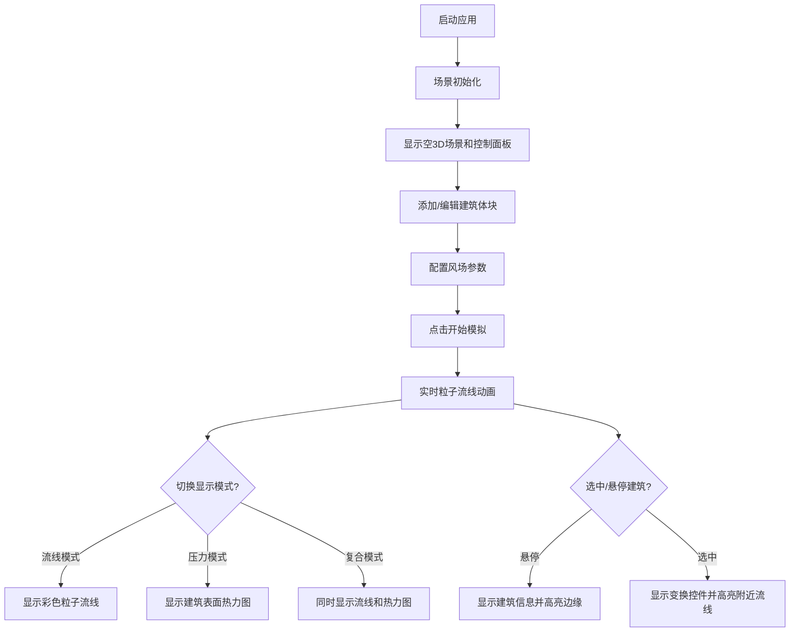

## 1. 产品概述
交互式3D建筑风环境流线可视化应用，为建筑设计师和城市规划者提供早期设计阶段的风环境快速分析工具。
- 核心目标：通过实时3D粒子流线动画和建筑表面风压热力图，帮助用户直观理解建筑群周围的风场分布，优化建筑布局方案。
- 目标用户：建筑设计师、城市规划师、环境工程师及相关专业学生。

## 2. 核心功能

### 2.1 用户角色
| 角色 | 注册方式 | 核心权限 |
|------|----------|----------|
| 普通用户 | 无需注册，直接使用 | 创建/编辑建筑体块、配置风场参数、查看风场模拟结果 |

### 2.2 功能模块
1. **场景管理**：建筑体块创建与编辑、视角控制、地面网格渲染
2. **风场模拟**：粒子系统、流线动画、风压计算
3. **可视化切换**：流线模式、压力模式、复合模式
4. **参数控制面板**：风向、风速、粒子密度、建筑体块参数

### 2.3 页面详情
| 页面名称 | 模块名称 | 功能描述 |
|----------|----------|----------|
| 主界面 | 3D场景区域 | 全屏渲染3D场景，支持鼠标旋转/缩放/平移视角 |
| 主界面 | 控制面板 | 右上角半透明毛玻璃面板，包含风场参数、显示模式、建筑操作控件 |
| 主界面 | 建筑工具栏 | 侧边建筑添加按钮（立方体/圆柱体/L形） |
| 主界面 | 信息提示 | 建筑悬停时显示编号与尺寸，选中建筑显示变换控件 |

## 3. 核心流程
用户打开应用后默认看到带有地面网格的3D空场景，用户可添加建筑体块、调整风场参数，然后启动模拟查看粒子流线和风压热力图。

## 4. 用户界面设计

### 4.1 设计风格
- **主色调**：深色科技风，背景 `#1E1E2E`，地面网格半透明青色 `#00FFFF33`
- **建筑体块**：浅灰半透明 `#C0C0C0AA`
- **粒子颜色**：风速 0-2m/s 蓝色渐变至 10m/s+ 红色
- **压力热力图**：绿色（低压）至红色（高压）渐变
- **控制面板**：半透明毛玻璃 `#2A2A3AAA`，圆角 12px，边框 `1px #FFFFFF33`
- **高亮色**：建筑选中/悬停时边缘亮黄 `#FFFF00`
- **字体**：现代无衬线科技感字体，控件间距 8px

### 4.2 页面设计概述
| 页面名称 | 模块名称 | UI元素 |
|----------|----------|----------|
| 主界面 | 3D场景区 | 全屏渲染容器，场景淡入动画2秒，背景深灰，地面青色网格 |
| 主界面 | 控制面板 | 右上角定位，半透明毛玻璃，滑块/按钮带hover提示，控件间距8px |
| 主界面 | 建筑工具栏 | 左侧建筑类型选择按钮，选中高亮 |
| 主界面 | 变换控件 | 选中建筑后出现，支持平移/缩放/旋转 |

### 4.3 响应式
- 桌面优先设计，主分辨率 1920x1080
- 适配 1366x768 分辨率，场景和UI字体等比例缩放
- 所有过渡动画 0.3秒 ease-out

### 4.4 3D场景引导
- **环境**：深色背景，无HDRI，模拟科技感暗室环境
- **光照**：环境光 + 方向光，确保建筑体块和粒子有足够可见度
- **相机**：透视相机，初始俯视偏角45度，支持OrbitControls自由控制
- **交互**：鼠标左键旋转、滚轮缩放、右键平移；建筑拖拽放置、点击选中
- **后处理**：场景淡入、粒子渐显、平滑过渡动画
- **性能预算**：8建筑+2000粒子 ≥ 30FPS，粒子更新 ≤ 5ms/帧，热力图 ≥ 15FPS
