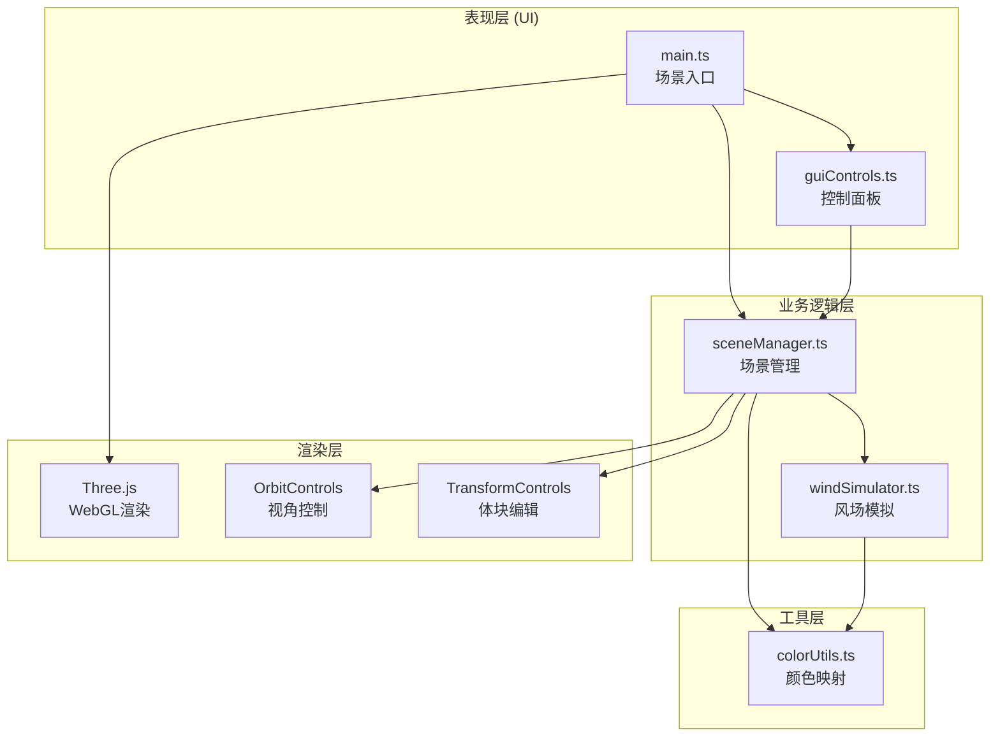

## 1. 架构设计



**模块调用关系与数据流向：**
1. `main.ts` 作为入口，初始化渲染器、场景、相机、控制器，创建 `SceneManager` 和 `GUIControls` 实例，启动动画循环
2. `guiControls.ts` 接收用户输入（风向、风速、粒子密度、模式切换），调用 `SceneManager` 的更新方法
3. `sceneManager.ts` 管理建筑体块数组、粒子系统、热力图覆盖层；调用 `windSimulator.ts` 获取粒子速度向量并更新粒子位置
4. `windSimulator.ts` 纯计算模块，基于格子法/势流法计算每个粒子在三维空间中的速度和方向，返回位置与速度数组，不依赖Three.js
5. `colorUtils.ts` 提供风速→颜色、风压→颜色的渐变映射工具函数，供粒子和热力图使用

## 2. 技术描述
- **前端框架**：原生 TypeScript + Three.js（无需React/Vue，按用户指定）
- **构建工具**：Vite
- **状态管理**：无需全局状态库，由 SceneManager 内部管理状态
- **UI控件**：dat.gui
- **3D库**：three @0.160+, @types/three
- **类型系统**：TypeScript 严格模式

## 3. 文件结构
```
project/
├── package.json
├── vite.config.js
├── tsconfig.json
├── index.html
└── src/
    ├── main.ts              # 入口：初始化渲染器/场景/相机/控制器，动画循环
    ├── sceneManager.ts      # 场景管理：建筑体块、粒子系统、热力图、交互
    ├── windSimulator.ts     # 风场模拟：纯计算，格子法，速度向量计算
    ├── guiControls.ts       # GUI面板：dat.gui，风场参数、显示模式
    └── colorUtils.ts        # 颜色工具：getWindColor, getPressureColor
```

## 4. 核心数据模型

### 4.1 建筑体块 (Building)
```typescript
interface Building {
  id: string;
  type: 'cube' | 'cylinder' | 'lshape';
  position: { x: number; y: number; z: number };
  size: { x: number; y: number; z: number };
  rotation: { x: number; y: number; z: number };
  mesh?: THREE.Mesh;
  edges?: THREE.LineSegments;
  pressureMesh?: THREE.Mesh;
}
```

### 4.2 粒子 (Particle)
```typescript
interface Particle {
  position: THREE.Vector3;
  velocity: THREE.Vector3;
  speed: number;
  life: number;        // 剩余生命 0-1
  age: number;         // 已存活时间(秒)
  maxAge: number;      // 最大生命周期(10秒)
}
```

### 4.3 风场配置 (WindConfig)
```typescript
interface WindConfig {
  direction: number;   // 风向角度 0-360度
  speed: number;       // 风速 1-20 m/s
  particleCount: number; // 粒子数量 100-5000
}
```

### 4.4 显示模式 (VisualMode)
```typescript
type VisualMode = 'streamline' | 'pressure' | 'composite';
```

## 5. 风场模拟算法

### 5.1 基本原理
基于简化的势流法(Potential Flow)结合格子法：
1. **背景流场**：由风向和风速定义的均匀来流
2. **建筑影响**：将每个建筑体块视为速度势扰动源，对经过的粒子施加偏转和减速
3. **边界层效应**：粒子靠近建筑表面时，速度衰减并沿表面切线方向偏转

### 5.2 计算流程
```
粒子位置 → 计算背景风速向量 → 遍历建筑检测距离 → 
近场叠加扰动速度 → 边界层减速/偏转 → 更新粒子位置 → 
超出生命周期或场景边界则重生
```

## 6. 性能优化策略
- **粒子池化**：固定数量粒子对象复用，避免GC
- **空间网格**：建筑体块空间划分，加速碰撞检测
- **增量更新**：热力图每4帧更新一次（≥15FPS）
- **TypedArray**：粒子位置/颜色使用Float32Array，减少内存开销
- **GPU粒子**：使用THREE.Points + BufferGeometry实现批量渲染
