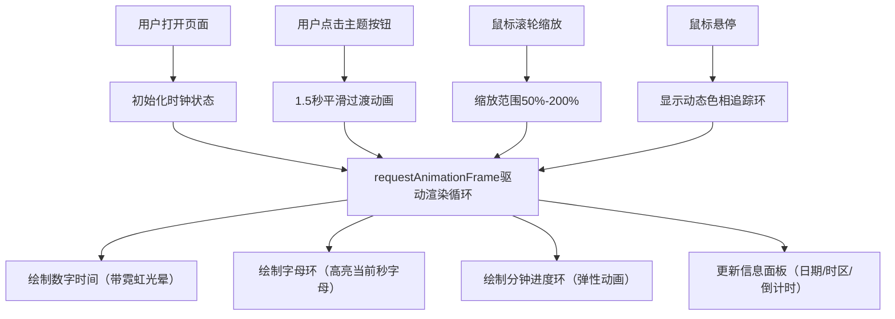

## 1. 产品概述

霓虹时钟是一款沉浸式数字艺术时钟应用，将时间展示与动态视觉艺术相结合，为用户提供独特的桌面美学体验。

- 主要目的：通过艺术化的时钟界面，将日常时间查看转化为视觉享受
- 目标用户：追求个性化桌面体验、喜爱数字艺术和赛博朋克风格的用户
- 市场价值：填补功能性时钟与艺术装置之间的空白，提供可交互的动态视觉体验

## 2. 核心功能

### 2.1 用户角色

| 角色 | 注册方式 | 核心权限 |
|------|----------|----------|
| 普通用户 | 无需注册 | 完整使用所有时钟功能、切换主题、交互操作 |

### 2.2 功能模块

1. **主时钟界面**：数字时间显示、字母环、分钟进度环
2. **主题切换系统**：3种预设视觉风格平滑过渡
3. **交互系统**：鼠标滚轮缩放、悬停追踪环
4. **信息面板**：日期、时区、整点倒计时显示

### 2.3 页面详情

| 页面名称 | 模块名称 | 功能描述 |
|----------|----------|----------|
| 主页面 | 数字时钟 | 超大艺术字体显示时分秒，带霓虹光晕效果，每秒更新 |
| 主页面 | 字母环 | 26个字母A-Z环形排列，当前秒对应字母高亮放大旋转到12点方向 |
| 主页面 | 分钟进度环 | 60个圆点代表分钟，已完成的点亮青色，未完成的暗青色 |
| 主页面 | 主题切换按钮 | 3个圆形按钮切换赛博朋克、蒸汽波、极光三种主题 |
| 主页面 | 信息面板 | 右上角显示日期、时区、距离下一个整点的倒计时 |

## 3. 核心流程

用户打开页面后，时钟自动开始运行并显示当前系统时间。用户可以通过底部按钮切换视觉主题，通过鼠标滚轮缩放时钟大小，鼠标悬停时显示动态追踪环。所有动画效果流畅运行，保持60fps帧率。

## 4. 用户界面设计

### 4.1 设计风格

- **主色调**：根据主题动态变化，默认赛博朋克风格（冰蓝#00FFFF，品红#FF00FF，背景暗紫#1A0033）
- **字体**：Google Fonts Orbitron 艺术字体，数字占画布高度80%
- **按钮样式**：圆形40px直径，显示主题代表色圆点，间距30px
- **布局风格**：全屏深色渐变背景（深蓝#0D0D2B到深紫#1B0A3E），时钟居中，按钮底部居中，信息面板右上角
- **视觉效果**：所有元素带发光效果（text-shadow / drop-shadow），毛玻璃信息面板

### 4.2 页面设计概览

| 页面名称 | 模块名称 | UI元素 |
|----------|----------|--------|
| 主页面 | 数字时钟 | Orbitron字体、80%高度、白色、霓虹光晕（蓝紫-粉红3秒周期） |
| 主页面 | 字母环 | A-Z均匀排布、逆时针10秒一圈、高亮字母动态霓虹色、其余0.3透明灰色 |
| 主页面 | 分钟进度环 | 60圆点、已完成6px亮青0.8、未完成3px暗青0.2、每分钟弹性动画0.5秒 |
| 主页面 | 主题切换 | 3个圆形按钮40px、代表色圆点、间距30px、1.5秒渐变过渡 |
| 主页面 | 信息面板 | 毛玻璃backdrop-filter: blur(10px)、14px主色文字、日期/时区/倒计时 |

### 4.3 响应式

- 桌面优先设计，自动适应屏幕尺寸
- 时钟画布自动缩放，保持比例
- 移动设备上字体和按钮等比例缩小
- 触摸操作支持（点击切换主题）

### 4.4 动画系统

- 时间更新：requestAnimationFrame驱动，60fps
- 霓虹光晕：3秒周期色相循环
- 字母环：10秒逆时针自转一圈
- 主题切换：1.5秒平滑颜色过渡
- 分钟动画：0.5秒弹性放大缩回效果
- 追踪环：鼠标X坐标映射色相0-360度
