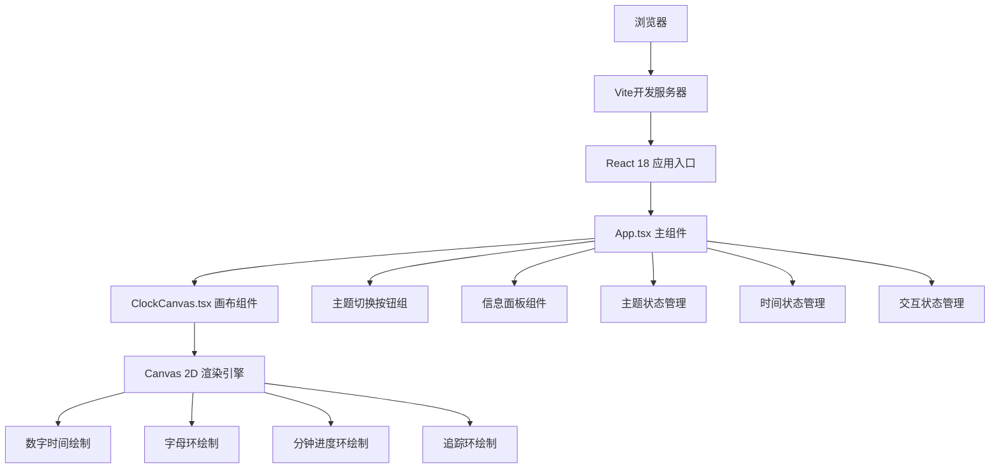

## 1. 架构设计



## 2. 技术描述

- **前端框架**：React 18 + TypeScript 5
- **构建工具**：Vite 5
- **样式方案**：原生CSS（支持CSS变量、渐变、动画）
- **渲染技术**：Canvas 2D API
- **动画驱动**：requestAnimationFrame
- **字体**：Google Fonts Orbitron
- **状态管理**：React useState / useRef
- **包管理**：npm

### 依赖包

| 包名 | 版本 | 用途 |
|------|------|------|
| react | ^18.2.0 | 前端框架 |
| react-dom | ^18.2.0 | DOM渲染 |
| typescript | ^5.4.0 | 类型系统 |
| vite | ^5.2.0 | 构建工具 |
| @types/react | ^18.2.0 | React类型定义 |
| @types/react-dom | ^18.2.0 | React DOM类型定义 |

## 3. 目录结构

```
auto163/
├── index.html              # 入口HTML
├── package.json            # 项目配置
├── tsconfig.json           # TypeScript配置
├── vite.config.js          # Vite配置
└── src/
    ├── main.tsx            # React入口
    ├── App.tsx             # 主组件（状态管理、时间更新、主题切换）
    ├── ClockCanvas.tsx     # 核心画布组件（Canvas 2D绘制）
    └── styles.css          # 全局样式
```

## 4. 路由定义

| 路由 | 用途 |
|------|------|
| / | 主页面（时钟应用） |

## 5. 核心数据结构

### 主题类型定义

```typescript
interface Theme {
  name: string;
  primary: string;    // 主色
  secondary: string;  // 辅色
  background: string; // 背景色
}

const themes: Theme[] = [
  { name: 'cyberpunk', primary: '#00FFFF', secondary: '#FF00FF', background: '#1A0033' },
  { name: 'vaporwave', primary: '#E6A8D7', secondary: '#A8D7E6', background: '#2D1B2E' },
  { name: 'aurora', primary: '#00FF7F', secondary: '#8A2BE2', background: '#0B0C10' },
];
```

### 时间状态定义

```typescript
interface TimeState {
  hours: number;
  minutes: number;
  seconds: number;
  milliseconds: number;
  date: Date;
}
```

### 交互状态定义

```typescript
interface InteractionState {
  scale: number;           // 缩放比例 0.5-2.0
  mouseX: number;          // 鼠标X坐标
  mouseY: number;          // 鼠标Y坐标
  isHovering: boolean;     // 是否悬停
  hoverProgress: number;   // 悬停环动画进度
}
```

## 6. 核心算法

### 6.1 颜色插值（主题平滑过渡）

```typescript
function lerpColor(color1: string, color2: string, t: number): string {
  // 将十六进制颜色转换为RGB
  // 按t值线性插值
  // 返回新的十六进制颜色
}
```

### 6.2 霓虹光晕计算

```typescript
function getGlowHue(time: number): number {
  // 3秒周期：0 -> 270°（蓝紫）-> 300°（品红）-> 270°（蓝紫）
  const phase = (time % 3000) / 3000;
  if (phase < 0.5) {
    return 270 + phase * 60; // 270 -> 300
  } else {
    return 300 - (phase - 0.5) * 60; // 300 -> 270
  }
}
```

### 6.3 字母环位置计算

```typescript
function getLetterPosition(
  index: number,
  centerX: number,
  centerY: number,
  radius: number,
  rotation: number,
  highlightIndex: number
): { x: number; y: number; scale: number; rotation: number } {
  // 计算每个字母的极坐标位置
  // 高亮字母旋转到12点方向（-90°）
  // 应用整体自转偏移
}
```

### 6.4 分钟弹性动画

```typescript
function elasticOut(t: number): number {
  const p = 0.3;
  return Math.pow(2, -10 * t) * Math.sin((t - p / 4) * (2 * Math.PI) / p) + 1;
}
```

## 7. 性能优化策略

1. **渲染循环**：使用单个requestAnimationFrame驱动所有动画
2. **状态最小化**：避免不必要的React re-render，使用useRef存储高频变化数据
3. **Canvas优化**：
   - 使用离屏Canvas预绘制静态元素
   - 仅在必要时清空重绘
   - 使用requestAnimationFrame而非setInterval
4. **交互响应**：鼠标事件使用节流，确保16ms内响应
5. **CSS变量**：主题颜色使用CSS变量，避免频繁DOM操作

## 8. 文件职责划分

| 文件 | 职责 |
|------|------|
| main.tsx | React应用挂载入口 |
| App.tsx | 时间更新循环、主题状态管理、交互事件处理、组件编排 |
| ClockCanvas.tsx | Canvas初始化、所有视觉元素的绘制逻辑、动画帧计算 |
| styles.css | 全局布局、渐变背景、按钮样式、信息面板样式、响应式规则 |
