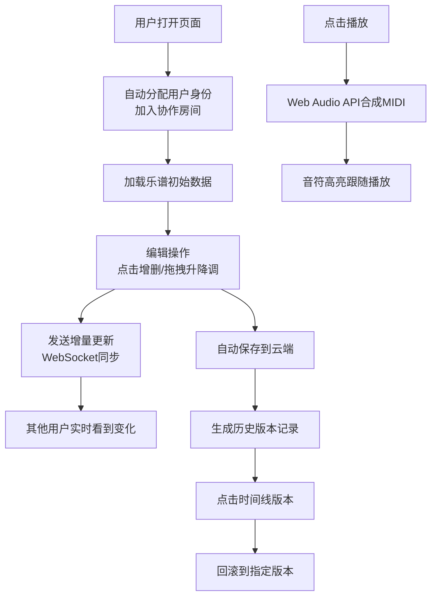

## 1. 产品概述

协作式在线乐谱编辑器与演奏平台，让多位音乐爱好者能同时在浏览器中编辑同一份五线谱，实时同步修改内容，并支持MIDI合成播放与导出。

- 解决音乐爱好者远程协作编曲的痛点，提供实时多人协作编辑能力
- 集成乐谱编辑、演奏播放、版本管理于一体，降低音乐创作门槛

## 2. 核心功能

### 2.1 用户角色
| 角色 | 注册方式 | 核心权限 |
|------|----------|----------|
| 协作用户 | 无需注册，自动分配身份 | 编辑乐谱、播放演奏、查看历史版本、回滚版本 |

### 2.2 功能模块
1. **乐谱编辑器**：五线谱渲染、音符增删改、节拍/调号设置、拖拽升降调
2. **演奏播放**：MIDI合成、音符高亮跟随、速度调节、MIDI导出
3. **协作同步**：多用户光标显示、操作轨迹展示、WebSocket实时同步
4. **版本管理**：历史时间线、版本回滚、修改记录展示
5. **响应式界面**：桌面端三栏布局、移动端抽屉式面板

### 2.3 页面详情
| 页面名称 | 模块名称 | 功能描述 |
|---------|----------|----------|
| 主编辑页 | 顶部工具栏 | 文件操作、编辑、视图、播放控制、共享设置 |
| 主编辑页 | 五线谱编辑区 | Canvas渲染五线谱、点击增删音符、拖拽升降调、悬停显示音名 |
| 主编辑页 | 协作面板 | 在线成员列表、头像昵称、光标位置显示 |
| 主编辑页 | 历史时间线 | 版本列表、点击回滚、时间戳和修改人显示 |
| 主编辑页 | 状态栏 | 当前节拍、调号、在线人数显示 |

## 3. 核心流程

用户打开页面后自动加入协作房间，在五线谱上点击添加音符，拖拽调整音高，修改实时同步给其他协作者。编辑完成后点击播放按钮，系统通过Web Audio API合成MIDI音色演奏，播放时音符跟随进度条高亮。可在右侧时间线查看历史修改记录，点击任意版本回滚到该状态。

## 4. 用户界面设计

### 4.1 设计风格
- 主色调：深灰#2C3E50背景，白色#FFFFFF编辑画布
- 强调色：青色#1ABC9C（按钮悬停、版本高亮），蓝色#3498DB（音符高亮、操作轨迹），橙色#FFA500（拖拽状态）
- 按钮：圆角矩形，背景#34495E，悬停变#1ABC9C，白色文字，Arial 14px 600字重
- 字体：Arial为主，清晰易读
- 布局：桌面端三栏布局（顶部工具栏+左侧编辑区+右侧面板），移动端抽屉式

### 4.2 页面设计概述
| 页面名称 | 模块名称 | UI元素 |
|---------|----------|--------|
| 主编辑页 | 顶部工具栏 | 圆角按钮横向排列，文件/编辑/视图/播放/共享 |
| 主编辑页 | 五线谱编辑区 | 白色画布，浅灰#ECF0F1五线谱，线间距20px，圆形黑色音符头 |
| 主编辑页 | 协作成员列表 | 圆形头像32px，2px彩色边框，昵称显示 |
| 主编辑页 | 历史时间线 | 列表式布局，最近在上，左滑动画0.3s |
| 主编辑页 | 状态栏 | 底部横条，节拍/调号/在线人数（绿色#2ECC71圆点） |

### 4.3 响应式
- 桌面端（≥768px）：左右分栏，编辑区自适应
- 移动端（<768px）：右侧面板折叠为底部抽屉，高度200px，带拖拽手柄
- 音符大小按屏幕比例缩放，保证可读性

### 4.4 动画效果
- 点击添加音符：+1.1倍放大动画0.15s
- 拖拽升降调：音符从黑变橙#FFA500
- 光标呼吸动画：周期1s
- 操作轨迹：蓝色虚线，1.5s后消失
- 播放高亮：音符变蓝#3498DB，跟随进度条
- 版本回滚：列表项左滑动画0.3s，目标版本高亮边框#1ABC9C
