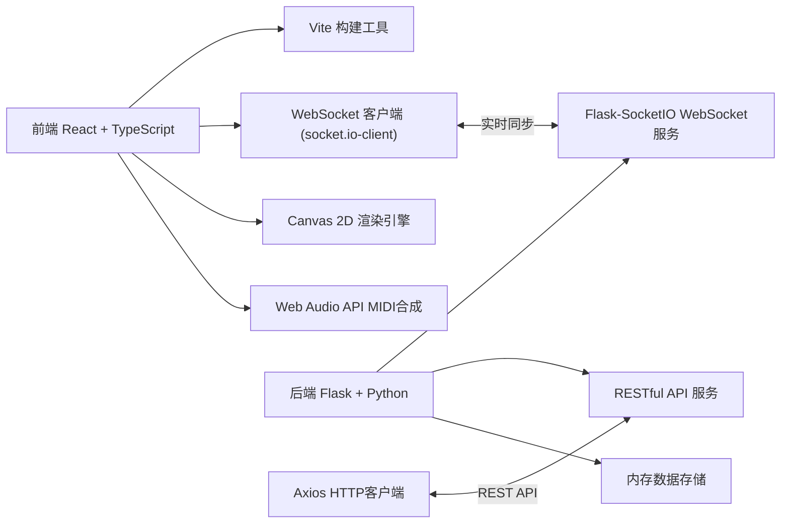
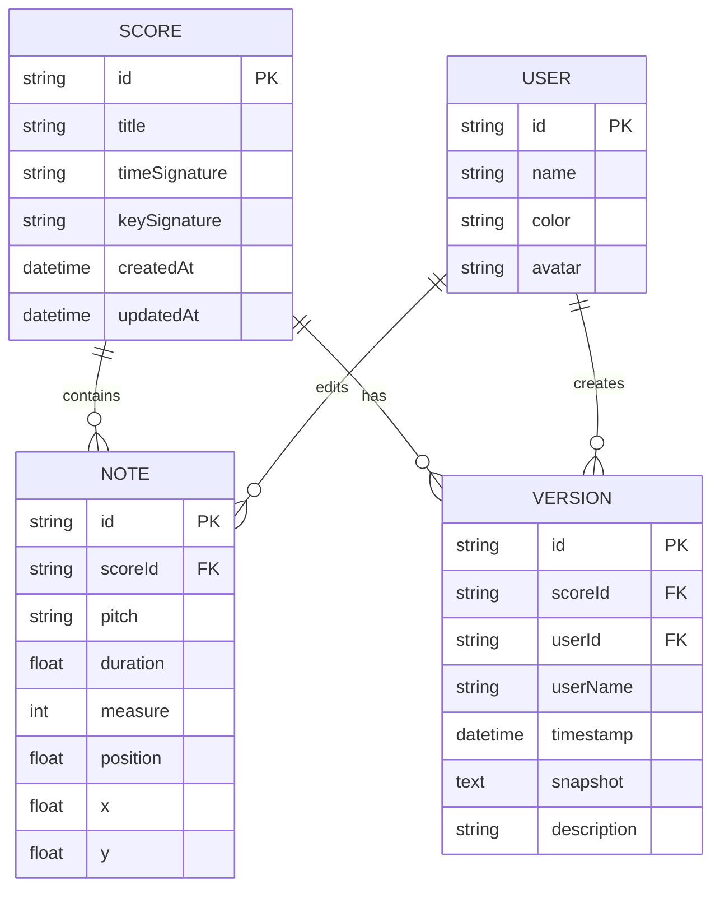

## 1. 架构设计



## 2. 技术描述

- 前端：React 18 + TypeScript + Vite 5
- UI框架：原生CSS + CSS变量，不使用额外UI库
- WebSocket：socket.io-client 4.x
- HTTP客户端：Axios 1.x
- MIDI合成：Web Audio API 原生实现（无需tonemidi）
- 后端：Python 3.9+ + Flask 2.x + Flask-SocketIO 5.x + eventlet
- 跨域：flask-cors
- 数据存储：内存数据结构（便于演示，可扩展至数据库）

## 3. 目录结构

```
项目根目录/
├── package.json          # 前端依赖
├── index.html            # 入口HTML
├── tsconfig.json         # TypeScript配置
├── vite.config.js        # Vite构建配置
├── src/
│   ├── main.tsx          # React入口
│   ├── App.tsx           # 主布局组件
│   ├── ScoreEditor.tsx   # 五线谱编辑器组件
│   ├── CollaborationPanel.tsx  # 协作面板组件
│   └── types.ts          # 类型定义（补充）
└── backend/
    ├── app.py            # Flask应用主文件
    └── requirements.txt  # Python依赖
```

## 4. 路由定义

| 路由 | 用途 |
|------|------|
| / | 主编辑页面（单页应用） |
| /api/scores | 乐谱CRUD接口 |
| /api/scores/:id/versions | 历史版本查询 |
| /socket.io | WebSocket连接端点 |

## 5. API定义

### 5.1 RESTful API

```typescript
// 乐谱数据类型
interface Note {
  id: string;
  pitch: string;      // 音高，如"C4", "G5"
  duration: number;   // 时长，1=四分音符，0.5=八分音符
  measure: number;    // 小节号
  position: number;   // 小节内位置
  x: number;          // Canvas X坐标
  y: number;          // Canvas Y坐标
}

interface Score {
  id: string;
  title: string;
  timeSignature: string;  // 节拍，如"4/4", "3/4"
  keySignature: string;   // 调号，如"C大调", "A小调"
  notes: Note[];
  createdAt: string;
  updatedAt: string;
}

interface Version {
  id: string;
  scoreId: string;
  timestamp: string;
  userId: string;
  userName: string;
  snapshot: Score;
  description: string;
}

// GET /api/scores/:id
// Response: Score

// PUT /api/scores/:id
// Request: Partial<Score>
// Response: Score

// GET /api/scores/:id/versions
// Response: Version[]
```

### 5.2 WebSocket事件

```typescript
// 客户端发送事件
'join_room'        // 加入房间：{ roomId: string, user: User }
'edit_note'        // 编辑音符：{ roomId: string, type: 'add'|'delete'|'update', note: Note, userId: string }
'cursor_move'      // 光标移动：{ roomId: string, userId: string, x: number, y: number }
'rollback'         // 回滚版本：{ roomId: string, versionId: string, userId: string }

// 服务端广播事件
'user_joined'      // 用户加入：{ user: User }
'user_left'        // 用户离开：{ userId: string }
'note_edited'      // 音符编辑：{ type: 'add'|'delete'|'update', note: Note, userId: string }
'cursor_updated'   // 光标更新：{ userId: string, x: number, y: number }
'rollback_done'    // 回滚完成：{ snapshot: Score, versionId: string }
'version_added'    // 新版本添加：{ version: Version }
```

## 6. 数据模型

### 6.1 实体关系图



## 7. 性能优化策略

1. **Canvas渲染优化**：使用requestAnimationFrame批量重绘，仅重绘变化区域
2. **增量同步**：仅发送修改的音符数据，而非全量乐谱
3. **防抖节流**：光标移动事件节流，避免频繁发送
4. **内存管理**：及时清理已消失的操作轨迹和过期动画
5. **WebSocket优化**：使用二进制数据传输，减少数据包大小
6. **懒加载**：历史版本列表按需加载，避免一次性加载过多
