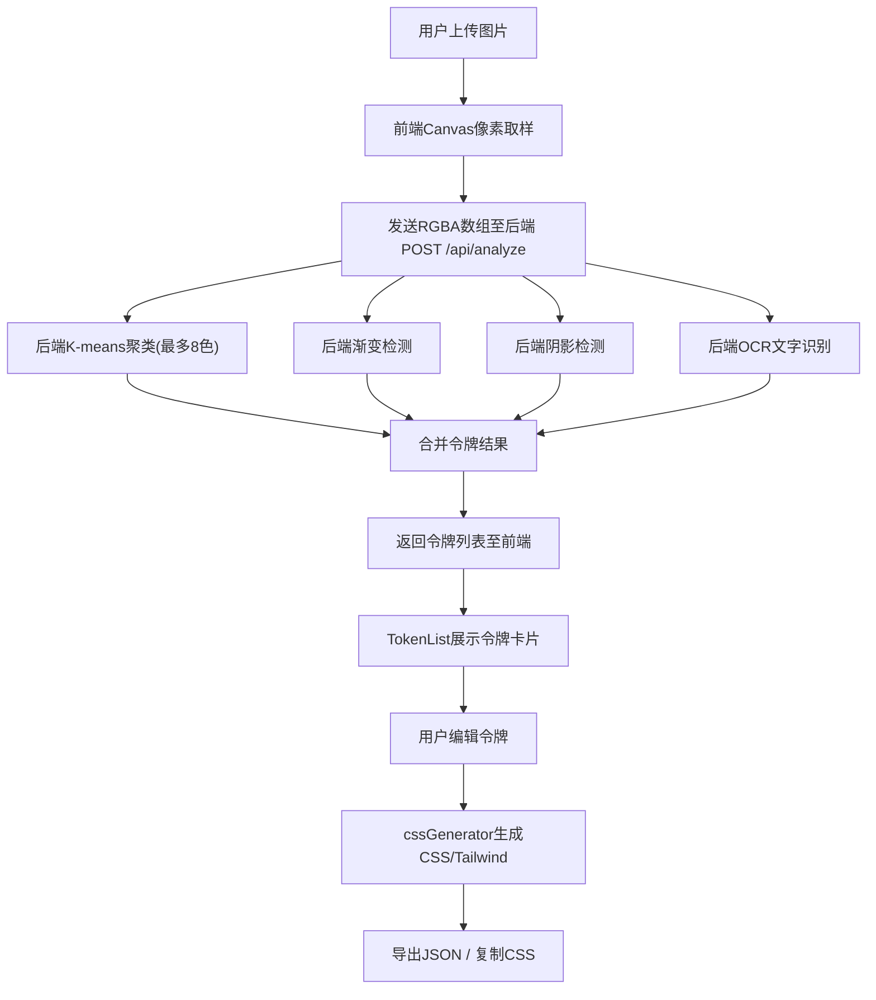

## 1. 产品概述

设计令牌提取与CSS样式生成工具，帮助产品设计团队从设计稿截图中自动提取颜色、阴影、渐变和字体参数，生成可编辑的设计令牌列表，并输出可复用的CSS变量或Tailwind配置代码，消除设计师与开发之间的参数理解偏差，减少返工。

- 目标用户：UI设计师、前端开发者、设计系统维护者
- 核心价值：将视觉稿参数自动化提取为结构化设计令牌，打通设计到代码的最后一公里

## 2. 核心功能

### 2.1 用户角色

| 角色 | 使用方式 | 核心权限 |
|------|----------|----------|
| 设计师 | 上传设计稿截图 | 提取令牌、编辑颜色、导出JSON |
| 开发者 | 获取令牌和CSS代码 | 复制CSS变量、Tailwind配置、导出JSON |

### 2.2 功能模块

1. **工作台页面**：图片上传区、令牌列表区、CSS预览区、操作栏

### 2.3 页面详情

| 页面名称 | 模块名称 | 功能描述 |
|----------|----------|----------|
| 工作台 | 图片上传区 | 拖拽/点击上传PNG/JPG图片，Canvas像素取样，缩略图预览，加载动画 |
| 工作台 | 令牌列表区 | 展示颜色/渐变/阴影/字体令牌卡片，支持颜色拾取、名称编辑、CSS值编辑 |
| 工作台 | CSS预览区 | 实时预览CSS变量文本和Tailwind配置片段 |
| 工作台 | 操作栏 | 导出JSON、复制CSS、清空令牌（二次确认） |

## 3. 核心流程

用户上传设计稿截图 → 前端Canvas像素取样（每10px取样）→ 发送RGBA数组至后端 → 后端K-means聚类提取主色调 → 检测渐变/阴影/字体 → 返回令牌列表 → 前端展示可编辑令牌卡片 → 用户编辑令牌 → 实时生成CSS变量/Tailwind配置 → 导出JSON或复制CSS

## 4. 用户界面设计

### 4.1 设计风格

- 主色调：蓝灰系 (#3B82F6, #1F2937, #F5F5F5)
- 按钮风格：圆角6px，内边距10px 20px，点击缩放动画
- 字体：系统默认无衬线，令牌名称/CSS值使用monospace
- 布局风格：左右两栏（40%/60%），卡片列表，底部固定操作栏
- 图标风格：铅笔编辑图标，使用lucide-react

### 4.2 页面设计概述

| 页面名称 | 模块名称 | UI元素 |
|----------|----------|--------|
| 工作台 | 图片上传区 | 虚线边框#CCCCCC，圆角12px，白底，拖入蓝框#3B82F6放大1.02倍0.3s，缩略图预览，旋转圆环加载动画 |
| 工作台 | 令牌概览卡片 | 最多3个主色调色块 |
| 工作台 | 令牌列表标题 | 字重600，字号20px，颜色#1F2937 |
| 工作台 | 令牌卡片 | 高64px，内边距16px/8px，白底，圆角8px，阴影0 2px 4px rgba(0,0,0,0.08)，hover阴影加深上浮2px |
| 工作台 | 色块矩形 | 32x32px，圆角4px，点击弹出取色器 |
| 工作台 | 编辑按钮 | 圆形，背景#EEF2FF，铅笔图标 |
| 工作台 | 操作栏 | 背景#F9FAFB，上边框#E5E7EB，高56px，导出JSON蓝/复制CSS绿/清空令牌红 |

### 4.3 响应式设计

- 桌面优先设计，左右两栏布局
- 屏幕宽度 < 768px 时，改为上下堆叠
- 左侧高度固定200px，右侧占据剩余高度
- 所有转场过渡统一0.2秒ease-in-out

### 4.4 交互细节

- 拖拽上传：边框变蓝 + 放大1.02倍0.3s过渡
- 加载状态：旋转圆环动画（周期1秒）+"分析中..."
- 令牌编辑：双击名称进入编辑（input框，最多20字符），点击色块弹出react-colorful取色器弹窗（固定卡片上方，箭头指向，点击外部关闭）
- 按钮点击：0.1秒缩至0.95倍后恢复
- 复制成功：绿色弹出条，2秒后自动消失
- 清空确认：二次确认弹窗
- 虚拟列表：令牌超过50个时启用，确保FPS≥30
