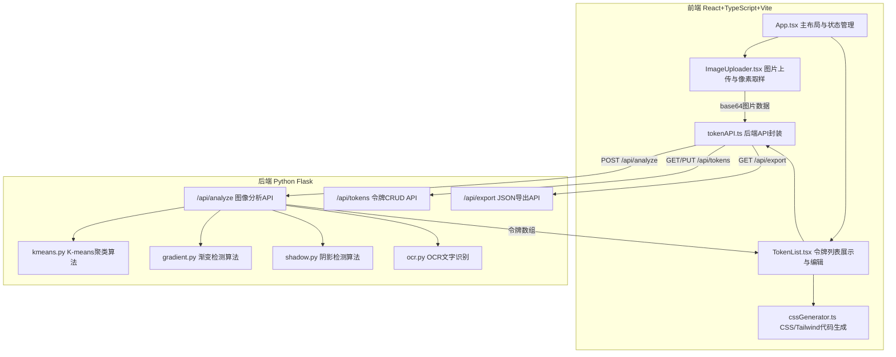
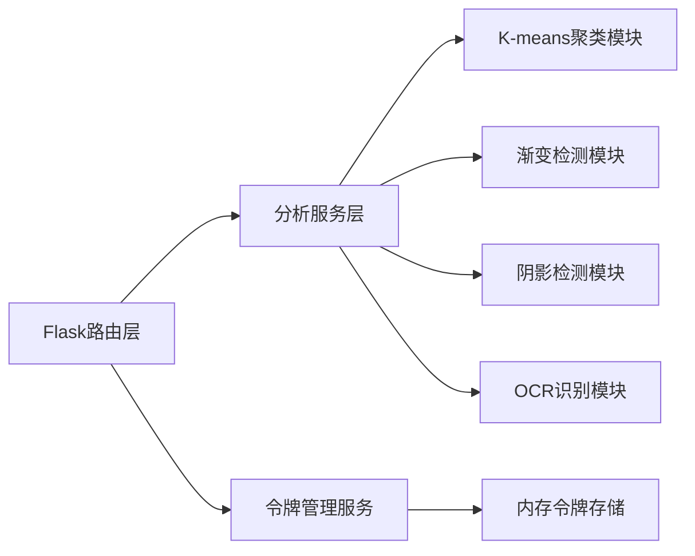

## 1. 架构设计



## 2. 技术说明

- 前端：React 18 + TypeScript + Vite + TailwindCSS + Zustand
- 初始化工具：vite-init (react-ts 模板)
- 后端：Python Flask + scikit-learn (K-means) + pytesseract (OCR) + Pillow (图像处理)
- 数据库：无持久化数据库，令牌数据在会话中管理
- 数据流向：用户上传图片 → 前端Canvas取样 → base64发送后端 → 后端分析返回令牌 → 前端展示编辑 → 生成CSS/导出JSON

## 3. 路由定义

| 路由 | 用途 |
|------|------|
| / | 工作台主页面（图片上传 + 令牌列表 + CSS预览） |

## 4. API定义

### 4.1 POST /api/analyze

请求体：
```typescript
interface AnalyzeRequest {
  image: string // base64编码图片
  samplePoints: Array<{ r: number; g: number; b: number; a: number; x: number; y: number }>
}
```

响应体：
```typescript
interface AnalyzeResponse {
  tokens: DesignToken[]
}

interface DesignToken {
  id: string
  name: string // 如 "primary"
  cssValue: string // 如 "#3B82F6"
  type: "color" | "gradient" | "shadow" | "font"
  cssVariable: string // 如 "--primary"
  metadata?: {
    percentage?: number // 面积占比
    blurRadius?: number // 阴影模糊半径
    offsetX?: number // 阴影X偏移
    offsetY?: number // 阴影Y偏移
    fontSize?: number // 字体大小
    fontFamily?: string // 字体家族
    gradientAngle?: number // 渐变角度
    gradientStops?: Array<{ color: string; position: number }>
  }
}
```

### 4.2 GET /api/tokens

响应体：
```typescript
interface TokensResponse {
  tokens: DesignToken[]
}
```

### 4.3 PUT /api/tokens/:id

请求体：
```typescript
interface UpdateTokenRequest {
  name?: string
  cssValue?: string
}
```

### 4.4 GET /api/export

响应体：JSON文件下载（包含name, cssValue, type字段数组）

## 5. 后端架构图



## 6. 数据模型

### 6.1 设计令牌模型

```typescript
interface DesignToken {
  id: string
  name: string
  cssValue: string
  type: "color" | "gradient" | "shadow" | "font"
  cssVariable: string
  metadata?: TokenMetadata
}

interface TokenMetadata {
  percentage?: number
  blurRadius?: number
  offsetX?: number
  offsetY?: number
  fontSize?: number
  fontFamily?: string
  gradientAngle?: number
  gradientStops?: Array<{ color: string; position: number }>
}
```

### 6.2 前端状态模型（Zustand）

```typescript
interface AppState {
  tokens: DesignToken[]
  uploadedImage: string | null
  isAnalyzing: boolean
  editingTokenId: string | null
  setTokens: (tokens: DesignToken[]) => void
  updateToken: (id: string, updates: Partial<DesignToken>) => void
  clearTokens: () => void
  setUploadedImage: (image: string | null) => void
  setIsAnalyzing: (v: boolean) => void
}
```

## 7. 文件结构与调用关系

```
project/
├── package.json              # 依赖管理，启动脚本
├── index.html                # 入口页面
├── tsconfig.json             # TypeScript配置
├── vite.config.ts            # Vite构建配置，代理后端API
├── src/
│   ├── main.tsx              # React根组件，初始化App
│   ├── App.tsx               # 主布局(左栏ImageUploader+右栏TokenList)，管理整体状态
│   ├── store.ts              # Zustand状态管理
│   ├── components/
│   │   ├── ImageUploader.tsx # 文件拖拽/点击上传，Canvas像素取样
│   │   ├── TokenList.tsx     # 令牌卡片列表展示
│   │   ├── TokenCard.tsx     # 单个令牌卡片(色块+名称+CSS值+编辑)
│   │   ├── ColorPicker.tsx   # react-colorful取色器弹窗
│   │   ├── ActionBar.tsx     # 底部操作栏(导出/复制/清空)
│   │   ├── ConfirmDialog.tsx # 清空确认弹窗
│   │   └── Toast.tsx         # 成功提示弹出条
│   └── services/
│       ├── cssGenerator.ts   # CSS变量文本和Tailwind配置生成
│       └── tokenAPI.ts       # 后端API封装
├── api/                      # Python Flask后端
│   ├── app.py                # Flask应用入口，路由定义
│   ├── requirements.txt      # Python依赖
│   ├── services/
│   │   ├── kmeans.py         # K-means聚类算法
│   │   ├── gradient.py       # 渐变检测算法
│   │   ├── shadow.py         # 阴影检测算法
│   │   └── ocr.py            # OCR文字识别(Tesseract)
│   └── utils/
│       └── image_utils.py    # 图像处理工具函数
```

### 数据流向说明

1. **上传流程**：用户 → ImageUploader → Canvas像素取样 → base64 → tokenAPI.analyze() → POST /api/analyze → Flask → K-means/渐变/阴影/OCR → 返回令牌数组 → TokenList展示
2. **编辑流程**：用户点击令牌卡片 → 弹出取色器/编辑input → 修改后更新Zustand状态 → cssGenerator重新生成CSS文本
3. **导出流程**：用户点击导出JSON → tokenAPI.export() → 下载JSON文件；用户点击复制CSS → cssGenerator生成文本 → 复制到剪贴板 → Toast提示
