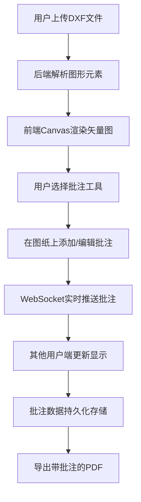

## 1. 产品概述

图纸快递是一款在线CAD协作审图应用，让团队成员能够同时查看并批注同一份DXF图纸，批注实时同步，最终导出带所有批注的PDF文件。该应用解决了传统审图流程中协作效率低、版本混乱、批注难以追踪的问题，为建筑、工程、制造等领域的团队提供高效的数字化审图解决方案。

## 2. 核心功能

### 2.1 用户角色

| 角色 | 参与方式 | 核心权限 |
|------|----------|----------|
| 审图用户 | 输入6位图纸码或扫码加入 | 上传图纸、添加/移动/删除批注、导出PDF、查看在线用户 |

### 2.2 功能模块

1. **图纸上传与渲染**：DXF文件上传，解析为线段、圆、文字等图形元素，Canvas矢量渲染
2. **批注工具**：圆形批注、矩形批注、文字批注，支持5种预设颜色
3. **实时协作**：WebSocket实时同步批注，多用户同时在线
4. **图纸交互**：滚轮缩放（0.1x-10x）、鼠标拖拽平移，带缓动动画
5. **批注管理**：选中拖拽移动、Delete键删除、图层控制显示/隐藏
6. **PDF导出**：一键导出含批注的PDF，带进度条提示
7. **协作房间**：6位图纸码加入、二维码分享、最多10人同时在线
8. **用户面板**：在线用户列表、随机头像、操作日志

### 2.3 页面详情

| 页面名称 | 模块名称 | 功能描述 |
|-----------|-------------|---------------------|
| 主审图页 | 顶部导航栏 | 应用logo、图纸码输入框、导出PDF按钮 |
| 主审图页 | 左栏图纸列表 | 图纸缩略图、文件名、最后修改时间、选中高亮 |
| 主审图页 | 中栏图纸区域 | DXF渲染画布、批注绘制、缩放平移交互 |
| 主审图页 | 批注工具栏 | 颜色选择器、批注类型按钮、撤销、导出 |
| 主审图页 | 右栏面板 | 在线用户列表、批注图层控制、操作日志 |

## 3. 核心流程

用户上传DXF图纸后，系统解析图形元素并在Canvas上渲染。用户选择批注工具后在图纸上添加批注，批注通过WebSocket实时同步给其他在线用户。所有批注持久化存储在后端数据库，刷新页面可恢复。用户可随时导出含所有批注的PDF文件。

## 4. 用户界面设计

### 4.1 设计风格

- **主色调**：深蓝色 #1A5276（导航栏）、浅灰色 #F5F5F5（背景）
- **强调色**：橙色 #E67E22（按钮、重要状态、分隔线）
- **画布背景**：深灰色 #2C2C2C，带浅灰色网格线（间距20px，线宽0.5px，透明度0.2）
- **按钮样式**：悬停0.2秒透明度变化（1.0→0.8），点击时向下偏移1px
- **字体**：采用现代无衬线字体，保持专业工程感
- **布局**：三栏布局，左栏220px可折叠，右栏280px可折叠，中栏自适应
- **图标**：使用简洁的线性图标，符合工程软件风格

### 4.2 页面设计概述

| 页面名称 | 模块名称 | UI元素 |
|-----------|-------------|-------------|
| 主审图页 | 顶部导航栏 | 高度48px，深蓝色背景，橙色2px分隔线，闪电logo+文字，图纸码输入框，导出按钮 |
| 主审图页 | 左栏图纸列表 | 白色卡片，缩略图图标，文件名，最后修改时间，选中项浅蓝#D6EAF8高亮 |
| 主审图页 | 中栏画布 | 深灰背景，网格线，图纸矢量图，彩色批注锚点，气泡文本 |
| 主审图页 | 批注工具栏 | 5色圆形选择器，工具按钮组，悬停效果，更新提示黄点 |
| 主审图页 | 右栏面板 | 在线用户卡片（彩色圆形头像+首字母，绿色边框高亮在线），图层复选框，操作日志倒序 |

### 4.3 动画效果

- 缩放平移：0.3秒 ease-in-out 缓动动画
- 批注出现：0.2秒淡入动画（透明度0→1）
- 批注移动：平滑过渡到新位置
- 用户退出：0.5秒淡出动画
- 按钮交互：0.2秒透明度变化，点击1px下沉
- 工具栏更新提示：黄色小圆点闪烁

### 4.4 响应式

- 桌面端优先设计，三栏布局
- 移动端可折叠左右侧栏，全屏显示图纸
- 触摸设备支持双指缩放和平移

## 5. 性能指标

| 指标 | 目标 |
|------|------|
| 缩放平移帧率 | ≥ 30 FPS（2000个图形元素以内） |
| WebSocket同步延迟 | ≤ 500ms（发送到所有客户端渲染完成） |
| PDF导出时间 | ≤ 10秒（100个批注以内） |
| 房间最大人数 | 10人 |
