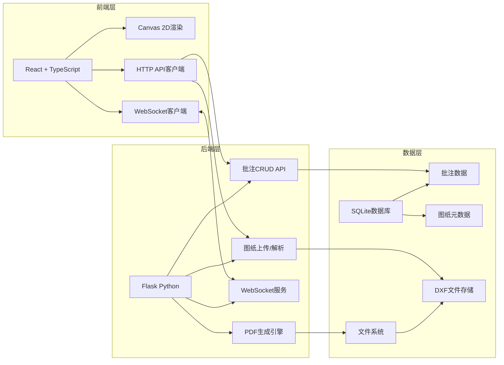
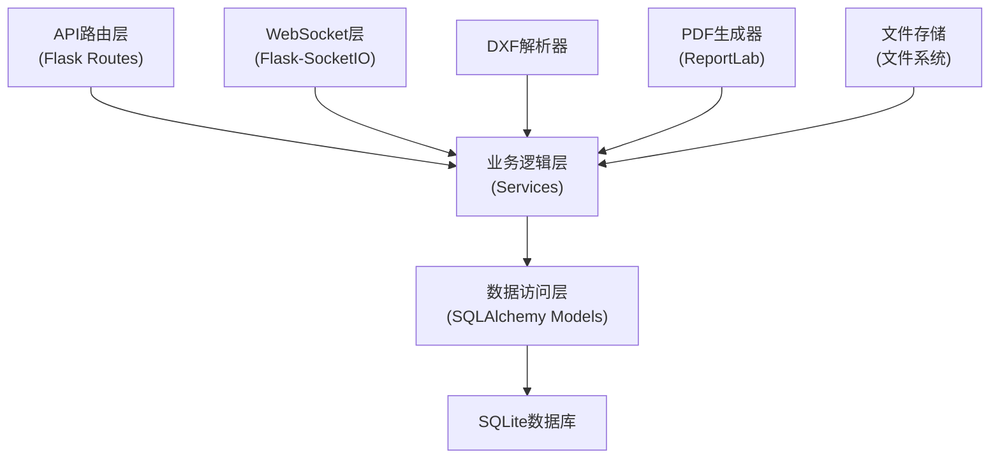
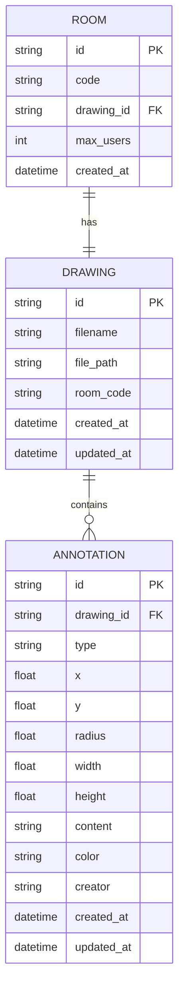

## 1. 架构设计



## 2. 技术描述

- **前端**：React 18 + TypeScript + Vite + Bootstrap 5
- **状态管理**：React useState/useReducer 组件内状态
- **HTTP客户端**：Axios
- **实时通信**：Socket.IO Client
- **后端**：Python Flask + Flask-SocketIO
- **数据库**：SQLite（使用SQLAlchemy ORM）
- **PDF生成**：ReportLab
- **DXF解析**：后端自定义解析器

## 3. 文件结构

```
项目根目录/
├── package.json
├── index.html
├── tsconfig.json
├── vite.config.js
├── src/
│   └── main.tsx
├── frontend/
│   ├── Viewer.tsx
│   ├── Toolbar.tsx
│   └── api.ts
└── backend/
    ├── app.py
    ├── models.py
    └── requirements.txt
```

## 4. API 定义

### 4.1 类型定义

```typescript
// 图形元素类型
interface LineElement {
  type: 'line';
  x1: number;
  y1: number;
  x2: number;
  y2: number;
  color: string;
}

interface CircleElement {
  type: 'circle';
  cx: number;
  cy: number;
  r: number;
  color: string;
}

interface TextElement {
  type: 'text';
  x: number;
  y: number;
  content: string;
  color: string;
  size: number;
}

type DrawingElement = LineElement | CircleElement | TextElement;

// 批注类型
interface Annotation {
  id: string;
  drawingId: string;
  type: 'circle' | 'rectangle' | 'text';
  x: number;
  y: number;
  radius?: number;
  width?: number;
  height?: number;
  content?: string;
  color: string;
  creator: string;
  createdAt: string;
}

// 用户类型
interface User {
  id: string;
  nickname: string;
  avatarColor: string;
  isOnline: boolean;
}

// 操作日志
interface LogEntry {
  id: string;
  userId: string;
  userName: string;
  action: 'add' | 'move' | 'delete';
  annotationType: string;
  timestamp: string;
}
```

### 4.2 HTTP API 接口

| 方法 | 路径 | 描述 | 请求体 | 响应 |
|------|------|------|--------|------|
| POST | `/api/drawings/upload` | 上传DXF图纸 | `multipart/form-data: { file: File }` | `{ drawingId: string, elements: DrawingElement[] }` |
| GET | `/api/drawings/:id` | 获取图纸信息 | - | `{ drawingId: string, filename: string, elements: DrawingElement[] }` |
| GET | `/api/drawings/:id/annotations` | 获取批注列表 | - | `Annotation[]` |
| POST | `/api/annotations` | 创建批注 | `Annotation` | `Annotation` |
| PUT | `/api/annotations/:id` | 更新批注 | `Partial<Annotation>` | `Annotation` |
| DELETE | `/api/annotations/:id` | 删除批注 | - | `{ success: boolean }` |
| POST | `/api/drawings/:id/export-pdf` | 导出PDF | - | `{ taskId: string }` |
| GET | `/api/export/:taskId/progress` | 获取导出进度 | - | `{ progress: number, status: 'processing' | 'completed' | 'error', url?: string }` |
| GET | `/api/rooms/:code/users` | 获取房间用户列表 | - | `User[]` |
| POST | `/api/rooms/join` | 加入房间 | `{ code: string, nickname: string }` | `{ roomId: string, drawingId: string, users: User[] }` |

### 4.3 WebSocket 事件

| 事件名 | 方向 | 数据 | 描述 |
|--------|------|------|------|
| `join_room` | 客户端→服务端 | `{ roomId: string, userId: string, nickname: string }` | 加入协作房间 |
| `annotation_added` | 客户端→服务端 | `Annotation` | 发送新添加的批注 |
| `annotation_added` | 服务端→客户端 | `Annotation` | 广播新批注 |
| `annotation_updated` | 客户端→服务端 | `Annotation` | 发送更新的批注 |
| `annotation_updated` | 服务端→客户端 | `Annotation` | 广播更新的批注 |
| `annotation_deleted` | 客户端→服务端 | `{ id: string }` | 发送删除的批注ID |
| `annotation_deleted` | 服务端→客户端 | `{ id: string }` | 广播删除的批注ID |
| `user_joined` | 服务端→客户端 | `User` | 通知新用户加入 |
| `user_left` | 服务端→客户端 | `{ userId: string }` | 通知用户离开 |

## 5. 后端服务架构



## 6. 数据模型

### 6.1 ER图



### 6.2 DDL 语句

```sql
CREATE TABLE drawings (
    id VARCHAR(36) PRIMARY KEY,
    filename VARCHAR(255) NOT NULL,
    file_path VARCHAR(512) NOT NULL,
    room_code VARCHAR(6) UNIQUE,
    created_at DATETIME DEFAULT CURRENT_TIMESTAMP,
    updated_at DATETIME DEFAULT CURRENT_TIMESTAMP
);

CREATE TABLE annotations (
    id VARCHAR(36) PRIMARY KEY,
    drawing_id VARCHAR(36) NOT NULL,
    type VARCHAR(20) NOT NULL CHECK (type IN ('circle', 'rectangle', 'text')),
    x FLOAT NOT NULL,
    y FLOAT NOT NULL,
    radius FLOAT,
    width FLOAT,
    height FLOAT,
    content TEXT,
    color VARCHAR(7) NOT NULL,
    creator VARCHAR(50) NOT NULL,
    created_at DATETIME DEFAULT CURRENT_TIMESTAMP,
    updated_at DATETIME DEFAULT CURRENT_TIMESTAMP,
    FOREIGN KEY (drawing_id) REFERENCES drawings(id) ON DELETE CASCADE
);

CREATE TABLE rooms (
    id VARCHAR(36) PRIMARY KEY,
    code VARCHAR(6) UNIQUE NOT NULL,
    drawing_id VARCHAR(36) NOT NULL,
    max_users INT DEFAULT 10,
    created_at DATETIME DEFAULT CURRENT_TIMESTAMP,
    FOREIGN KEY (drawing_id) REFERENCES drawings(id) ON DELETE CASCADE
);

CREATE INDEX idx_annotations_drawing_id ON annotations(drawing_id);
CREATE INDEX idx_drawings_room_code ON drawings(room_code);
```
