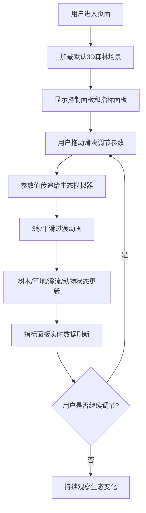

## 1. 产品概述

"森林呼吸"是一个基于浏览器的3D交互式生态景观模拟器，让用户通过调节环境参数实时观察虚拟森林生态系统的动态变化。
- 主要目的：为用户提供沉浸式的生态教育与娱乐体验，直观展示环境因素对森林生态的影响
- 目标用户：自然爱好者、学生、教育工作者、休闲用户

## 2. 核心功能

### 2.1 用户角色
| 角色 | 注册方式 | 核心权限 |
|------|----------|----------|
| 普通用户 | 无需注册，直接使用 | 调整环境参数、观察生态变化、重置配置 |

### 2.2 功能模块
1. **3D森林场景主界面**：实时渲染的森林景观，包含树木、草地、溪流、动物
2. **右侧控制面板**：四个环境参数滑块（光照、降雨、风力、温度）
3. **左下角生态指标面板**：实时显示生态健康度、生物多样性等指数
4. **动态过渡系统**：参数变化后3秒平滑过渡动画

### 2.3 页面详情
| 页面名称 | 模块名称 | 功能描述 |
|----------|----------|----------|
| 主界面 | 3D森林场景 | 50+棵随机分布树木（松树/橡树/樱花树），动态草地，溪流带波纹特效，3种游走动物 |
| 主界面 | 控制面板 | 四个滑块调节环境参数，毛玻璃效果，温度渐变背景色，重置按钮 |
| 主界面 | 生态指标区 | 实时显示生态健康度、生物多样性预估、生长活跃度等数值 |
| 主界面 | 淡入淡出过渡 | 场景加载和切换时的1秒过渡动画 |

## 3. 核心流程

用户打开页面后，首先看到默认生态参数下的3D森林场景，用户可以拖动右侧控制面板的滑块调整光照、降雨、风力、温度等参数，系统在3秒内平滑过渡到新状态，同时左下角指标面板实时更新数据。用户可以点击重置按钮恢复默认配置。

## 4. 用户界面设计

### 4.1 设计风格
- 主色调：深绿#1A2E1A到墨蓝#0D1B2A的径向渐变背景
- 辅助色：暖橙#FF8C00（高温）、冷蓝#1E90FF（低温）表示温度变化
- 按钮/滑块：圆角半透明毛玻璃效果（backdrop-filter: blur）
- 字体：采用优雅的无衬线字体，配合场景主题
- 布局：全屏3D场景 + 右侧浮岛式控制面板 + 左下角浮岛式指标面板
- 交互：所有悬停元素0.3秒发光描边动画

### 4.2 页面设计概述
| 页面名称 | 模块名称 | UI元素 |
|----------|----------|--------|
| 主界面 | 3D森林场景 | 50+棵树（松树深绿锥形、橡树绿色球形、樱花粉色伞形）、动态草地、溪流、动物（兔子/松鼠/蝴蝶） |
| 主界面 | 控制面板 | 毛玻璃背景、温度渐变条、四个带标签的滑块（光照0-100/降雨0-100/风力0-100/温度-10~40°C）、重置按钮 |
| 主界面 | 指标面板 | 半透明卡片、生态健康度进度条、生物多样性数值、温湿度显示 |

### 4.3 响应式设计
- 桌面端优先：右侧控制面板（约320px宽），左下角指标面板
- 移动端适配：控制面板移至底部可折叠抽屉，指标面板调整为顶部横条
- 触摸优化：滑块增大触摸区域，适配移动端手势

### 4.4 3D场景指引
- 环境氛围：自然森林，柔和自然光，雾气营造深度感
- 光照设置：主光源（DirectionalLight模拟阳光，强度受光照参数影响）+ 环境光（AmbientLight）
- 相机设置：PerspectiveCamera，初始视角俯视森林中心，支持OrbitControls旋转缩放
- 构图元素：中央区域树木密集，边缘渐稀，溪流从左上蜿蜒流向右下
- 交互动画：树木生长/枯萎动画、草地高度渐变、水位升降、动物游走轨迹带缓动曲线
- 后处理效果：雾化效果增强沉浸感，水面使用法线贴图实现波纹
- 性能优化：实例化渲染处理草地，LOD简化远处树木，帧率保持30fps以上
