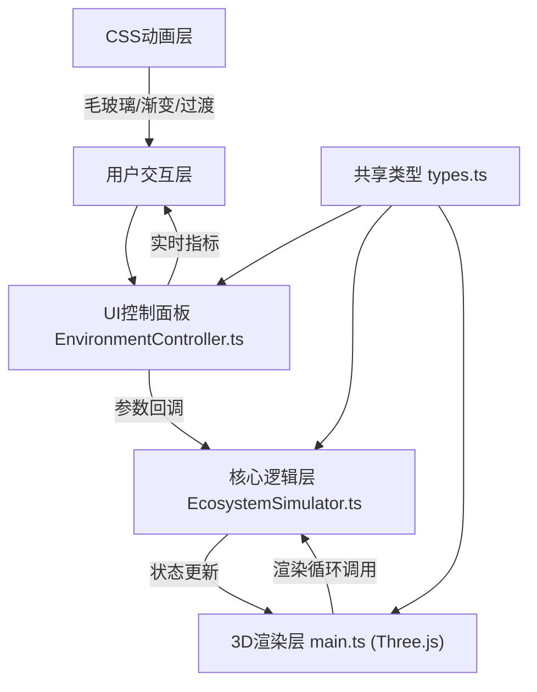

## 1. 架构设计



## 2. 技术说明
- 前端框架：纯TypeScript + Vite（无需React，用户明确要求拆分渲染模块和逻辑模块）
- 3D渲染：Three.js@0.160+，原生OrbitControls控制器
- 样式：纯CSS（包含CSS动画、渐变、毛玻璃效果、响应式布局）
- 构建工具：Vite@5
- 开发语言：TypeScript@5（strict严格模式）
- 后端：无（纯前端项目）
- 数据源：无外部API，全部基于模拟数据实时计算

## 3. 文件结构
| 文件路径 | 用途 |
|----------|------|
| /index.html | 入口页面，全屏3D容器，引入CSS样式和TS入口 |
| /package.json | 依赖：typescript, vite, three, @types/three；脚本：npm run dev |
| /tsconfig.json | TypeScript严格模式配置 |
| /vite.config.js | Vite构建配置 |
| /src/main.ts | Three.js场景初始化、相机/灯光/渲染循环、调用EcosystemSimulator |
| /src/EcosystemSimulator.ts | 核心生态模拟：管理树木/草地/溪流/动物状态数组、计算生长响应、updateScene方法 |
| /src/EnvironmentController.ts | UI控制面板：滑块创建、指标显示、回调通知、resetToDefault方法 |
| /src/types.ts | 共享类型：EnvironmentParams、EcoEntity等接口定义 |

## 4. 模块接口定义

### 4.1 共享类型 (types.ts)
```typescript
export interface EnvironmentParams {
  light: number;    // 光照 0-100
  rain: number;     // 降雨 0-100
  wind: number;     // 风力 0-100
  temp: number;     // 温度 -10 到 40°C
}

export type TreeType = 'pine' | 'oak' | 'sakura';
export type AnimalType = 'rabbit' | 'squirrel' | 'butterfly';

export interface EcoEntity {
  id: string;
  position: { x: number; y: number; z: number };
  type: string;
  currentState: {
    health: number;      // 0-100 健康度
    growth: number;      // 0-1 生长阶段
    saturation: number;  // 颜色饱和度
  };
  targetState: {
    health: number;
    growth: number;
    saturation: number;
  };
}

export interface TreeEntity extends EcoEntity {
  type: TreeType;
  canopyScale: number;
  targetCanopyScale: number;
}

export interface AnimalEntity extends EcoEntity {
  type: AnimalType;
  velocity: { x: number; y: number; z: number };
  targetPosition: { x: number; y: number; z: number };
  activityLevel: number; // 0-1 受温度影响
}

export interface EcosystemMetrics {
  healthIndex: number;       // 生态健康度 0-100
  biodiversity: number;      // 生物多样性预估 0-100
  growthActivity: number;    // 生长活跃度 0-100
  humidity: number;          // 湿度 0-100
}
```

### 4.2 EcosystemSimulator 类接口
| 方法 | 参数 | 返回值 | 说明 |
|------|------|--------|------|
| constructor(scene: THREE.Scene) | Three.js场景实例 | - | 初始化模拟器 |
| setEnvironmentParams(params: EnvironmentParams) | 新的环境参数 | void | 设置目标参数，触发3秒过渡 |
| updateScene(deltaTime: number) | 帧间隔时间(秒) | EcosystemMetrics | 每帧调用，更新所有实体状态，返回指标 |
| reset() | - | void | 重置生态系统到初始状态 |

### 4.3 EnvironmentController 类接口
| 方法 | 参数 | 返回值 | 说明 |
|------|------|--------|------|
| constructor(container: HTMLElement, onParamsChange: (p: EnvironmentParams) => void) | 容器DOM、参数变化回调 | - | 创建控制面板UI |
| updateMetrics(metrics: EcosystemMetrics) | 最新生态指标 | void | 更新指标面板显示 |
| resetToDefault() | - | void | 还原滑块到默认值（light:60, rain:50, wind:20, temp:22） |
| getCurrentParams() | - | EnvironmentParams | 获取当前参数值 |

## 5. 性能优化策略
- 草地使用 InstancedMesh 实例化渲染（数千草叶共享几何体）
- 树木几何体重用（3种树形，50棵树复用）
- 动物使用基础几何体组合（无外部模型加载）
- 动画采用线性插值+缓动函数，避免每帧复杂计算
- 帧率目标：30fps+，移动设备可降级
- 3秒过渡动画采用增量更新，非一次性DOM操作

## 6. 动画系统
- 过渡时间：3000ms（参数变化到目标状态）
- 缓动函数：easeInOutCubic（y = t<0.5 ? 4t³ : 1-(-2t+2)³/2）
- 树木：树冠scale、材质color饱和度插值
- 草地：草叶高度scale插值、密度控制visible
- 溪流：水位y值、水流动画速度、波纹法线贴图uv缩放
- 动物：活动频率、移动速度、跳跃幅度受风力/温度影响
