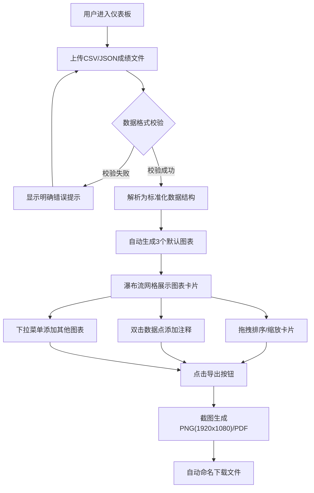

## 1. 产品概述
在线教育学生成绩分析仪表板，帮助教师通过上传学生成绩数据，自动生成多种统计图表进行成绩分析，支持拖拽布局、个性化注释和一键导出报告，大幅提升教学数据分析效率。

## 2. 核心功能

### 2.1 用户角色
| 角色 | 说明 | 核心权限 |
|------|------|----------|
| 教师用户 | 平台主要使用者 | 上传数据、生成图表、编辑布局、添加注释、导出报告 |

### 2.2 功能模块
1. **侧边栏模块**：数据上传区、图表类型选择下拉菜单、导出按钮
2. **主仪表板模块**：瀑布流式网格布局、图表卡片列表
3. **图表卡片模块**：多种图表类型渲染、数据点注释、拖拽排序、缩放
4. **导出模块**：PNG图片导出、PDF报告导出

### 2.3 页面详情
| 页面名称 | 模块名称 | 功能描述 |
|-----------|-------------|---------------------|
| 仪表板主页面 | 侧边栏上传区 | 支持拖拽或点击上传CSV/JSON文件，实时校验数据格式并显示错误提示 |
| 仪表板主页面 | 图表类型选择 | 下拉菜单选择额外图表类型（雷达图、散点图等），点击添加到网格 |
| 仪表板主页面 | 导出按钮区 | 提供PNG和PDF两种导出格式，文件名自动带时间戳 |
| 仪表板主页面 | 图表网格 | 瀑布流式布局，支持卡片拖拽排序和自动让位动画 |
| 仪表板主页面 | 图表卡片 | 渲染recharts图表，双击数据点添加注释气泡，右下角手柄缩放 |

## 3. 核心流程

用户进入仪表板 → 上传成绩数据文件 → 系统校验并解析数据 → 自动生成三个默认图表（分布直方图、趋势折线图、平均分柱状图）→ 用户可拖拽调整卡片位置/缩放 → 双击数据点添加注释 → 选择添加其他图表类型 → 点击导出按钮 → 生成PNG/PDF报告并下载

## 4. 用户界面设计

### 4.1 设计风格
- **主色调**：#1E1E2E（深色背景）
- **强调色**：#7C3AED（紫色）
- **文字色**：#E0E0E0（浅灰）
- **图表渐变**：蓝紫到粉红柔和渐变色系
- **卡片样式**：圆角12px，阴影box-shadow: 0 4px 20px rgba(124, 58, 237, 0.15)
- **Hover效果**：阴影加深，上移2px，transition: all 0.3s ease
- **注释气泡**：浅黄底#FFFDEB，深灰文字，6px小三角形指向数据点
- **布局方式**：两栏布局，左侧固定260px侧边栏，右侧主内容区瀑布流

### 4.2 页面设计概述
| 页面名称 | 模块名称 | UI元素 |
|-----------|-------------|-------------|
| 仪表板主页面 | 侧边栏 | 260px固定宽度，深色背景，上传区带虚线边框，下拉菜单，导出按钮组 |
| 仪表板主页面 | 主内容区 | 瀑布流式网格，卡片间距16px，响应式列数 |
| 仪表板主页面 | 图表卡片 | 圆角12px，紫色阴影，标题栏，图表区域，缩放手柄，注释气泡 |
| 仪表板主页面 | 注释气泡 | 浅黄色背景，圆角8px，三角指针，可拖拽，文本可编辑 |

### 4.3 响应式设计
- 桌面优先设计，适配1366px到1920px宽度
- 屏幕宽度<1366px时，侧边栏自动折叠为悬浮图标按钮
- 网格列数根据屏幕宽度自适应调整（1920px: 3列，1600px: 2-3列，1366px: 2列）
- 折叠侧边栏后，点击悬浮图标展开侧边栏面板

### 4.4 动画与交互
- 所有操作（添加图表、移动、缩放）使用0.3秒流畅过渡动画
- 拖拽时卡片半透明跟随效果，周围其他卡片自动让位动画
- 卡片hover时平滑过渡（阴影加深+上移2px）
- 图表渲染使用渐变填充，增强视觉美感
